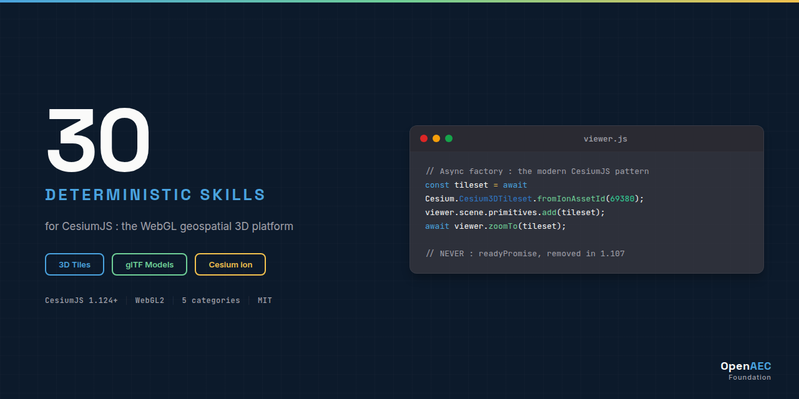

# CesiumJS : Claude Skill Package

<p align="center">
  
</p>


**0 deterministic Claude AI skills for CesiumJS. Deterministic Claude skills for CesiumJS : WebGL geospatial 3D platform, 3D Tiles, glTF, KML/CZML/CityGML, Resium, digital twin, AEC geo-BIM**

Built on the [Agent Skills](https://agentskills.org) open standard. Discoverable via npm-agentskills manifest and OpenAI Codex skill discovery.

## Why This Exists

Without skills, Claude lacks deterministic guidance for CesiumJS patterns:

```{{LANGUAGE}}
// Wrong : {{WRONG_PATTERN_DESCRIPTION}}
{{WRONG_CODE_EXAMPLE}}
```

With this skill package, Claude produces correct patterns:

```{{LANGUAGE}}
// Correct : {{CORRECT_PATTERN_DESCRIPTION}}
{{CORRECT_CODE_EXAMPLE}}
```

## What's Inside

| Category | Count | Purpose |
|----------|:-----:|---------|
| **core/** | 0 | Architecture, cross-cutting concerns |
| **syntax/** | 0 | API syntax, code patterns, signatures |
| **impl/** | 0 | Step-by-step development workflows |
| **errors/** | 0 | Error handling, debugging, anti-patterns |
| **agents/** | 0 | Validation, code generation, orchestration |
| **Total** | **0** | |

See [INDEX.md](INDEX.md) for the complete skill catalog with descriptions and dependency graph.

## Installation

### Claude Code (recommended)

```bash
# Clone the full package
git clone https://github.com/OpenAEC-Foundation/CesiumJS-Claude-Skill-Package.git
cp -r CesiumJS-Claude-Skill-Package/skills/source/ ~/.claude/skills/cesium/
```

### As git submodule

```bash
git submodule add https://github.com/OpenAEC-Foundation/CesiumJS-Claude-Skill-Package.git .claude/skills/cesium
```

### Via npm-agentskills standard

```bash
npx skills add @openaec/cesium-claude-skill-package
```

### Claude.ai (web)

Upload individual SKILL.md files as project knowledge.

## Skill Structure

Every skill follows 3-level progressive disclosure:

```
cesium-{category}-{topic}/
├── SKILL.md              # Main guidance (< 500 lines)
└── references/
    ├── methods.md        # Complete API signatures
    ├── examples.md       # Working code examples
    └── anti-patterns.md  # What NOT to do (with explanations)
```

YAML frontmatter uses folded scalar `>`, "Use when..." opener, and a `Keywords:` line with technical + symptom-based + plain-language terms for maximum discoverability.

## Quality Guarantees

- **Deterministic language** : ALWAYS / NEVER, no "you might consider"
- **Version-explicit code** : every example annotated with applicable versions
- **WebFetch-verified** : all code-snippets validated against official docs
- **CI/CD validated** : frontmatter, line count, structure, language, em-dash checks on every push
- **Compliance audit** : score >= 90% required for releases

## Companion Skills : Cross-Technology Integration

For projects combining CesiumJS with other AEC technologies, see [Cross-Tech-AEC-Claude-Skill-Package](https://github.com/OpenAEC-Foundation/Cross-Tech-AEC-Claude-Skill-Package).

## Related Skill Packages (OpenAEC Foundation)

| Package | Skills | Repo |
|---------|--------|------|
| Blender-Bonsai-ifcOpenshell-Sverchok | 73 | [Link](https://github.com/OpenAEC-Foundation/Blender-Bonsai-ifcOpenshell-Sverchok-Claude-Skill-Package) |
| Frappe | 61 | [Link](https://github.com/OpenAEC-Foundation/Frappe_Claude_Skill_Package) |
| Speckle | 25 | [Link](https://github.com/OpenAEC-Foundation/Speckle-Claude-Skill-Package) |

See full list at [OpenAEC-Foundation](https://github.com/OpenAEC-Foundation).

## License

MIT : OpenAEC Foundation

## Contributing

See [CONTRIBUTING.md](CONTRIBUTING.md). Built with the [Skill Package Workflow Template](https://github.com/OpenAEC-Foundation/Skill-Package-Workflow-Template) methodology.
