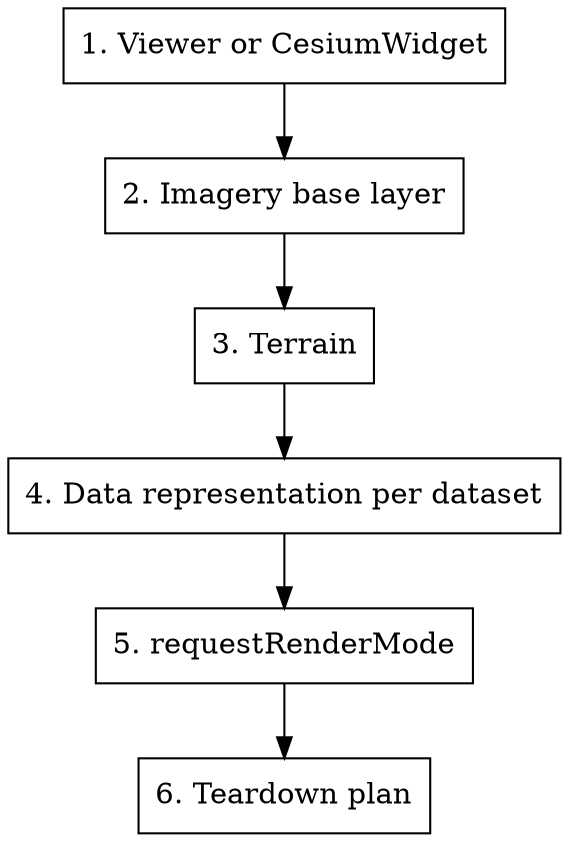
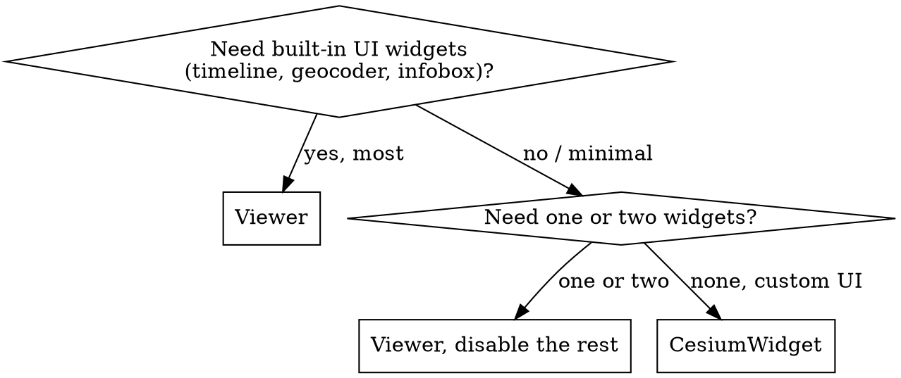
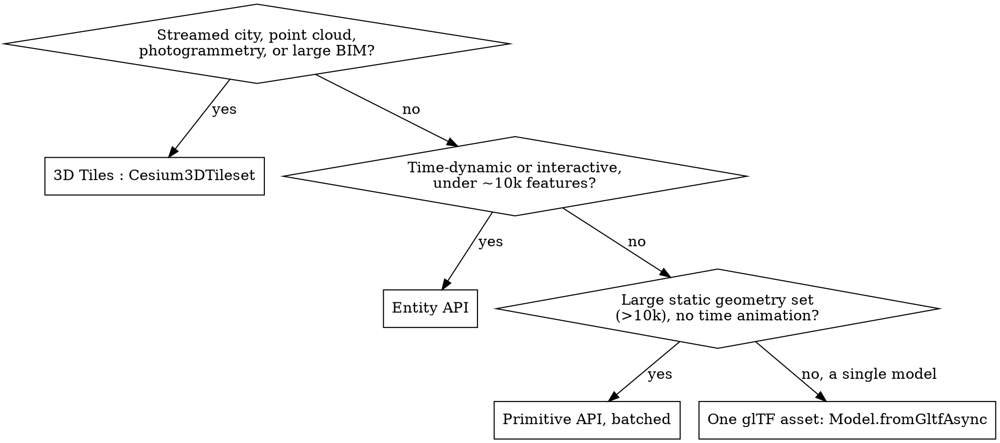
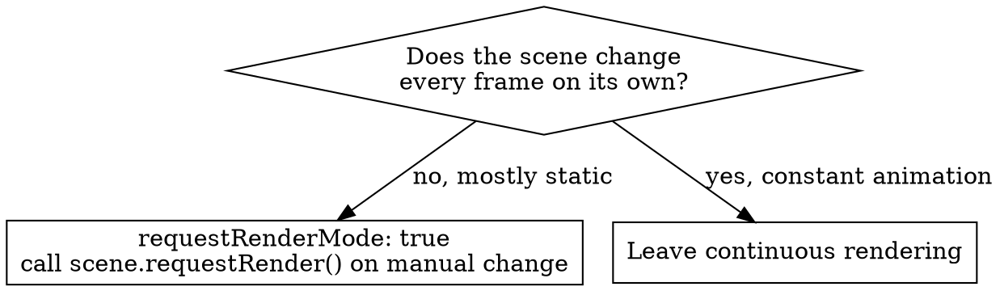

# Cesium Agents : Scene Architect

## Overview

This is an orchestration skill. It does not teach one API; it sequences the
setup decisions for a CesiumJS scene and routes each one to the skill that
covers it in depth. Follow the decisions in order. Each produces a concrete
choice and names the skill to consult.

CesiumJS is WebGL2 only (1.124+). There is no WebGPU path; never plan for one.

## When to Use

- Starting a new CesiumJS application or a new map feature.
- A prompt asks "how should I show this data in Cesium" or "how do I set this
  up".
- Reviewing a scene that was assembled without a clear plan and renders slowly,
  blank, or wrong.

## The Setup Decision Order

Resolve these six decisions in sequence. Skipping ahead causes rework.

## Decision 1 : Viewer or CesiumWidget

- ALWAYS set `Ion.defaultAccessToken` before constructing, if any ion asset is
  used. A missing token is the top cause of a blank globe.
- Depth: `cesium-core-architecture`, `cesium-syntax-viewer`.

## Decision 2 : Imagery Base Layer

| Need | Choice | Skill |
|------|--------|-------|
| Cesium-hosted default imagery | `ImageryLayer.fromWorldImagery` (ion) | `cesium-syntax-imagery` |
| OpenStreetMap raster | `OpenStreetMapImageryProvider` | `cesium-syntax-imagery` |
| Bing or ArcGIS imagery | `BingMapsImageryProvider`, `ArcGisMapServerImageryProvider` | `cesium-syntax-imagery` |
| A custom XYZ or WMTS source (incl. MapTiler) | `UrlTemplateImageryProvider` or `WebMapTileServiceImageryProvider` | `cesium-syntax-imagery` |
| No imagery, abstract globe | construct with `baseLayer: false` | `cesium-syntax-viewer` |

All metadata-fetching providers use async factories. NEVER plan around
`readyPromise`.

## Decision 3 : Terrain

| Need | Choice | Skill |
|------|--------|-------|
| Realistic global elevation | `Terrain.fromWorldTerrain()` or `createWorldTerrainAsync()` (ion) | `cesium-syntax-terrain` |
| A custom quantized-mesh server | `CesiumTerrainProvider.fromUrl(url)` | `cesium-syntax-terrain` |
| Esri elevation | `ArcGISTiledElevationTerrainProvider.fromUrl(url)` | `cesium-syntax-terrain` |
| Flat ellipsoid, no elevation | `EllipsoidTerrainProvider` (default) | `cesium-syntax-terrain` |

When terrain is enabled, plan ground clamping for every dataset that must sit
on the surface. Depth: `cesium-errors-coordinates`.

## Decision 4 : Data Representation Per Dataset

This is the decision most often made wrong. Choose per dataset.

| Representation | Use for | Skill |
|----------------|---------|-------|
| `Cesium3DTileset` | cities, point clouds, photogrammetry, massive BIM | `cesium-syntax-3d-tiles`, `cesium-impl-3d-tiles-styling` |
| Entity API | interactive markers, tracks, time-dynamic data under ~10k | `cesium-syntax-entity`, `cesium-syntax-time` |
| Primitive API | large static geometry sets above ~10k features | `cesium-syntax-primitive` |
| `Model` | a single glTF or glb asset | `cesium-syntax-gltf-model` |
| `GeoJsonDataSource`, `KmlDataSource`, `CzmlDataSource` | file-based vector or time-dynamic data | `cesium-syntax-datasources` |

- NEVER place tens of thousands of individual `Entity` objects. The per-tick
  visualizer loop becomes the bottleneck. Use batched primitives or 3D Tiles.
- For georeferencing a BIM or CityGML model, see `cesium-impl-aec-georef`.

## Decision 5 : requestRenderMode

- ALWAYS enable `requestRenderMode` for a static or rarely-changing scene. It
  is the largest single performance and battery win.
- Depth: `cesium-core-performance`, `cesium-core-architecture`.

## Decision 6 : Teardown Plan

Decide teardown before shipping, not after a leak appears.

- ALWAYS plan one `viewer.destroy()` on the cleanup path.
- ALWAYS plan removers for every `addEventListener`, and `destroy()` for every
  `ScreenSpaceEventHandler` and custom primitive.
- In a single-page app or React, plan ONE long-lived viewer, not one per route.
- Depth: `cesium-core-memory`, `cesium-errors-memory`.

## React Applications

When the host app is React, the structural choices above still hold; the
component wiring is delegated to `cesium-impl-resium`.

## Output of This Skill

Applying the six decisions yields a written setup plan: the viewer class, the
imagery and terrain providers, a representation per dataset, the render mode,
and a teardown checklist. Hand each item to the named skill for the code.

## Reference Files

- `references/methods.md` : the decision criteria as lookup tables with the
  governing skill for each.
- `references/examples.md` : three worked scene plans (a static AEC site
  viewer, a time-dynamic tracking app, a minimal custom-UI globe).
- `references/anti-patterns.md` : the recurring scene-architecture mistakes.

## Related Skills

- `cesium-core-architecture` : the object hierarchy these decisions rest on.
- `cesium-syntax-viewer`, `cesium-syntax-imagery`, `cesium-syntax-terrain`.
- `cesium-syntax-entity`, `cesium-syntax-primitive`, `cesium-syntax-3d-tiles`.
- `cesium-core-performance`, `cesium-core-memory`.
- `cesium-agents-skill-validator` : checks the generated code after setup.

## Sources

Built on the project research base (`docs/research/vooronderzoek-cesium.md`),
itself verified via WebFetch against the CesiumJS API Reference and learn
tutorials on the approved sources, 2026-05-20.
