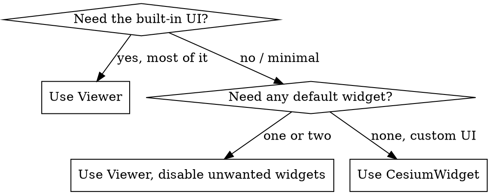

# CesiumJS Core Architecture

## Overview

CesiumJS is built from three nested objects. `Viewer` wraps a `CesiumWidget`.
`CesiumWidget` owns the canvas, the `Scene`, the `Camera`, the `Clock`, and the
`ScreenSpaceEventHandler`, and it runs the render loop. `Scene` contains every piece of
3D state: the `Globe`, sky, lighting, fog, post-processing, the camera, and the
primitive collections.

Core principle: `Globe` is a MEMBER of `Scene`, NEVER a sibling. The single most
important architectural fact for writing correct code is the access path:
`viewer.scene.globe`, `viewer.scene.camera`, `viewer.scene.primitives`.

This skill is technology-specific: CesiumJS 1.124+, WebGL2 only.

## When to Use This Skill

- Setting up a new CesiumJS application and choosing `Viewer` or `CesiumWidget`.
- Code reaches for `scene.viewer`, `globe.scene`, or any back-reference that returns
  `undefined`.
- The scene renders once and then freezes, or never updates after a data change.
- The app drains battery or pegs the GPU on a static, unchanging scene.
- A frame looks stale immediately after mutating a primitive or property by hand.
- Code or a prompt assumes a WebGPU rendering path.
- Deciding between the `Entity` API and the `Primitive` API for a dataset.
- The scene must switch between 3D, 2D, and Columbus View.

## The Containment Hierarchy

ALWAYS reason about CesiumJS objects through this exact graph. Reading it wrong
produces `undefined` access and silent no-op code.

```
Viewer
 |
 +-- cesiumWidget : CesiumWidget   (Viewer wraps exactly one)
 +-- scene        : Scene          (forwarded from cesiumWidget)
 +-- camera       : Camera         (forwarded; same object as scene.camera)
 +-- clock        : Clock          (forwarded)
 +-- entities     : EntityCollection
 +-- dataSources  : DataSourceCollection
 +-- animation, timeline, baseLayerPicker, geocoder, infoBox, ...  (UI widgets)

CesiumWidget
 |
 +-- canvas                  : HTMLCanvasElement
 +-- scene                   : Scene
 +-- camera                  : Camera
 +-- clock                   : Clock
 +-- screenSpaceEventHandler : ScreenSpaceEventHandler

Scene
 |
 +-- globe          : Globe        (the depth-test ellipsoid: terrain + imagery)
 +-- camera         : Camera
 +-- primitives     : PrimitiveCollection
 +-- screenSpaceCameraController : ScreenSpaceCameraController
 +-- skyAtmosphere  : SkyAtmosphere
 +-- skyBox         : SkyBox
 +-- sun            : Sun
 +-- moon           : Moon
 +-- light          : Light        (SunLight by default)
 +-- fog            : Fog
 +-- postProcessStages : PostProcessStageCollection
 +-- mode           : SceneMode
```

| Access intent | Correct path | NEVER write |
|---------------|--------------|-------------|
| The globe surface | `viewer.scene.globe` | `viewer.globe`, `globe.scene` |
| The camera | `viewer.scene.camera` or `viewer.camera` | `globe.camera` |
| Add a primitive | `viewer.scene.primitives.add(p)` | `viewer.primitives` |
| The underlying widget | `viewer.cesiumWidget` | `scene.viewer` (no back-reference) |
| The canvas | `viewer.scene.canvas` or `widget.canvas` | `viewer.canvas` |

There is NO `scene.viewer` or `globe.scene` back-reference. ALWAYS pass the object you
need into your own functions; NEVER expect to walk back up the graph.

## Viewer vs CesiumWidget



- ALWAYS use `Viewer` for standard applications. It adds the timeline, animation
  widget, base layer picker, geocoder, info box, and selection indicator, and exposes
  `entities`, `dataSources`, `zoomTo`, and `flyTo`.
- ALWAYS use `CesiumWidget` when the application supplies its own UI and wants none of
  the default widgets. `CesiumWidget` is the foundational renderer; `Viewer` is a
  composite built on top of it.
- NEVER construct both for the same container. `Viewer` already owns a `CesiumWidget`,
  reachable as `viewer.cesiumWidget`.
- Disabling every `Viewer` widget through boolean options is valid but still loads the
  widget code. ALWAYS prefer `CesiumWidget` directly for a truly minimal build.

Since CesiumJS 1.123, `entities`, `dataSources`, `zoomTo`, and `flyTo` live on
`CesiumWidget`, so they are available whichever class is chosen.

## The Render Loop

`Scene.render(time)` updates and draws one frame. `CesiumWidget` drives this loop
through `requestAnimationFrame` while `useDefaultRenderLoop` is `true` (the default).

Each frame fires four events in this fixed order:

| Order | Event | Fires |
|-------|-------|-------|
| 1 | `scene.preUpdate` | before the scene is updated for the frame |
| 2 | `scene.postUpdate` | after update, before rendering |
| 3 | `scene.preRender` | after update, immediately before rendering |
| 4 | `scene.postRender` | immediately after the frame is rendered |

ALWAYS attach per-frame logic with `scene.preUpdate.addEventListener(callback)` and
remove it with `removeEventListener` during teardown. NEVER run per-frame work in a
separate `requestAnimationFrame` loop; it desynchronises from Cesium's frame timing.

See `references/examples.md` for a render-loop hook example.

## requestRenderMode

By default CesiumJS renders continuously, every animation frame, even when nothing
changed. This drains battery and pegs the GPU.

ALWAYS set `requestRenderMode: true` in the `Viewer` or `CesiumWidget` options for a
static or rarely-changing scene. In this mode a frame renders only when Cesium detects
a change.

Cesium automatically requests a render for changes it can detect: camera movement,
imagery and tileset loads, property changes on entities, and a simulation-time change
larger than `maximumRenderTimeChange`.

NEVER assume a manual change is detected. After mutating a primitive, a `modelMatrix`,
a material uniform, or any value directly, ALWAYS call `scene.requestRender()` to force
the next frame. Forgetting this call is the dominant cause of a scene that looks
frozen after an update.

```js
const viewer = new Cesium.Viewer("cesiumContainer", {
  requestRenderMode: true,
  maximumRenderTimeChange: Infinity, // never auto-render purely from time passing
});
// ... later, after a manual change Cesium cannot detect:
viewer.scene.requestRender();
```

Set `maximumRenderTimeChange` to `Infinity` for a scene with no time-dynamic data, or
to a small number of seconds when clock-driven data must keep advancing.

## SceneMode

| Mode | `SceneMode` value | View |
|------|-------------------|------|
| 3D | `SceneMode.SCENE3D` | perspective view of the globe (default) |
| 2D | `SceneMode.SCENE2D` | top-down orthographic map |
| Columbus View | `SceneMode.COLUMBUS_VIEW` | 2.5D flat map, heights drawn above it |
| Morphing | `SceneMode.MORPHING` | transient state during a transition |

- Read the current mode with `viewer.scene.mode`.
- Transition with `scene.morphTo3D(duration)`, `scene.morphTo2D(duration)`, and
  `scene.morphToColumbusView(duration)`. A `duration` of `0` switches instantly.
- ALWAYS set `scene3DOnly: true` in the constructor options when the application never
  leaves 3D. It skips 2D and Columbus View geometry batches and conserves GPU memory.
- NEVER set `scene3DOnly: true` and then call a `morphTo2D` path; the modes are
  unavailable and the call is wasted.

## WebGL2 Is The Only Backend

CesiumJS 1.124+ renders EXCLUSIVELY on WebGL2 through the current release line. WebGPU
is a long-term roadmap item and is NOT shipped. There is no WebGPU backend toggle.

- NEVER reference, configure, or assume a WebGPU rendering path for CesiumJS.
- ALWAYS treat WebGL2 as the only backend.
- `contextOptions.requestWebgl2` exists but defaults to true; CesiumJS requires WebGL2.

## Entity vs Primitive API Tiers

CesiumJS exposes two API tiers for placing content in a `Scene`. This skill covers the
decision; the dedicated `cesium-syntax-entity` and `cesium-syntax-primitive` skills
cover each API in depth.

| Aspect | Entity API | Primitive API |
|--------|-----------|---------------|
| Style | retained-mode, declarative | low-level, imperative |
| Time-dynamic | yes, via `Property` objects | no, static once built |
| Visualised by | `DataSourceDisplay` each tick | the render loop directly |
| Draw calls | one per visual, unbatched | batched into few calls |
| Picked back as | `entity` | `primitive` |
| Best scale | under roughly 10k objects | large static datasets |

- ALWAYS prefer the `Entity` API for interactive or time-dynamic data under roughly
  10k objects.
- ALWAYS use batched `GeometryInstance` primitives beyond that scale, where the
  per-tick entity visualizer loop becomes the bottleneck.
- ALWAYS use `Cesium3DTileset` (3D Tiles) for massive streamed datasets such as cities,
  point clouds, and photogrammetry; it supersedes both tiers there.

## Common Mistakes

| Mistake | Fix |
|---------|-----|
| Treating `Globe` as a sibling of `Scene` | `Globe` is `viewer.scene.globe` |
| Expecting `scene.viewer` to exist | No back-reference; pass objects explicitly |
| Continuous render on a static scene | `requestRenderMode: true` |
| Scene frozen after a manual change | Call `scene.requestRender()` |
| Assuming a WebGPU backend | WebGL2 only in 1.124+ |
| Reading camera state right after `flyTo` | `flyTo` is animated; wait for its promise |

Full root-cause analysis for each is in `references/anti-patterns.md`.

## Reference Files

- `references/methods.md` : verified constructor signatures, `Scene` members and
  methods, `SceneMode` values, render-loop events, and `requestRenderMode` properties.
- `references/examples.md` : complete runnable bootstrap, `CesiumWidget` setup,
  `requestRenderMode` usage, render-loop hooks, and a `SceneMode` morph.
- `references/anti-patterns.md` : the architectural failure modes, each with symptom,
  root cause, prevention, and recovery.

## Related Skills

- `cesium-syntax-viewer` : full `Viewer` and `CesiumWidget` construction options.
- `cesium-syntax-camera` : camera navigation methods and frustums.
- `cesium-core-performance` : `requestRenderMode` tuning, screen-space error, fog.
- `cesium-core-versioning` : the async-factory migration and version matrix.
- `cesium-errors-rendering` : blank globe and context-loss diagnosis.
