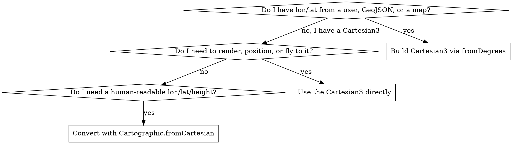

# CesiumJS Coordinates

## Overview

CesiumJS positions everything on a true WGS84 globe. There are two position
types and one orientation type, and confusing them is the single most common
positioning bug.

- `Cartesian3` : an ECEF (Earth-centered, Earth-fixed) point in **meters**. The
  `x`, `y`, `z` are geocentric, NOT longitude/latitude/height. This is what
  almost every API consumes (`entity.position`, `camera.destination`,
  `modelMatrix` origins).
- `Cartographic` : longitude and latitude in **radians** plus height in meters.
  This is a geographic description, NOT a renderable position.
- `HeadingPitchRoll` : an orientation in **radians**, applied inside a local
  reference frame built by `Transforms`.

The verified API surface is in `references/methods.md`. Runnable code is in
`references/examples.md`. Failure modes are in `references/anti-patterns.md`.

## Core Rules

- ALWAYS create a position from geographic input with
  `Cesium.Cartesian3.fromDegrees(lon, lat, height)`. NEVER pass longitude and
  latitude into `new Cesium.Cartesian3()`; that constructor takes raw ECEF
  x/y/z meters and lon/lat values produce a point near the Earth center.
- Cartographic `longitude` and `latitude` are ALWAYS radians. Only the
  `fromDegrees` factory converts. The constructor `new Cesium.Cartographic()`
  and the `.longitude` / `.latitude` fields are radians with no conversion.
- NEVER pass a `Cartographic` where a `Cartesian3` is expected. Convert first
  with `Cesium.Cartographic.toCartesian(carto)` or
  `Cesium.Ellipsoid.WGS84.cartographicToCartesian(carto)`.
- ALWAYS pass `height` in meters explicitly. Omitting it defaults to `0.0`
  (the ellipsoid surface), which places geometry underground wherever terrain
  rises above the ellipsoid.
- Cartesian3 `x`/`y`/`z` are geocentric meters. NEVER read `.x` as longitude or
  `.z` as height.
- HeadingPitchRoll `heading`, `pitch`, `roll` are ALWAYS radians. Use
  `Cesium.HeadingPitchRoll.fromDegrees(h, p, r)` for degree input.

## Quick Reference

| Goal | Call | Returns |
|------|------|---------|
| Lon/lat/height to position | `Cartesian3.fromDegrees(lon, lat, height)` | `Cartesian3` (ECEF meters) |
| Radian lon/lat to position | `Cartesian3.fromRadians(lon, lat, height)` | `Cartesian3` |
| Many lon/lat pairs to positions | `Cartesian3.fromDegreesArray([lon, lat, ...])` | `Cartesian3[]` |
| Many lon/lat/height triples | `Cartesian3.fromDegreesArrayHeights([lon, lat, h, ...])` | `Cartesian3[]` |
| Position to geographic | `Cartographic.fromCartesian(position)` | `Cartographic` (radians) |
| Cartographic to position | `Cartographic.toCartesian(carto)` | `Cartesian3` |
| Radian field to degrees | `Cesium.Math.toDegrees(carto.longitude)` | `number` |
| Degrees to radians | `Cesium.Math.toRadians(deg)` | `number` |
| Local ENU frame at a point | `Transforms.eastNorthUpToFixedFrame(origin)` | `Matrix4` |
| Oriented local frame | `Transforms.headingPitchRollToFixedFrame(origin, hpr)` | `Matrix4` |
| Degrees to HeadingPitchRoll | `HeadingPitchRoll.fromDegrees(heading, pitch, roll)` | `HeadingPitchRoll` |

All signatures verified against the CesiumJS API reference. Full parameter
lists are in `references/methods.md`.

## Which Type Do I Use



Rule: APIs that **render or move** (entity `position`, `camera.flyTo`
`destination`, `modelMatrix`) ALWAYS take `Cartesian3`. `Cartographic` exists
only to read or describe a location in lon/lat/height.

## Position Conversion Patterns

### Geographic input to a position

```javascript
// Longitude first, then latitude, then height in meters. ALWAYS pass height.
const position = Cesium.Cartesian3.fromDegrees(-75.1652, 39.9526, 30.0);

const entity = viewer.entities.add({
  position: position,
  point: { pixelSize: 12, color: Cesium.Color.YELLOW },
});
```

`fromDegrees` order is `(longitude, latitude, height, ellipsoid, result)`.
Latitude before longitude is wrong and silently puts the point in the wrong
hemisphere. See `references/anti-patterns.md`.

### A position back to longitude and latitude

```javascript
// fromCartesian returns a Cartographic whose fields are RADIANS.
const carto = Cesium.Cartographic.fromCartesian(entity.position.getValue(
  viewer.clock.currentTime,
));

const lonDeg = Cesium.Math.toDegrees(carto.longitude);
const latDeg = Cesium.Math.toDegrees(carto.latitude);
const heightMeters = carto.height; // height is already meters, no conversion
```

NEVER print `carto.longitude` as if it were degrees. A radian value of `1.31`
is not `1.31` degrees.

### Many coordinates at once

```javascript
// Pairs: [lon, lat, lon, lat, ...]. All clamped to height 0.
const ring = Cesium.Cartesian3.fromDegreesArray([
  -75.17, 39.95, -75.16, 39.95, -75.16, 39.96, -75.17, 39.96,
]);

// Triples with explicit heights: [lon, lat, height, ...].
const path = Cesium.Cartesian3.fromDegreesArrayHeights([
  -75.17, 39.95, 100.0, -75.16, 39.96, 250.0,
]);
```

## The Ellipsoid

Every geographic-to-Cartesian conversion uses an ellipsoid. The default is
WGS84.

- `Cesium.Ellipsoid.WGS84` : the WGS84 reference ellipsoid instance.
- `Cesium.Ellipsoid.default` : a **settable** property used whenever an
  `ellipsoid` argument is omitted. It is WGS84 unless reassigned.

```javascript
// Reassign ONCE, before constructing the Viewer, if a non-Earth body is used.
Cesium.Ellipsoid.default = Cesium.Ellipsoid.MOON;
```

ALWAYS set `Ellipsoid.default` before constructing the `Viewer`. Reassigning it
after positions are already computed leaves a scene with mixed-ellipsoid data.
For Earth work, leave it at WGS84 and omit the `ellipsoid` argument.

The ellipsoid also converts directly:

```javascript
const carto = Cesium.Cartographic.fromDegrees(4.9, 52.37, 12.0);
const position = Cesium.Ellipsoid.WGS84.cartographicToCartesian(carto);
const back = Cesium.Ellipsoid.WGS84.cartesianToCartographic(position);
```

`cartesianToCartographic` returns `undefined` if the input is at the ellipsoid
center. ALWAYS guard the result before reading `.longitude`.

## Local Reference Frames

ECEF axes do not align with "up" or "north" at a given location. To place an
oriented object (a model, a building, a sensor cone), build a **local frame**
as a `Matrix4` and assign it as a `modelMatrix`.

### East-North-Up frame

```javascript
const origin = Cesium.Cartesian3.fromDegrees(-75.1652, 39.9526, 0.0);
// x = east, y = north, z = up at the origin.
const enuMatrix = Cesium.Transforms.eastNorthUpToFixedFrame(origin);
```

### Oriented frame from HeadingPitchRoll

```javascript
const origin = Cesium.Cartesian3.fromDegrees(-75.1652, 39.9526, 0.0);
const hpr = Cesium.HeadingPitchRoll.fromDegrees(45.0, 0.0, 0.0); // 45 deg heading
const modelMatrix = Cesium.Transforms.headingPitchRollToFixedFrame(origin, hpr);

const model = scene.primitives.add(
  await Cesium.Model.fromGltfAsync({ url: "model.glb", modelMatrix }),
);
```

`headingPitchRollToFixedFrame` signature is
`(origin, headingPitchRoll, ellipsoid, fixedFrameTransform, result)`. The
`fixedFrameTransform` defaults to the ENU generator.

### Non-ENU axis order

```javascript
// Generate a frame builder with a different first/second axis.
const nwuFromFixedFrame = Cesium.Transforms.localFrameToFixedFrameGenerator(
  "north", "west",
);
const matrix = nwuFromFixedFrame(origin);
```

Valid axis names are `"east"`, `"north"`, `"up"`, `"west"`, `"south"`,
`"down"`. The third axis is derived.

## HeadingPitchRoll Semantics

Per the CesiumJS reference, in the local frame:

- `heading` : rotation about the negative z axis. In an ENU frame this is a
  clockwise rotation measured from north. Heading `0` faces north.
- `pitch` : rotation about the negative y axis. Tilts the nose up or down.
- `roll` : rotation about the positive x axis. Rotates about the forward axis.

All three are radians. ALWAYS use `HeadingPitchRoll.fromDegrees(h, p, r)` for
degree input. NEVER assign degrees to `.heading` directly.

## Common Mistakes

| Mistake | Symptom | Fix |
|---------|---------|-----|
| `new Cartesian3(lon, lat, height)` | Object sits near the Earth center | Use `Cartesian3.fromDegrees` |
| Latitude passed before longitude | Object in the wrong hemisphere | Order is `(lon, lat, height)` |
| Reading `carto.longitude` as degrees | Coordinate off by a factor of ~57 | Wrap in `Cesium.Math.toDegrees` |
| Passing a `Cartographic` as `position` | NaN or invisible geometry | Convert with `Cartographic.toCartesian` |
| Omitting `height` over terrain | Geometry buried underground | Pass explicit meters, or clamp to ground |
| Degrees assigned to `hpr.heading` | Object spins wildly | Use `HeadingPitchRoll.fromDegrees` |
| `new Cesium.Cartesian3()` after 1.139 expecting a plain object | Confusion: it is an ES6 class | It is still constructible; just never feed it lon/lat |

Full diagnosis of each is in `references/anti-patterns.md`.

## Note on ES6 Named Imports

With `import { ... } from "cesium"`, the `Math` namespace collides with the
JavaScript global. ALWAYS alias it:

```javascript
import { Cartesian3, Math as CesiumMath } from "cesium";
const radians = CesiumMath.toRadians(45.0);
```

Examples in this skill use the `Cesium.` namespace prefix for clarity. Import
configuration is owned by `cesium-impl-build-deploy`.

## Reference Files

- `references/methods.md` : verified signatures for Cartesian3, Cartographic,
  Ellipsoid, Transforms, HeadingPitchRoll, and the Math helpers.
- `references/examples.md` : complete runnable conversion and placement
  examples.
- `references/anti-patterns.md` : every NaN, off-globe, and wrong-place failure
  mode with root cause and fix.

## Related Skills

- `cesium-core-architecture` : where `Scene`, `Globe`, and `Camera` live.
- `cesium-syntax-gltf-model` : `Model.fromGltfAsync` and `modelMatrix` usage.
- `cesium-errors-coordinates` : deeper debugging of NaN and off-globe geometry.
- `cesium-impl-aec-georef` : georeferencing BIM and city models with these
  transforms.
