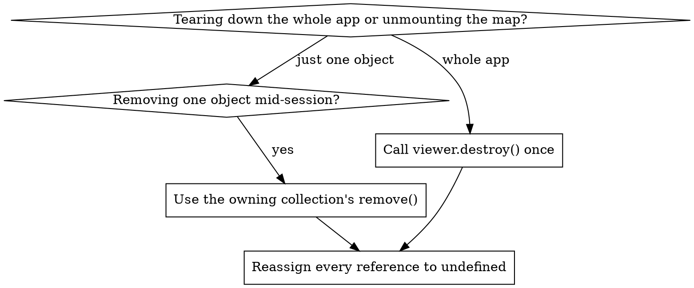

# CesiumJS Memory

## Overview

CesiumJS holds GPU resources (textures, buffers, shaders, a WebGL context) that
the JavaScript garbage collector cannot reclaim. Dropping a reference to a
`Viewer`, `Cesium3DTileset`, `Primitive`, or `DataSource` does NOT free its GPU
memory. Every such object exposes an explicit `destroy()` that must be called.

This skill covers four failure modes:

- GPU memory leaks from skipped `destroy()` calls.
- The roughly 16 WebGL contexts per browser tab limit.
- WebGL context loss and recovery.
- Distinguishing a real CesiumJS leak from a retained JavaScript reference.

Verified signatures are in `references/methods.md`. Runnable teardown code is in
`references/examples.md`. Failure modes are in `references/anti-patterns.md`.

## Core Rules

- ALWAYS call `destroy()` on a `Viewer`, `Cesium3DTileset`, `Primitive`, or
  `DataSource` before dropping the last reference to it. GPU resources are NOT
  garbage-collected.
- After `destroy()`, NEVER call any method except `isDestroyed()`. Any other
  call throws `DeveloperError`. ALWAYS reassign the reference to `undefined`.
- NEVER destroy the same object twice. One owner destroys each object exactly
  once. NEVER wrap `destroy()` in a try/catch to swallow a double-destroy error;
  fix the ownership instead.
- ALWAYS reuse one `Viewer` across views. NEVER construct a fresh `Viewer` on
  every route change or component remount without destroying the previous one.
- `viewer.dataSources.remove(ds)` does NOT destroy the data source: the
  `destroy` parameter defaults to `false`. ALWAYS pass `true` to free it.
- `scene.primitives.remove(primitive)` DOES destroy the primitive by default
  (`destroyPrimitives` is `true`). NEVER also call `primitive.destroy()` after.
- ALWAYS remove every event listener (DOM and CesiumJS `Event`) you added
  before destroying the `Viewer`. A retained listener keeps the whole graph
  alive.

## Quick Reference

| Object | Free it with | Notes |
|--------|--------------|-------|
| `Viewer` / `CesiumWidget` | `viewer.destroy()` | Call before removing the container from the DOM |
| `Cesium3DTileset` | `scene.primitives.remove(tileset)` | `destroyPrimitives` true destroys it; do not double-destroy |
| `Primitive` | `scene.primitives.remove(primitive)` | Same as above |
| `DataSource` | `viewer.dataSources.remove(ds, true)` | The `true` is required; default is `false` |
| All data sources | `viewer.dataSources.removeAll(true)` | The `true` is required |
| Tileset GPU budget | `tileset.cacheBytes` | Default 536870912 bytes (512 MiB) |
| Tileset overflow budget | `tileset.maximumCacheOverflowBytes` | Default 536870912 bytes (512 MiB) |
| Render-loop errors | `scene.renderError` event | See context loss below |
| Check destroyed state | `object.isDestroyed()` | The only safe call after `destroy()` |

## Teardown Ordering



Rule: there is exactly one owner per object. `viewer.destroy()` tears down the
`Scene` and its primitive collections, so a tileset that lives in
`scene.primitives` is freed by `viewer.destroy()`. NEVER also call
`tileset.destroy()` in that case. For mid-session removal, let the owning
collection do the destroy.

Correct full-teardown sequence:

1. Remove every DOM and CesiumJS `Event` listener you added.
2. Destroy any `ScreenSpaceEventHandler` you constructed yourself.
3. Call `viewer.destroy()` once.
4. Reassign `viewer` and every cached tileset/primitive/handler to `undefined`.

## Destroy Patterns

```javascript
// Full teardown of a Viewer.
function teardown(viewer) {
  if (viewer && !viewer.isDestroyed()) {
    viewer.destroy();
  }
  return undefined; // assign the return value back to the variable
}

viewer = teardown(viewer);
```

```javascript
// Remove a tileset mid-session. The collection destroys it.
const removed = scene.primitives.remove(tileset);
tileset = undefined; // do NOT call tileset.destroy() afterwards
```

```javascript
// Remove a data source mid-session. The `true` is mandatory.
viewer.dataSources.remove(dataSource, true);
dataSource = undefined;
```

The `isDestroyed()` guard before `destroy()` is correct and is not a fallback:
it prevents a double-destroy `DeveloperError` when teardown can be reached by
more than one code path (for example a React unmount plus an explicit close
button). It does NOT mask a bug; double-destroy is a real ownership question.

## Tileset GPU Budget

A `Cesium3DTileset` caches tile content in GPU memory. Two properties bound it:

- `cacheBytes` : the GPU memory budget for cached tiles. Default `536870912`
  bytes (512 MiB).
- `maximumCacheOverflowBytes` : extra memory allowed beyond `cacheBytes` when
  the current view needs it. Default `536870912` bytes (512 MiB).

```javascript
const tileset = await Cesium.Cesium3DTileset.fromIonAssetId(96188, {
  cacheBytes: 256 * 1024 * 1024,            // 256 MiB on a constrained device
  maximumCacheOverflowBytes: 128 * 1024 * 1024,
});
```

ALWAYS lower `cacheBytes` for memory-constrained devices (mobile, embedded
kiosks). The legacy property `maximumMemoryUsage` was deprecated in 1.107 and
removed in 1.110. NEVER emit `maximumMemoryUsage`; it does not exist in 1.124+.

## The WebGL Context Budget

Browsers cap the number of live WebGL contexts per tab at roughly 16. Each
`Viewer` and `CesiumWidget` owns exactly one context. `viewer.destroy()` does
not always release the context immediately (CesiumGS/cesium issue #11533), so
rapid create/destroy cycles exhaust the budget.

- ALWAYS reuse a single long-lived `Viewer`. Swap data sources and tilesets
  in and out instead of rebuilding the `Viewer`.
- NEVER mount a new `Viewer` per route or per component render without
  destroying the previous one first.
- Symptom of exhaustion: a console warning about too many active WebGL
  contexts, and a newly created `Viewer` renders a blank canvas.

## WebGL Context Loss

A WebGL context can be lost when the GPU is under memory pressure (the
`CONTEXT_LOST_WEBGL` condition). Handle it on two surfaces:

```javascript
// 1. The standard DOM event on the canvas.
viewer.canvas.addEventListener("webglcontextlost", (event) => {
  event.preventDefault(); // required to allow a later restore
}, false);

// 2. The CesiumJS render-loop error event.
viewer.scene.renderError.addEventListener((scene, error) => {
  console.error("Render error:", error);
});
```

`scene.renderError` fires when an error is thrown inside `render`. The handler
receives the `Scene` and the error. `scene.rethrowRenderErrors` controls what
happens next: when `false` (default behavior) `render` returns normally after
raising the event; when `true` the error is rethrown after the event. Keep it
`false` in production so one bad frame does not kill the render loop.

CesiumJS does not provide rich automatic context-loss recovery. A reliable
recovery is a full teardown of the `Viewer` followed by reconstruction.

## Real Leak Versus Lost Reference

CesiumJS pools and reuses memory, so the JavaScript heap not shrinking right
after a `remove()` is NOT proof of a leak. Confirm before chasing one:

1. Run a complete create-use-destroy cycle, then force GC in DevTools.
2. Take heap snapshots before the cycle and after GC; compare retained size.
3. If a destroyed `Viewer`, tileset, or your own objects are still retained,
   inspect the retainer chain.

The most common cause of an apparent leak is a retained JavaScript reference,
not a CesiumJS bug: a closure capturing the `Viewer`, an array still holding
removed entities, or an event listener that was never removed. Verified leak
patterns and their fixes are in `references/anti-patterns.md`.

## Common Mistakes

| Mistake | Symptom | Fix |
|---------|---------|-----|
| Dropping a `Viewer` reference without `destroy()` | Heap and GPU memory climb | `viewer.destroy()` first |
| New `Viewer` per route, old one kept | Blank canvas after ~16 navigations | Reuse one `Viewer` |
| `dataSources.remove(ds)` without `true` | Data source memory never freed | Pass `destroy` as `true` |
| `primitive.destroy()` after `primitives.remove()` | `DeveloperError` thrown | Remove OR destroy, not both |
| Using an object after `destroy()` | `DeveloperError` thrown | Reassign to `undefined` |
| Event listeners never removed | Whole graph stays alive | Remove every listener before teardown |
| `maximumMemoryUsage` set | No effect; property removed | Use `cacheBytes` |

## Reference Files

- `references/methods.md` : verified signatures for `destroy`/`isDestroyed`,
  the collection remove methods, tileset budget properties, and the context
  loss API.
- `references/examples.md` : complete teardown sequences, a React unmount
  pattern, and a context loss handler.
- `references/anti-patterns.md` : every leak and crash mode with root cause
  and fix.

## Related Skills

- `cesium-core-architecture` : the `Viewer` / `Scene` / `Globe` hierarchy.
- `cesium-core-performance` : `requestRenderMode` and tileset LOD tuning.
- `cesium-errors-memory` : deeper debugging of leaks and context budget
  exhaustion.
- `cesium-errors-rendering` : blank globe and context loss diagnosis.
