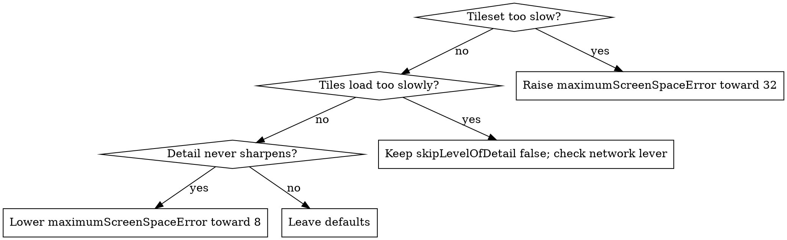

# CesiumJS Core Performance

## Overview

CesiumJS performance is governed by five independent levers: how often a frame is
rendered, how aggressively 3D Tiles drop detail, how expensive each frame is to draw,
how network requests are throttled, and how heavy work is offloaded to Web Workers.

Core principle: ALWAYS measure first, then apply the lever that targets the measured
bottleneck. NEVER raise `maximumScreenSpaceError` or change render settings by guess;
an unmeasured change trades visual quality for a speedup that may not address the real
cost.

This skill is technology-specific: CesiumJS 1.124+, WebGL2 only.

## When to Use This Skill

- The frame rate is low, the scene stutters, or camera movement is not smooth.
- The application drains battery or keeps the GPU busy on a static scene.
- A 3D Tileset loads slowly, pops in late, or never reaches full detail.
- Network requests storm the server or queue endlessly.
- Heavy per-frame computation blocks the main thread.
- A performance change must be chosen deliberately, not by trial and error.

## Quick Reference

| Lever | API | Targets |
|-------|-----|---------|
| Render frequency | `requestRenderMode`, `maximumRenderTimeChange` | static-scene battery and GPU cost |
| Tileset detail | `maximumScreenSpaceError`, `skipLevelOfDetail`, `preferLeaves`, `preloadWhenHidden` | 3D Tiles draw and load cost |
| Frame cost | `Scene.fog`, `logarithmicDepthBuffer`, `msaaSamples` | per-frame GPU work |
| Network | `RequestScheduler.maximumRequestsPerServer` | request concurrency and storms |
| Offload | `TaskProcessor` | main-thread blocking |
| Measure | `Scene.debugShowFramesPerSecond` | the bottleneck itself |

## Step 1: Measure Before Changing Anything

ALWAYS turn on the frame-rate overlay before applying any lever.

```js
viewer.scene.debugShowFramesPerSecond = true;
```

The overlay shows frames per second and milliseconds per frame. ALWAYS record the
baseline, apply ONE lever, and re-read the overlay. NEVER stack several changes at once;
a stacked change hides which lever helped.

A low frame rate with a high millisecond count is a per-frame GPU cost (use the frame
levers). A frame rate that is fine but the scene still drains battery is a render-
frequency problem (use `requestRenderMode`). Slow tile appearance with a healthy frame
rate is a network or LOD problem.

## Lever 1: requestRenderMode for Static Scenes

By default CesiumJS renders every animation frame even when nothing changed. For a
static or rarely-changing scene this is the largest waste of GPU and battery.

ALWAYS set `requestRenderMode: true` for a static scene. In this mode a frame renders
only on a detected change. Set `maximumRenderTimeChange: Infinity` when there is no
time-dynamic data, so the clock alone never forces a frame.

```js
const viewer = new Cesium.Viewer("cesiumContainer", {
  requestRenderMode: true,
  maximumRenderTimeChange: Infinity,
});
```

After ANY manual change Cesium cannot detect, ALWAYS call `viewer.scene.requestRender()`.
The render-loop mechanics are covered in depth by `cesium-core-architecture`.

## Lever 2: 3D Tileset Level of Detail

`Cesium3DTileset` chooses tile detail from `maximumScreenSpaceError` (default `16`).
Higher means coarser tiles and a faster scene; lower means sharper tiles and a slower
scene.



Verified tileset levers and their defaults:

| Member | Default | Effect |
|--------|---------|--------|
| `maximumScreenSpaceError` | `16` | higher: coarser and faster |
| `foveatedScreenSpaceError` | `true` | allows higher error at the screen edge |
| `dynamicScreenSpaceError` | `true` | relaxes error for distant tiles |
| `skipLevelOfDetail` | `false` | when true, skips intermediate levels |
| `preferLeaves` | `false` | when true, requests leaf tiles sooner |
| `preloadWhenHidden` | `false` | when true, keeps loading while `show` is false |
| `cullRequestsWhileMoving` | `true` | drops requests for tiles soon out of view |
| `preloadFlightDestinations` | `true` | preloads tiles at a `flyTo` destination |

- ALWAYS raise `maximumScreenSpaceError` first when a tileset is the bottleneck. A
  value of `32` roughly halves the tile count versus the default.
- NEVER raise `maximumScreenSpaceError` past the point where the scene is visibly
  blurry; the error value is the quality budget.
- ALWAYS leave `skipLevelOfDetail` at `false` unless progressive coarse-to-fine
  refinement is explicitly wanted; `true` increases peak memory and request bursts.
- ALWAYS set `preloadWhenHidden: false` (the default) for tilesets toggled on and off;
  `true` wastes bandwidth and memory on hidden content.

## Lever 3: Per-Frame Render Cost

| Member | Default | Effect |
|--------|---------|--------|
| `scene.fog.enabled` | `true` | fog culls distant terrain tiles and requests |
| `scene.fog.density` | `0.0006` | higher density culls more distant geometry |
| `scene.logarithmicDepthBuffer` | enabled where supported | fewer depth passes |
| `scene.msaaSamples` | `4` | anti-aliasing sample count; `1` disables MSAA |

- ALWAYS keep `scene.fog.enabled` at `true`; disabling fog increases distant terrain
  requests and frame cost.
- ALWAYS lower `scene.msaaSamples` to `1` or `2` on low-end GPUs when the millisecond
  count is high; `4` is the heaviest setting.
- NEVER disable `logarithmicDepthBuffer` to chase performance; it reduces multi-frustum
  passes and removes z-fighting.

## Lever 4: Network Throttling with RequestScheduler

`RequestScheduler` is a static utility class; it is configured, never instantiated.

| Static member | Default | Effect |
|---------------|---------|--------|
| `maximumRequests` | `50` | total simultaneous requests |
| `maximumRequestsPerServer` | `18` | simultaneous requests per host |
| `requestsByServer` | object | per-host overrides |
| `throttleRequests` | `true` | when false, the browser queues all requests |

- ALWAYS keep `throttleRequests` at `true`; disabling it lets a tile storm overwhelm
  the server.
- ALWAYS add a `requestsByServer` entry for a CDN that allows more concurrency than
  the default `18`, instead of raising the global limit.

```js
Cesium.RequestScheduler.requestsByServer["tiles.example.com:443"] = 30;
```

## Lever 5: Offloading Work with TaskProcessor

`TaskProcessor` wraps a Web Worker. Use it to move heavy computation off the main
thread so the render loop keeps a steady frame rate.

```js
const processor = new Cesium.TaskProcessor("myWorker.js", 5);
const promise = processor.scheduleTask({ data }, [data.buffer]);
```

- `scheduleTask(parameters, transferableObjects)` returns a `Promise` for the result,
  or `undefined` when more than `maximumActiveTasks` are already active.
- ALWAYS check for an `undefined` return and retry the task on a later frame; an
  `undefined` is a back-pressure signal, NOT an error.
- ALWAYS call `processor.destroy()` during teardown; the worker is not garbage-
  collected and leaks otherwise.

## Common Mistakes

| Mistake | Fix |
|---------|-----|
| Raising `maximumScreenSpaceError` without measuring | Measure with `debugShowFramesPerSecond` first |
| Continuous render on a static scene | `requestRenderMode: true` |
| `skipLevelOfDetail: true` causing memory spikes | Leave it `false` unless progressive load is wanted |
| `msaaSamples: 8` on a low-end GPU | Lower to `1` or `2` |
| Disabling `throttleRequests` | Keep throttling; override per server instead |
| Ignoring an `undefined` from `scheduleTask` | Treat it as back-pressure and retry |
| Never calling `TaskProcessor.destroy()` | Destroy the processor during teardown |

Full root-cause analysis is in `references/anti-patterns.md`.

## Reference Files

- `references/methods.md` : verified members, defaults, and signatures for every
  performance lever.
- `references/examples.md` : runnable measurement, `requestRenderMode`, tileset LOD
  tuning, frame-cost tuning, `RequestScheduler`, and `TaskProcessor` examples.
- `references/anti-patterns.md` : performance failure modes, each with symptom, root
  cause, prevention, and recovery.

## Related Skills

- `cesium-core-architecture` : the render loop and `requestRenderMode` mechanics.
- `cesium-core-memory` : `destroy()`, `cacheBytes`, and the WebGL context budget.
- `cesium-syntax-3d-tiles` : `Cesium3DTileset` loading and formats.
- `cesium-impl-3d-tiles-styling` : tileset styling and optimization workflow.
- `cesium-errors-rendering` : blank globe and context-loss diagnosis.
