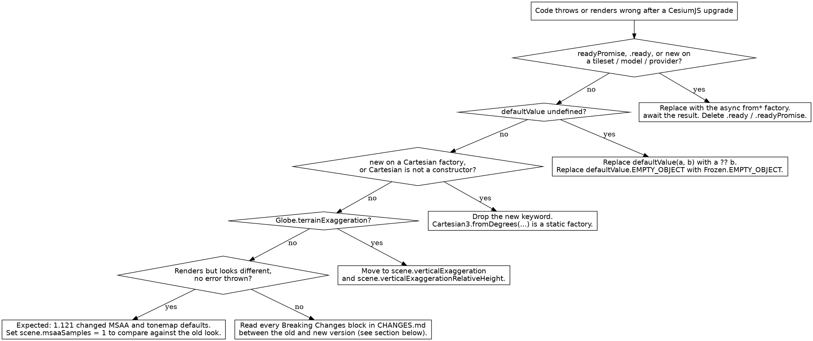

# CesiumJS Versioning and Migration

## Overview

CesiumJS releases monthly. Between versions 1.104 and 1.142 a set of
constructor, utility, and rendering changes turned most pre-2023 example code
into code that throws at runtime. This skill maps every relevant change and
gives a deterministic migration path for each legacy pattern.

**Core principle:** CesiumJS 1.124+ is the async-factory era. Resources that
touch the network (tilesets, models, terrain, imagery) ALWAYS load through a
static `from*` factory that returns a `Promise`. The synchronous `new` +
`readyPromise` pattern was removed in 1.107 and NEVER works on a 1.124+ target.

## When to Use This Skill

Use this skill when ANY of these symptoms appear:

- `TypeError: tileset.readyPromise is not a function` or `... is undefined`
- `TypeError: Cesium.Cesium3DTileset is not a constructor` when called with `new`
- `ReferenceError: defaultValue is not defined` or `Cesium.defaultValue is not a function`
- `Cesium.Cartesian3.fromDegrees is not a constructor` (calling `new` on a factory)
- `createWorldTerrain is not a function`
- `ModelExperimental` referenced anywhere in a codebase
- Code copied from an old Sandcastle, blog post, or tutorial silently fails
- A scene renders but looks visually different after a CesiumJS upgrade
- A question of the form "what version introduced X" or "how do I upgrade"

Do NOT use this skill for a blank globe caused by a missing `CESIUM_BASE_URL`
or a missing ion token. That is a build or configuration fault: see
`cesium-errors-rendering` and `cesium-impl-build-deploy`.

## The Async Era: One Rule

ALWAYS construct network-backed resources with their async factory and `await`
the result. NEVER use `new` on a tileset, model, or provider, and NEVER read
`.ready` or `.readyPromise`.

```js
// MODERN : the awaited result is fully loaded and ready to use.
const tileset = await Cesium.Cesium3DTileset.fromIonAssetId(69380);
viewer.scene.primitives.add(tileset);
await viewer.zoomTo(tileset);
```

The awaited factory result replaces every old readiness signal. There is no
`.ready` flag to poll and no `.readyPromise` to chain, because the `await`
already guarantees the resource is ready.

## Version Matrix: Baseline Changes (pre-1.124, baked into the target)

Every change below already took effect before the 1.124 support floor. Legacy
code written against an older release hits these as hard failures.

| Version | Change | Migration impact |
|---------|--------|------------------|
| 1.104 | Async factory constructors added; `readyPromise` deprecated | Synchronous `new` + `readyPromise` patterns start failing |
| 1.107 | `readyPromise` and `.ready` removed; `createWorldTerrain` removed | Hard break: pre-1.104 patterns throw |
| 1.113 | Vertical exaggeration moved to `Scene.verticalExaggeration` | `Globe.terrainExaggeration` code breaks |
| 1.114 to 1.115 | `HeightReference` gains `CLAMP_TO_TERRAIN` / `CLAMP_TO_3D_TILE`; `disableCollision` renamed `enableCollision` | Clamping and collision flags shift |
| 1.117 | `ClippingPolygon` + `ClippingPolygonCollection` added | New capability, no break |
| 1.119 | `Ellipsoid.default` introduced | Implicit ellipsoid resolves through one global default |
| 1.121 | MSAA on by default (4 samples); PBR Neutral tonemap default | Rendered output looks different from older versions |
| 1.123 | `entities`, `dataSources`, `zoomTo`, `flyTo` added to `CesiumWidget` | API surface widens, no break |

## Version Matrix: Within the 1.124 to 1.142 Window

| Version | Change | Migration impact |
|---------|--------|------------------|
| 1.127 | Voxel API (`VoxelProvider`, `EXT_primitive_voxels`) | New experimental API |
| 1.134 | `defaultValue()` removed; `defaultValue.EMPTY_OBJECT` removed | Copied legacy utility code breaks |
| 1.135 to 1.142 | `EdgeDisplayMode`, `EXT_mesh_primitive_edge_visibility` | New AEC CAD-edge capability |
| 1.139 | `Cartesian2` / `Cartesian3` / `Cartesian4` converted to ES6 classes | `new` on a Cartesian static factory throws |
| 1.142 | Current latest release | Recommended target baseline |

Verified against the official `CHANGES.md` on 2026-05-20. The full per-version
detail and exact changelog quotes are in `references/methods.md`.

## Legacy Pattern Detection

Scan a codebase for the tokens in the left column. Each one is a removed or
broken API on a 1.124+ target. The right column is the ONLY correct
replacement.

| Legacy token (NEVER use on 1.124+) | Status | Modern replacement |
|------------------------------------|--------|--------------------|
| `new Cesium3DTileset({ url })` | Removed 1.107 | `await Cesium3DTileset.fromUrl(url)` |
| `new Cesium3DTileset({ url: IonResource.fromAssetId(id) })` | Removed 1.107 | `await Cesium3DTileset.fromIonAssetId(id)` |
| `tileset.readyPromise` / `provider.readyPromise` | Removed 1.107 | Resolve the factory promise with `await` |
| `tileset.ready` / `provider.ready` | Removed 1.107 | The awaited factory result is already ready |
| `Cesium.Model.fromGltf(...)` | Removed | `await Cesium.Model.fromGltfAsync(...)` |
| `ModelExperimental` | Removed (merged into `Model`) | `Model` |
| `new CesiumTerrainProvider({ url })` | Removed 1.107 | `await CesiumTerrainProvider.fromUrl(url)` |
| `Cesium.createWorldTerrain()` | Removed 1.107 | `await Cesium.createWorldTerrainAsync()` |
| `new IonImageryProvider({ assetId })` | Removed 1.107 | `await IonImageryProvider.fromAssetId(id)` |
| `Cesium.defaultValue(a, b)` | Removed 1.134 | `a ?? b` |
| `Cesium.defaultValue.EMPTY_OBJECT` | Removed 1.134 | `Cesium.Frozen.EMPTY_OBJECT` |
| `new Cesium.Cartesian3.fromDegrees(...)` | Throws since 1.139 | `Cesium.Cartesian3.fromDegrees(...)` |
| `globe.terrainExaggeration` | Removed 1.113 | `scene.verticalExaggeration` |

The full grep-ready regex catalog for automated detection is in
`references/anti-patterns.md`.

## Decision Tree: Migrating Legacy Code



## Migration 1: Async Factory Constructors (1.104 / 1.107)

This is the single largest source of broken CesiumJS code. It affects
`Cesium3DTileset`, `Model`, every terrain provider, and every imagery provider.

```js
// LEGACY : removed in CesiumJS 1.107. This code throws on a 1.124+ target.
const tileset = new Cesium.Cesium3DTileset({
  url: Cesium.IonResource.fromAssetId(69380),
});
viewer.scene.primitives.add(tileset);
tileset.readyPromise.then(function () {
  viewer.zoomTo(tileset);
});
```

```js
// MODERN : async factory. await replaces the readyPromise chain entirely.
const tileset = await Cesium.Cesium3DTileset.fromIonAssetId(69380);
viewer.scene.primitives.add(tileset);
await viewer.zoomTo(tileset);
```

The factory rejects its promise on a load failure, so wrap the `await` in
`try / catch` to surface errors. The full factory list per class is in
`references/methods.md`; complete before/after ports are in
`references/examples.md`.

## Migration 2: defaultValue Removed (1.134)

The `defaultValue` helper was removed in 1.134. JavaScript nullish coalescing
covers the same intent and ships in every supported runtime.

```js
// LEGACY : removed in CesiumJS 1.134.
const height = Cesium.defaultValue(options.height, 0);
const opts = Cesium.defaultValue(options, Cesium.defaultValue.EMPTY_OBJECT);
```

```js
// MODERN : nullish coalescing and the Frozen constant.
const height = options.height ?? 0;
const opts = options ?? Cesium.Frozen.EMPTY_OBJECT;
```

`??` differs from `defaultValue` only in that it falls through on `null` and
`undefined` but NOT on `0`, `false`, or `""`. That difference is the correct
behavior and was a known bug class with the old helper.

## Migration 3: Cartesian ES6 Classes (1.139)

In 1.139 `Cartesian2`, `Cartesian3`, and `Cartesian4` became ES6 classes.
Calling `new` on one of their static factory methods now throws.

```js
// LEGACY : throws since CesiumJS 1.139. fromDegrees is a factory, not a constructor.
const pos = new Cesium.Cartesian3.fromDegrees(-75.0, 40.0, 100.0);
```

```js
// MODERN : call the static factory directly, with no new keyword.
const pos = Cesium.Cartesian3.fromDegrees(-75.0, 40.0, 100.0);
```

The real constructor `new Cesium.Cartesian3(x, y, z)` with raw numeric
components remains valid. Only `new` applied to a `from*` factory throws.

## Migration 4: Vertical Exaggeration Moved (1.113)

```js
// LEGACY : Globe-based exaggeration removed in 1.113.
viewer.scene.globe.terrainExaggeration = 2.0;
```

```js
// MODERN : vertical exaggeration is a Scene property and also affects 3D Tiles.
viewer.scene.verticalExaggeration = 2.0;
viewer.scene.verticalExaggerationRelativeHeight = 0.0;
```

## API Surface Change: Viewer to CesiumWidget (1.123)

In 1.123 the members `entities`, `dataSources`, `zoomTo`, and `flyTo` were
added to `CesiumWidget`. This is additive. Existing `Viewer` code is NOT
affected. Code that previously built a bare `CesiumWidget` and attached a
`DataSourceDisplay` by hand can now use the built-in members directly.

## Visual Behavior Changes (1.121)

Release 1.121 changed two rendering defaults. No code throws, but a scene
rendered against 1.124+ looks different from the same scene on an older build.

- **MSAA is on by default** at 4 samples. To restore the pre-1.121 aliased
  look or to measure cost, set `viewer.scene.msaaSamples = 1`.
- **PBR Neutral tonemapping** replaced ACES as the default tonemapper.
  Lit 3D Tiles and glTF models render with different brightness and color
  response. NEVER assume a scene looked identical across the 1.121 boundary.
  The tonemapper enum is documented in the API reference under `Scene`.

## How to Read CHANGES.md for a Migration

`CHANGES.md` in the CesiumGS/cesium repository is the authoritative change log.

1. ALWAYS fetch the raw form:
   `https://raw.githubusercontent.com/CesiumGS/cesium/main/CHANGES.md`.
   The rendered GitHub blob page does not expose the changelog text to an
   automated fetch.
2. Each release block carries subsections in this order: `### Breaking Changes`,
   `### Deprecated`, `### Additions`, `### Fixes`.
3. To plan an upgrade, read every `### Breaking Changes` and `### Deprecated`
   block for each release between the current version and the target version.
4. A `### Deprecated` notice ALWAYS names the version in which the API will be
   removed. Treat that as a hard deadline, not a suggestion.

## Common Mistakes

| Mistake | Consequence | Fix |
|---------|-------------|-----|
| Copying code from a pre-2023 Sandcastle or blog | `readyPromise` / `new` patterns throw | Apply Migration 1 |
| Adding `.then(...)` to a factory result | Chains on a resolved value, masks errors | `await` the factory, use `try / catch` |
| Calling `new` on `Cartesian3.fromDegrees` | Throws since 1.139 | Drop `new`, see Migration 3 |
| Pinning `cesium` to `latest` in `package.json` | Silent breaking change on install | Pin an exact version, upgrade deliberately |
| Assuming a scene renders identically after upgrade | Color and aliasing drift unnoticed | Check the 1.121 visual defaults |
| Skipping the `### Deprecated` blocks | Code breaks at the named removal version | Read deprecations, not only breaking changes |

## Reference Files

- `references/methods.md` : per-class async factory signatures, the full
  version matrix with exact `CHANGES.md` quotes, and the `CHANGES.md` section
  structure.
- `references/examples.md` : complete before/after migration ports, including
  a full legacy-to-modern bootstrap rewrite.
- `references/anti-patterns.md` : the grep-ready legacy-token regex catalog
  and each removed-API failure with symptom, root cause, and fix.

## Related Skills

- `cesium-syntax-3d-tiles` : the modern `Cesium3DTileset` async loading API.
- `cesium-syntax-gltf-model` : `Model.fromGltfAsync` usage.
- `cesium-syntax-terrain` : terrain provider async factories.
- `cesium-core-coordinates` : `Cartesian3` and `Cartographic` usage detail.
- `cesium-errors-tileset` : runtime tileset load failures.
- `cesium-agents-skill-validator` : automated deprecated-pattern detection.
