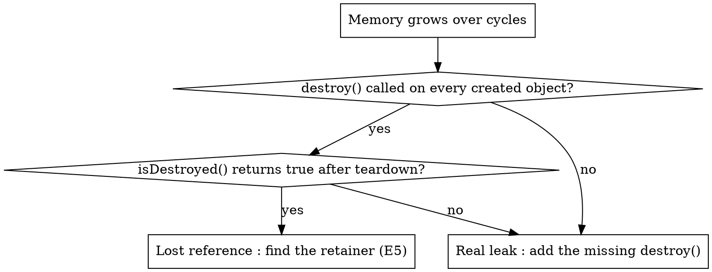

# Cesium Errors : Memory

## Overview

WebGL resources held by CesiumJS objects are NOT garbage collected. A texture,
vertex buffer, or shader stays on the GPU until something calls `destroy()` on
the object that owns it. Dropping the last JavaScript reference frees nothing.

Every CesiumJS memory bug reduces to one of two causes:

1. A `destroy()` call that never happened. This is a real leak.
2. A reference still held when you believe it was released. This is a
   lost-reference bug that only imitates a leak.

This skill separates the two and gives a deterministic teardown procedure.

## When to Use

- Heap or GPU memory climbs on every load, navigation, or add/remove cycle.
- The tab slows down, freezes, or crashes after the app runs a while.
- Console shows `WARNING: Too many active WebGL contexts. Oldest context will be lost.`
- Console throws `DeveloperError: This object was destroyed and should not be used.`
- An older map view goes blank while a newer one still renders.
- A Chrome heap snapshot diff shows CesiumJS objects surviving teardown.

## The Iron Rule

- ALWAYS call `destroy()` on every `Viewer`, `Cesium3DTileset`, `Model`, custom
  `Primitive`, custom `PrimitiveCollection`, and `ScreenSpaceEventHandler` you
  create, before you drop the reference.
- ALWAYS verify a teardown by checking `isDestroyed()` returns `true`.
- NEVER call any method except `isDestroyed()` on an object after `destroy()`.
  Doing so throws `DeveloperError`.
- NEVER construct a new `Viewer` on a code path that runs more than once.
  Create one `Viewer` and reuse it.
- NEVER assume removing a primitive frees GPU memory unless the collection's
  `destroyPrimitives` is `true` (see E3).

## Ownership and Teardown : Quick Reference

| Object | Freed by | Notes |
|--------|----------|-------|
| `Viewer` | `viewer.destroy()` | Cascades to `Scene`, globe, `scene.primitives`, owned imagery layers and data sources. |
| `Cesium3DTileset` or `Model` in `viewer.scene.primitives` | `viewer.destroy()` or `scene.primitives.remove(obj)` | `scene.primitives.destroyPrimitives` defaults `true`, so removal destroys the object. |
| A primitive you removed and kept | Already destroyed by `remove()` | After removal from a `destroyPrimitives: true` collection it is destroyed. Do NOT reuse it. |
| Custom `new PrimitiveCollection({ destroyPrimitives: false })` | You destroy each member, then the collection | `false` disables automatic destruction. |
| Entity in `viewer.entities` | `viewer.entities.remove()` or `removeAll()` | `EntityCollection` has NO `destroy()`. Visualizers free GPU primitives on the next render. |
| `DataSource` in `viewer.dataSources` | `viewer.dataSources.remove(ds, true)` | The `destroy` parameter defaults `false`. Pass `true` to free it. |
| `ScreenSpaceEventHandler` | `handler.destroy()` | The viewer does NOT own it. Always destroy it yourself. |

## Decision Tree : real leak or lost reference?

## Error Catalog

### E1 : WebGL resources leak after a dropped reference

- **Symptom** : GPU and heap memory climb every time a tileset, model, or
  primitive loads. The tab eventually slows or throws `CONTEXT_LOST_WEBGL`.
- **Root cause** : WebGL buffers, textures, and shaders are not garbage
  collected. Setting the variable to `null` or letting it leave scope frees
  nothing. Only `destroy()` releases GPU memory.
- **Prevention** : ALWAYS pair object creation with a `destroy()` in the
  matching teardown path. Objects inside `viewer.scene.primitives` are covered
  by a single `viewer.destroy()`. Destroy side-channel objects explicitly.
- **Recovery** : list every object created since startup; for each, confirm a
  `destroy()` runs on teardown; add the missing call; assert `isDestroyed()`.

### E2 : DeveloperError "This object was destroyed"

- **Symptom** : `DeveloperError: This object was destroyed and should not be
  used.` thrown when a method runs on a tileset, primitive, viewer, or handler.
- **Root cause** : the object was already destroyed, then reused. Common
  trigger : `scene.primitives.remove(primitive)` destroys the primitive because
  `PrimitiveCollection.destroyPrimitives` defaults to `true`; stale code keeps
  the reference. The same happens after `viewer.destroy()`.
- **Prevention** : after `remove()` or `destroy()`, set the reference to `null`
  immediately. Guard any reuse with `if (!obj.isDestroyed())`.
- **Recovery** : stop reusing the destroyed instance; recreate it through its
  async factory (`Cesium3DTileset.fromUrl`, `Model.fromGltfAsync`).

### E3 : Silent leak with destroyPrimitives set to false

- **Symptom** : heap grows across add/remove cycles even though `remove()` or
  `removeAll()` is called every time.
- **Root cause** : a `PrimitiveCollection` constructed with
  `{ destroyPrimitives: false }` does NOT destroy its members on `remove`,
  `removeAll`, or `destroy`. The caller owns destruction and skipped it.
- **Prevention** : keep `destroyPrimitives` at its default `true` unless
  primitives are deliberately shared between collections. When it must be
  `false`, call `destroy()` on each primitive yourself after removing it.
- **Recovery** : track members in an array; on clear, `destroy()` each one,
  then `removeAll()`.

### E4 : Memory retained after entity removal

- **Symptom** : after `viewer.entities.removeAll()`, CPU memory stays high;
  with very large entity counts the app stutters every tick.
- **Root cause** : `EntityCollection` has no `destroy()` method. Entity
  visualizers free the underlying GPU primitives lazily on the next render
  pass, and the per-tick visualizer loop scales with entity count. Historically
  about 100 MB per 5000 entities (issues #6534, #8767).
- **Prevention** : cap entity count; above roughly 10000 features migrate to
  `Cesium3DTileset` or batched `Primitive` plus `GeometryInstance`; reuse
  entities instead of churning remove and add.
- **Recovery** : call `removeAll()`, then allow one render pass so visualizers
  release primitives; for a hard reset, `viewer.destroy()` and create one fresh
  viewer.

### E5 : Heap grows but it is not a CesiumJS leak

- **Symptom** : a heap snapshot diff shows CesiumJS objects surviving an
  add/remove cycle even though `destroy()` was called.
- **Root cause** : CesiumJS pools and reuses memory, so modest steady-state
  growth is expected. A genuinely retained object is almost always held by
  application code : a closure, a module-level array, an un-removed event
  listener (`clock.onTick`, `scene.preRender`, `camera.changed`), a
  `requestAnimationFrame` callback, or framework state. XHR responses can also
  be retained by a pending `Request` (issue #8843).
- **Prevention** : store each CesiumJS object in exactly one owner; for every
  `addEventListener` on a CesiumJS `Event`, keep the returned remover function
  and call it on teardown.
- **Recovery** : take two Chrome heap snapshots around one cycle, diff
  retainers, and follow the retaining path to the application code holding the
  reference; remove that path. See `references/examples.md`.

### E6 : Too many active WebGL contexts

- **Symptom** : console warning `WARNING: Too many active WebGL contexts.
  Oldest context will be lost.`; an older Cesium view goes blank or throws
  `CONTEXT_LOST_WEBGL`.
- **Root cause** : a browser tab allows only about 16 live WebGL contexts. Each
  `Viewer` and each `CesiumWidget` holds one. Single-page-app route changes,
  React component re-mounts (StrictMode mounts twice in development), and modal
  open/close cycles create new viewers faster than old ones are destroyed.
  `viewer.destroy()` does not always release the context immediately
  (issue #11533).
- **Prevention** : create exactly ONE `Viewer` and reuse it across routes and
  components; ALWAYS call `viewer.destroy()` in the unmount or cleanup path;
  never construct a `Viewer` inside a function that runs on every render.
- **Recovery** : destroy every stray viewer; consolidate to a single long-lived
  viewer; in React, hold the viewer in a `useRef` and create it once.

## Teardown Ordering

`viewer.destroy()` cascades to its `Scene`, the globe, `scene.primitives`
(which destroys contained primitives because its `destroyPrimitives` is `true`),
and the imagery layers and data sources the viewer owns. Side-channel objects
are NOT covered. Tear down in this order:

1. Remove every CesiumJS event listener you added (`clock.onTick`,
   `scene.preRender`, `camera.changed`) by calling the remover that each
   `addEventListener` returned.
2. Call `destroy()` on every `ScreenSpaceEventHandler` you created.
3. Call `destroy()` on any custom `PrimitiveCollection` and on primitives it
   held with `destroyPrimitives: false`.
4. Call `viewer.destroy()` LAST.
5. Set the viewer reference and all child references to `null`.

NEVER read `viewer`, `viewer.scene`, or any child after step 4. A complete
React `useEffect` cleanup is in `references/examples.md`.

## Tileset Memory Budget

A `Cesium3DTileset` caps its GPU cache with `cacheBytes` (default `536870912`,
512 MiB) plus `maximumCacheOverflowBytes` (default `536870912`). Read
`tileset.totalMemoryUsageInBytes` to measure live usage. The removed
`maximumMemoryUsage` property no longer exists; code that sets it silently does
nothing. Lower `cacheBytes` to cap peak GPU memory at the cost of more tile
refetching. Signatures are in `references/methods.md`.

## Common Mistakes

| Mistake | Consequence | Fix |
|---------|-------------|-----|
| Setting a tileset variable to `null` without `destroy()` | GPU memory leaks | Remove it from `scene.primitives`, or call `tileset.destroy()` first |
| Reusing a primitive after `scene.primitives.remove()` | `DeveloperError` | Null the reference; recreate via the async factory |
| `new PrimitiveCollection({ destroyPrimitives: false })` then `removeAll()` | Silent leak | Destroy each member, or keep `destroyPrimitives` true |
| `viewer.dataSources.remove(ds)` without the destroy flag | DataSource leaks | Use `viewer.dataSources.remove(ds, true)` |
| New `Viewer` per React mount | 16-context budget exhausted | One viewer in a `useRef`, destroyed on unmount |
| Reading `viewer.scene` after `viewer.destroy()` | `DeveloperError` | Null references; never touch after destroy |

## Red Flags : STOP

- A variable holding a CesiumJS object is set to `null` and no `destroy()` ran first.
- A `Viewer` is constructed inside `render`, a `useEffect` without cleanup, or a loop.
- `destroyPrimitives: false` appears without a matching manual `destroy()` loop.
- An `addEventListener` on a CesiumJS `Event` has no paired remover on teardown.
- Code reads a property of an object after that object was removed or destroyed.

Each of these means a leak or a `DeveloperError` is already present. Fix before shipping.

## Reference Files

- `references/methods.md` : verified signatures and semantics of `destroy()`,
  `isDestroyed()`, `PrimitiveCollection.destroyPrimitives`,
  `DataSourceCollection.remove`, and the `Cesium3DTileset` memory budget.
- `references/examples.md` : a complete teardown function, a React `useEffect`
  cleanup, tileset memory-budget configuration, and a heap-snapshot workflow.
- `references/anti-patterns.md` : each memory anti-pattern with symptom, root
  cause, prevention, and recovery, traced to CesiumGS GitHub issues.

## Sources

Verified via WebFetch on 2026-05-20 against the CesiumJS API Reference
(https://cesium.com/learn/cesiumjs/ref-doc/) : `Viewer`, `Scene`,
`Cesium3DTileset`, `PrimitiveCollection`, `DataSourceCollection`,
`EntityCollection`, `ScreenSpaceEventHandler`.
