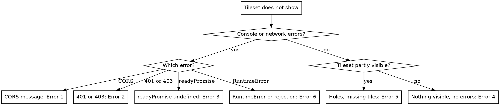

# CesiumJS Tileset Loading Errors

## Overview

A `Cesium3DTileset` streams tiles over the network. Most loading failures fall
into one of three classes: a network or permission failure the browser
surfaces (CORS, 401, 403), a legacy construction pattern removed in CesiumJS
1.107, or a tileset that loaded correctly but was never added to the scene or
never brought into view.

**Core principle:** ALWAYS read the browser console and network tab first. The
error class points straight at the cause. A CORS message, an HTTP status code,
`readyPromise is undefined`, and a silent no-op are four different problems
with four different fixes. NEVER guess before reading the console.

## When to Use This Skill

Use this skill when ANY of these apply:

- A `Cesium3DTileset` does not appear on the globe
- The console reports `blocked by CORS policy` or `Access-Control-Allow-Origin`
- The network tab shows `401` or `403` on `tileset.json` or tile requests
- The console reports `readyPromise is undefined` or a missing `url` option
- `Cesium3DTileset.fromUrl` resolves with no error but nothing renders
- The tileset renders partially, with holes or missing geometry
- `Cesium3DTileset.fromUrl` rejects with a `RuntimeError`

Do NOT use this skill for blank-globe failures unrelated to tilesets
(`cesium-errors-rendering`), for tileset memory growth
(`cesium-errors-memory`), or for tileset styling expressions
(`cesium-impl-3d-tiles-styling`).

## Diagnosis Quick Reference

| Symptom | Likely cause | Section |
|---------|--------------|---------|
| Console floods with `blocked by CORS policy` | CORS or file protocol | Error 1 |
| Network tab shows `401` or `403` | Authentication | Error 2 |
| `readyPromise is undefined`, tileset never appears | Legacy construction | Error 3 |
| `fromUrl` resolves, no errors, nothing visible | Not added or out of view | Error 4 |
| Tileset mostly shows but has holes | Individual tile failures | Error 5 |
| `RuntimeError` or unhandled promise rejection | Unsupported version or missing await | Error 6 |

## Decision Tree



## Error 1: CORS and file protocol failures

**Symptom:** The tileset never appears. The console floods with messages such
as `has been blocked by CORS policy` or `No 'Access-Control-Allow-Origin'
header is present`. Requests for `tileset.json` and tile content are blocked
before any data reaches CesiumJS.

**Root cause:** The browser enforces the same-origin policy on every fetch a
tileset makes. When the tileset host does not send an
`Access-Control-Allow-Origin` header that permits the page origin, the browser
blocks the response. A page opened directly from disk over the `file:`
protocol has a null origin, so the browser treats every request, even one for
a `tileset.json` in the same folder, as cross-origin and blocks it.

**Prevention:** ALWAYS serve both the application and the tileset over `http`
or `https`. NEVER open the application by double-clicking the HTML file. Host
tilesets on a server that returns CORS headers permitting the application
origin.

**Recovery:** During development, serve the files with a local HTTP server, for
example `npx http-server` or `python3 -m http.server`, and load the app from
`http://localhost`. In production, add `Access-Control-Allow-Origin` to the
tileset host configuration. When the host cannot be changed, route the tileset
through a CORS-enabled reverse proxy on the application origin.

## Error 2: 401 and 403 authentication failures

**Symptom:** Tiles do not load. The network tab shows `401 Unauthorized` or
`403 Forbidden` on `tileset.json` or tile requests. `Cesium3DTileset.fromIonAssetId`
may reject.

**Root cause:** The request reached the server but carried no valid
credentials. Common cases:

- ion: `Ion.defaultAccessToken` is unset, expired, or its token scopes do not
  include the requested asset. The Sandcastle demo token is rate-limited and
  is not valid for a deployed application.
- Google Photorealistic 3D Tiles: `GoogleMaps.defaultApiKey` is unset or the
  key has API restrictions that exclude the Map Tiles API.
- `IonResource` refreshes ion tokens, but for a Google tileset it does not
  refresh the underlying non-ion Google credential, so an expired Google key
  still returns 403.

**Prevention:** Set `Ion.defaultAccessToken` before constructing anything that
uses an ion asset. Set `GoogleMaps.defaultApiKey` before calling
`createGooglePhotorealistic3DTileset`, or stream Google tiles through ion
instead. ALWAYS use a token whose scopes cover the target asset.

**Recovery:** Generate a fresh token at the provider, replace the value in the
application, and confirm the token scopes or key API restrictions include the
asset. See `cesium-impl-cesium-ion` for ion token management.

## Error 3: Legacy synchronous construction

**Symptom:** The console reports `readyPromise is undefined`, or an error about
an invalid or missing `url` option. The tileset never appears. `boundingSphere`
and `root` are `undefined` right after construction.

**Root cause:** `new Cesium3DTileset({ url })`, `Cesium3DTileset.ready`, and
`Cesium3DTileset.readyPromise` were deprecated in CesiumJS 1.104 and removed in
1.107. The `url` constructor option no longer exists. Code copied from older
tutorials or Sandcastle examples constructs a tileset with no source on
CesiumJS 1.124+.

**Prevention:** ALWAYS construct a tileset with the async factory
`Cesium3DTileset.fromUrl(url)` or `Cesium3DTileset.fromIonAssetId(id)`. After
the returned promise resolves, the tileset is fully ready and `boundingSphere`
and `root` are valid immediately. NEVER write `new Cesium3DTileset({ url })`,
`tileset.ready`, or `tileset.readyPromise`.

```js
// REMOVED in 1.107, fails on 1.124+
const tileset = new Cesium.Cesium3DTileset({ url });
tileset.readyPromise.then(() => viewer.zoomTo(tileset));

// CORRECT
const tileset = await Cesium3DTileset.fromUrl(url);
viewer.scene.primitives.add(tileset);
await viewer.zoomTo(tileset);
```

**Recovery:** Rewrite the construction to the async factory. Move any code that
ran inside `readyPromise.then(...)` to run after the `await`. See
`cesium-core-versioning` for the full migration.

## Error 4: Tileset loads but nothing is visible

**Symptom:** `Cesium3DTileset.fromUrl` resolves without rejecting, the console
shows no errors, yet nothing renders.

**Root cause:** The factory only loads and parses `tileset.json`. It does not
add the tileset to the scene and it does not move the camera. The usual causes
of an invisible but correctly loaded tileset are:

- The resolved tileset was never added to `scene.primitives`.
- `tileset.show` is `false`.
- The camera is not pointed at the tileset; the factory never flies the camera.
- `tileset.modelMatrix` placed the tileset off the globe or below the surface.

**Prevention:** After the `await`, ALWAYS add the tileset to the scene and
bring it into view.

```js
const tileset = await Cesium3DTileset.fromUrl(url);
viewer.scene.primitives.add(tileset);
await viewer.zoomTo(tileset);
```

**Recovery:** Check, in order: the tileset is in `viewer.scene.primitives`;
`tileset.show` is `true`; the camera has flown to `tileset.boundingSphere`;
`tileset.modelMatrix` is `Matrix4.IDENTITY` or a correct placement matrix. A
very high `maximumScreenSpaceError` does not hide the tileset, it only renders
it coarse; the default is `16`.

## Error 5: Individual tiles fail to load

**Symptom:** The tileset mostly renders, but parts are missing, leaving holes
in the model. The network tab shows `404` or other failures for specific tile
content files.

**Root cause:** `Cesium3DTileset.fromUrl` loads only `tileset.json`. Tile
content files load lazily as the camera approaches, so the factory promise
resolves successfully while individual tiles fail later. Individual failures
come from content files missing on the host, wrong relative paths inside
`tileset.json`, or intermittent network errors.

**Prevention:** ALWAYS attach a `tileFailed` event listener so failing tiles
are detected and logged rather than silently dropped. Verify every content
file referenced by `tileset.json` is deployed.

```js
tileset.tileFailed.addEventListener((error) => {
  console.error(`Tile failed: ${error.url} : ${error.message}`);
});
```

**Recovery:** The `tileFailed` event passes an object with `url` and `message`.
Use the logged URLs to find the missing or mispathed files and correct them on
the host.

## Error 6: RuntimeError and unhandled promise rejection

**Symptom:** An uncaught promise rejection appears in the console, or a
`RuntimeError` aborts setup. A related symptom: `scene.primitives.add` throws,
or `tileset.style` assignment fails because `tileset` is still a `Promise`.

**Root cause:** Two distinct causes:

- `Cesium3DTileset.fromUrl` rejects with a `RuntimeError` when the tileset
  asset version is not `0.0`, `1.0`, or `1.1`, or when the tileset requires an
  unsupported extension. An unhandled rejection surfaces as a console error.
- The factory return value is a `Promise`. Code that calls
  `Cesium3DTileset.fromUrl(url)` without `await` keeps the `Promise` in the
  variable and then treats it as a tileset.

**Prevention:** ALWAYS `await` the factory inside an `async` function and wrap
it in `try`/`catch`. NEVER pass the unresolved `Promise` to
`scene.primitives.add`.

```js
try {
  const tileset = await Cesium3DTileset.fromUrl(url);
  viewer.scene.primitives.add(tileset);
} catch (error) {
  console.error(`Tileset failed to load: ${error}`);
}
```

**Recovery:** Add the `try`/`catch`. When the rejection is a `RuntimeError`,
the tileset version or a required extension is unsupported; re-tile the source
to 3D Tiles 1.0 or 1.1, or remove the unsupported extension.

## Diagnostic Checklist

Run this checklist when a tileset does not load:

1. Open the browser console and the network tab before anything else.
2. Confirm the application is served over `http` or `https`, not `file`.
3. Check the HTTP status of the `tileset.json` request: 200, 401, 403, or 404.
4. Confirm the construction uses `fromUrl` or `fromIonAssetId`, not `new`.
5. Confirm `Ion.defaultAccessToken` is set before any ion asset is used.
6. Confirm the resolved tileset is added to `viewer.scene.primitives`.
7. Confirm the camera was flown to the tileset with `viewer.zoomTo`.
8. Attach a `tileFailed` listener to surface per-tile failures.

## Common Mistakes

| Mistake | Consequence | Fix |
|---------|-------------|-----|
| Opening the app over the `file` protocol | Every tile request blocked as cross-origin | Serve over `http://localhost` |
| Tileset host sends no CORS header | Tileset never loads, console floods with CORS errors | Add `Access-Control-Allow-Origin` on the host |
| `Ion.defaultAccessToken` unset or expired | 401 on ion assets | Set a valid token before constructing |
| Sandcastle demo token kept in production | Rate-limited, 401 | Use your own ion token |
| `new Cesium3DTileset({ url })` | `readyPromise is undefined`, no tileset | Use `await Cesium3DTileset.fromUrl(url)` |
| Tileset resolved but not added to the scene | `fromUrl` succeeds, nothing renders | `viewer.scene.primitives.add(tileset)` |
| Camera never flown to the tileset | Tileset loads off-screen | `await viewer.zoomTo(tileset)` |
| `fromUrl` used without `await` | Variable holds a `Promise`, not a tileset | `await` inside an `async` function |
| `fromUrl` rejection unhandled | Unhandled promise rejection, `RuntimeError` | Wrap the `await` in `try`/`catch` |
| No `tileFailed` listener | Missing tiles fail silently | Attach a `tileFailed` event listener |

## Reference Files

- `references/methods.md` : the tileset factory methods, the loading and
  failure events, and the authentication and viewport API used to diagnose
  each error.
- `references/examples.md` : complete correct loading code for ion, a self
  hosted URL, and Google Photorealistic 3D Tiles, plus a diagnostic harness
  and local server commands.
- `references/anti-patterns.md` : each tileset loading failure with symptom,
  root cause, prevention, and recovery, traced to the verified CesiumJS issue.

## Related Skills

- `cesium-syntax-3d-tiles` : the correct `Cesium3DTileset` loading API.
- `cesium-impl-cesium-ion` : ion tokens, asset IDs, and `IonResource`.
- `cesium-errors-rendering` : blank-globe diagnosis unrelated to tilesets.
- `cesium-errors-memory` : tileset cache and memory growth.
- `cesium-core-versioning` : migrating the removed `readyPromise` pattern.
- `cesium-impl-build-deploy` : serving the app and assets over HTTP.
