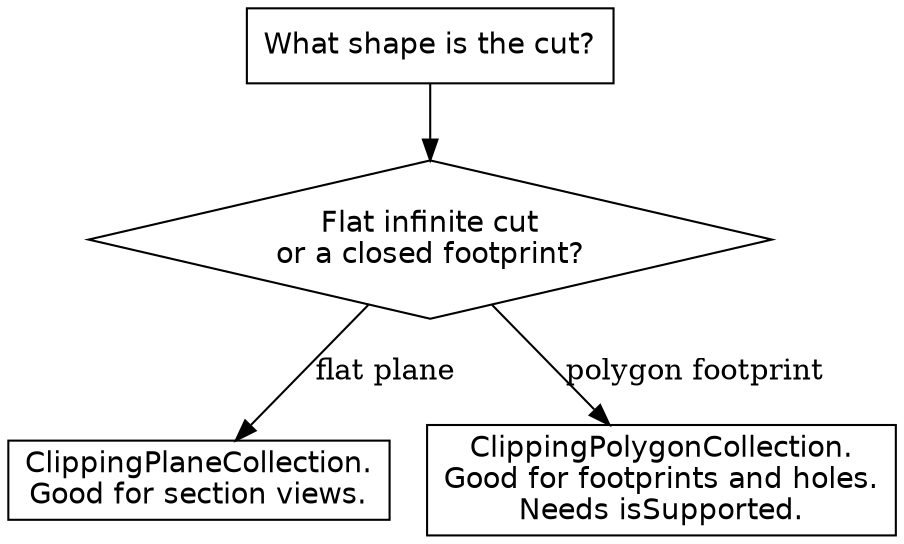

# CesiumJS 3D Tiles Styling and Clipping

## Overview

A loaded `Cesium3DTileset` has two declarative ways to control what its
features look like and which parts of it render:

- **`Cesium3DTileStyle`** colors, sizes, and shows or hides features by their
  metadata, through the 3D Tiles styling expression language.
- **`ClippingPlaneCollection`** and **`ClippingPolygonCollection`** cut the
  tileset geometry by infinite planes or by geodesic polygons.

**Core principle:** ALWAYS assign a `Cesium3DTileStyle` to `tileset.style` to
style features; NEVER mutate individual features in a loop for a static
style. ALWAYS gate a `ClippingPolygonCollection` behind
`ClippingPolygonCollection.isSupported(scene)`.

This skill assumes the tileset is already loaded with the async factory
`Cesium3DTileset.fromUrl` or `Cesium3DTileset.fromIonAssetId`; see
`cesium-syntax-3d-tiles` for loading.

## When to Use This Skill

Use this skill when ANY of these apply:

- Coloring tileset features by a metadata property such as height or type
- Showing or hiding features by a condition
- Sizing point-cloud points with `pointSize`
- A style does not apply, or every feature ends up the same color
- Cutting a tileset with a plane, for example a section view
- Clipping a tileset to or from a polygon footprint
- A clipping setup produces no visible cut

Do NOT use this skill to load a tileset; that is `cesium-syntax-3d-tiles`.
Do NOT use it for `CustomShader` GLSL; that is `cesium-syntax-materials`.

## Applying a Style

A style is a `Cesium3DTileStyle` built from a JSON object. Assign it to
`tileset.style`.

```js
const tileset = await Cesium.Cesium3DTileset.fromUrl(url);
viewer.scene.primitives.add(tileset);

tileset.style = new Cesium.Cesium3DTileStyle({
  color: "color('cyan')",
  show: true,
  pointSize: 4.0,
});
```

Assigning `tileset.style` re-evaluates every feature. To clear a style, set
`tileset.style = undefined`. To force a re-evaluation after an expression
that depends on changing state, call `tileset.makeStyleDirty()`.

## The Styling Expression Language

Each style value is an expression string in the 3D Tiles styling language. A
feature property is referenced with `${PropertyName}`.

```js
tileset.style = new Cesium.Cesium3DTileStyle({
  // Color each feature from its own Height property.
  color: "${Height} >= 50 ? color('red') : color('green')",
  // Hide small features.
  show: "${Area} > 100",
});
```

Property names are case-sensitive. `${Height}` and `${height}` are different
properties; a wrong case evaluates to `undefined`.

Operators: `+ - * / %`, `< > <= >= === !==`, `&& || !`, the ternary `? :`,
and the regular-expression match operators `=~` and `!~`.

Color functions:

| Function | Purpose |
|----------|---------|
| `color('name')` or `color('#RRGGBB', alpha)` | Named or hex color |
| `rgb(r, g, b)` | Components in the range 0 to 255 |
| `rgba(r, g, b, a)` | Components 0 to 255, alpha 0 to 1 |
| `hsl(h, s, l)` / `hsla(h, s, l, a)` | Components 0.0 to 1.0 |

Math functions are available: `abs`, `sqrt`, `floor`, `ceil`, `round`,
`min`, `max`, `clamp`, `mix`, `pow`, `log`, the trigonometric set, plus
`Math.PI` and `Math.E`.

## Conditions Arrays

A `conditions` array maps ranges to results. It is evaluated top to bottom;
the first matching condition wins. ALWAYS end a `conditions` array with a
`['true', ...]` fallback so every feature gets a value.

```js
tileset.style = new Cesium.Cesium3DTileStyle({
  color: {
    conditions: [
      ["${Height} >= 100", "color('#0000FF')"],
      ["${Height} >= 50", "color('#00FF00')"],
      ["${Height} >= 0", "color('#FF0000')"],
      ["true", "color('#FFFFFF')"],
    ],
  },
});
```

A condition with no `true` fallback leaves non-matching features unstyled.

## Reusing Subexpressions With defines

`defines` pre-computes a named expression that other expressions reference
like a property.

```js
tileset.style = new Cesium.Cesium3DTileStyle({
  defines: {
    NormalizedHeight: "clamp(${Height} / 100.0, 0.0, 1.0)",
  },
  color: "color() * ${NormalizedHeight}",
});
```

## Styleable Keys

| Key | Returns | Purpose |
|-----|---------|---------|
| `color` | `Color` | Feature color, multiplied with the source color |
| `show` | `Boolean` | Feature visibility |
| `pointSize` | `Number` | Point-cloud point size |
| `pointOutlineColor` | `Color` | Point outline color |
| `pointOutlineWidth` | `Number` | Point outline width |
| `labelColor` | `Color` | Label text color |
| `labelText` | `String` | Label text |
| `font` | `String` | Label CSS font string |

The full styleable-key list is in `references/methods.md`.

## The evaluate Function Alternative

When an expression cannot express the logic, a style key accepts an object
with an `evaluate` function that receives the feature.

```js
tileset.style = new Cesium.Cesium3DTileStyle();
tileset.style.color = {
  evaluate: function (feature) {
    const type = feature.getProperty("type");
    return type === "tree"
      ? Cesium.Color.GREEN
      : Cesium.Color.GRAY;
  },
};
```

Use a string expression first; an `evaluate` function runs in JavaScript and
is slower per feature.

## Clipping With Planes

A `ClippingPlaneCollection` cuts a tileset with one or more infinite planes.
Each `ClippingPlane` has a `normal` and a `distance`. The geometry on the
side opposite the normal is hidden.

```js
const tileset = await Cesium.Cesium3DTileset.fromUrl(url);
viewer.scene.primitives.add(tileset);

tileset.clippingPlanes = new Cesium.ClippingPlaneCollection({
  planes: [
    // Hide everything on the negative-X side of the local frame.
    new Cesium.ClippingPlane(new Cesium.Cartesian3(1.0, 0.0, 0.0), 0.0),
  ],
  edgeWidth: 1.0,
  edgeColor: Cesium.Color.WHITE,
});
```

The planes are defined in the tileset local coordinate system.
`unionClippingRegions` controls multi-plane logic: when `false` (default), a
region is clipped only when it is outside every plane; when `true`, a region
is clipped when it is outside any plane.

## Clipping With Polygons

A `ClippingPolygonCollection` clips a tileset by geodesic polygons, added in
CesiumJS 1.117. ALWAYS guard it with `ClippingPolygonCollection.isSupported`.

```js
if (Cesium.ClippingPolygonCollection.isSupported(viewer.scene)) {
  const footprint = new Cesium.ClippingPolygon({
    positions: Cesium.Cartesian3.fromDegreesArray([
      4.89, 52.36, 4.91, 52.36, 4.91, 52.38, 4.89, 52.38,
    ]),
  });
  tileset.clippingPolygons = new Cesium.ClippingPolygonCollection({
    polygons: [footprint],
  });
}
```

`inverse` controls the kept side: when `false` (default), geometry inside any
polygon is clipped away; when `true`, geometry outside every polygon is
clipped, keeping only what is inside.

## Decision: Planes or Polygons



## Optimization Note

`tileset.maximumScreenSpaceError`, `cacheBytes`, and the preload flags tune
how a tileset streams. They are not styling. See `cesium-syntax-3d-tiles` for
the loading properties and `cesium-core-performance` for the full tuning set.

## Common Mistakes

| Mistake | Consequence | Fix |
|---------|-------------|-----|
| Wrong-case `${height}` for a `Height` property | Expression is `undefined` | Match the property name case exactly |
| `conditions` array with no `['true', ...]` | Non-matching features unstyled | End every `conditions` array with a `true` row |
| A constant `color('red')` when per-feature was wanted | Every feature the same color | Reference a `${property}` or use `conditions` |
| Mutating features in a loop for a static style | Slow, fights the style system | Assign a `Cesium3DTileStyle` |
| `ClippingPolygonCollection` without `isSupported` | Silent failure on unsupported scenes | Guard with `ClippingPolygonCollection.isSupported` |
| `ClippingPlane` normal pointing the wrong way | The wrong half is hidden | Flip the `normal`, or negate `distance` |
| `clippingPlanes.enabled` left `false` | No clip appears | Leave `enabled` at its `true` default |
| Expecting `inverse` default to keep the inside | The inside is clipped away | Set `inverse: true` to keep only the inside |

## Reference Files

- `references/methods.md` : the full `Cesium3DTileStyle`,
  `ClippingPlaneCollection`, `ClippingPlane`, `ClippingPolygonCollection`,
  and `ClippingPolygon` API, plus the styling-language operator and function
  catalog.
- `references/examples.md` : complete recipes for styling by property,
  conditions, point clouds, plane clipping, and polygon clipping.
- `references/anti-patterns.md` : each styling and clipping failure with
  symptom, root cause, and fix.

## Related Skills

- `cesium-syntax-3d-tiles` : loading a tileset and the `Cesium3DTileFeature`
  metadata model.
- `cesium-syntax-materials` : `CustomShader` GLSL styling for a tileset.
- `cesium-core-performance` : tileset streaming and screen-space-error
  tuning.
- `cesium-impl-picking-measurement` : picking a feature to read the
  properties a style expression references.
