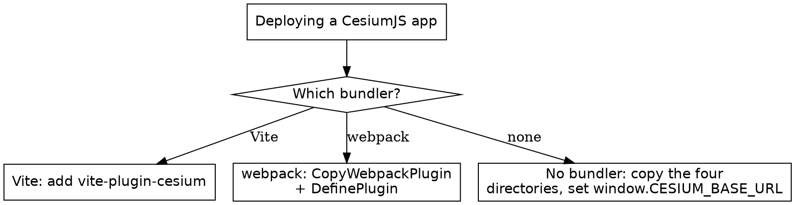

# CesiumJS Build and Deployment

## Overview

CesiumJS ships as the `cesium` npm package. Unlike a single-file library it
needs four static directories served alongside the bundle: `Workers`,
`ThirdParty`, `Assets`, and `Widgets`. CesiumJS finds those directories
through a base URL it reads at load time. Getting that base URL and the asset
copy right is the whole job; getting it wrong is the dominant cause of a blank
globe.

**Core principle:** ALWAYS do two things in a bundled CesiumJS app: copy the
four static directories into the build output, and set the `CESIUM_BASE_URL`
global to where they are served, before CesiumJS is imported. A bundler plugin
does both; doing neither produces a blank globe.

## When to Use This Skill

Use this skill when ANY of these apply:

- A bundled CesiumJS app renders a blank or black globe
- The console logs 404s for files under `Workers`, `Assets`, or `Widgets`
- A worker fails to load, or a bundler throws on a CesiumJS import
- Setting up CesiumJS in a Vite or webpack project
- Converting a Sandcastle example into a real application
- The widgets render unstyled or with a broken layout

Do NOT use this skill for runtime rendering failures unrelated to assets
(`cesium-errors-rendering`) or for ion tokens and assets
(`cesium-impl-cesium-ion`).

## The cesium Package and Its Static Directories

```bash
npm install cesium
```

The package installs a prebuilt copy at `node_modules/cesium/Build/Cesium`.
That folder contains the four directories CesiumJS loads at runtime:

| Directory | Holds |
|-----------|-------|
| `Workers` | Web Worker scripts for tiling, decoding, and geometry |
| `ThirdParty` | Bundled third-party worker dependencies |
| `Assets` | Textures, IAU data, and the default imagery |
| `Widgets` | Widget CSS and images, including `widgets.css` |

These are NOT bundled into the JavaScript. They MUST be copied into the
deployed output and served as static files.

## window.CESIUM_BASE_URL

CesiumJS resolves every worker and asset request relative to a base URL. It
reads this from the `CESIUM_BASE_URL` global. ALWAYS set it to the path where
the four directories are served, and ALWAYS set it BEFORE the first CesiumJS
import.

In a plain page with no bundler:

```html
<script>
  window.CESIUM_BASE_URL = "/cesiumStatic";
</script>
<script type="module" src="./app.js"></script>
```

In a bundler the value is injected at build time instead; see the Vite and
webpack sections. NEVER set `CESIUM_BASE_URL` after `import`ing `cesium`; the
library reads it during module initialization and a later assignment is
ignored.

## Vite Setup

Use `vite-plugin-cesium`. It copies the four static directories into the build
and configures the base URL, so the application code does not set
`window.CESIUM_BASE_URL` itself.

```bash
npm install cesium
npm install --save-dev vite-plugin-cesium
```

```js
// vite.config.js
import { defineConfig } from "vite";
import cesium from "vite-plugin-cesium";

export default defineConfig({
  plugins: [cesium()],
});
```

```js
// app.js
import { Ion, Viewer } from "cesium";

Ion.defaultAccessToken = "<your ion token>";
const viewer = new Viewer("cesiumContainer");
```

ALWAYS add `vite-plugin-cesium` to a Vite project. Without it Vite ships the
JavaScript but not the `Workers`, `ThirdParty`, `Assets`, and `Widgets`
directories, and the globe is blank.

## Webpack Setup

Webpack needs two plugins: `copy-webpack-plugin` to copy the static
directories, and `webpack.DefinePlugin` to inject `CESIUM_BASE_URL`. The
official `cesium-webpack-example` is the reference.

```js
// webpack.config.js
const path = require("path");
const webpack = require("webpack");
const CopyWebpackPlugin = require("copy-webpack-plugin");

const cesiumSource = "node_modules/cesium/Build/Cesium";
const cesiumBaseUrl = "cesiumStatic";

module.exports = {
  output: {
    filename: "app.js",
    path: path.resolve(__dirname, "dist"),
    sourcePrefix: "",
  },
  module: {
    rules: [{ test: /\.css$/, use: ["style-loader", "css-loader"] }],
  },
  plugins: [
    new CopyWebpackPlugin({
      patterns: [
        { from: path.join(cesiumSource, "Workers"), to: `${cesiumBaseUrl}/Workers` },
        { from: path.join(cesiumSource, "ThirdParty"), to: `${cesiumBaseUrl}/ThirdParty` },
        { from: path.join(cesiumSource, "Assets"), to: `${cesiumBaseUrl}/Assets` },
        { from: path.join(cesiumSource, "Widgets"), to: `${cesiumBaseUrl}/Widgets` },
      ],
    }),
    new webpack.DefinePlugin({
      CESIUM_BASE_URL: JSON.stringify(cesiumBaseUrl),
    }),
  ],
};
```

`DefinePlugin` replaces the `CESIUM_BASE_URL` identifier in the CesiumJS source
with the string `"cesiumStatic"` at build time. `CopyWebpackPlugin` copies the
four directories to that same `cesiumStatic` path in `dist`. ALWAYS keep the
two values identical; a mismatch sends every asset request to a path that does
not exist.

`output.sourcePrefix: ""` is required so webpack does not indent the CesiumJS
worker code in a way that breaks it.

## ES6 Named Imports and the Widgets CSS

ALWAYS import the specific symbols by name; this lets the bundler tree-shake
unused CesiumJS code.

```js
import { Ion, Viewer, Cartesian3, createOsmBuildingsAsync } from "cesium";
import "cesium/Build/Cesium/Widgets/widgets.css";
```

The `widgets.css` import is mandatory for any app that shows Viewer widgets.
Without it the Animation, Timeline, BaseLayerPicker, and other widgets render
unstyled and overlap. NEVER omit the CSS import in an app that uses the
`Viewer`.

The engine-only `@cesium/engine` package places its widget CSS at
`@cesium/engine/Source/Widget/CesiumWidget.css` instead.

## Sandcastle to Production Conversion

Sandcastle at `sandcastle.cesium.com` runs each example inside a scaffold that
auto-provides the `Cesium` global, an HTML page, and a shared demo ion token.
Production code has none of that. Convert an example in five steps.

1. Replace the implicit global with ES6 named imports. Sandcastle code uses
   `Cesium.Viewer`; production code imports `{ Viewer } from "cesium"`.
2. Supply your own `Ion.defaultAccessToken`. The Sandcastle demo token is
   rate-limited and NEVER valid for a deployed app.
3. Set up the bundler so `CESIUM_BASE_URL` is defined and the four static
   directories are copied, using the Vite or webpack setup above.
4. Import `cesium/Build/Cesium/Widgets/widgets.css`.
5. Provide real HTML with a container element, for example
   `<div id="cesiumContainer"></div>`, and a matching CSS height.

```js
// Sandcastle form
const viewer = new Cesium.Viewer("cesiumContainer");

// Production form
import { Ion, Viewer } from "cesium";
import "cesium/Build/Cesium/Widgets/widgets.css";

Ion.defaultAccessToken = "<your ion token>";
const viewer = new Viewer("cesiumContainer");
```

## Decision: Which Build Path



## Common Mistakes

| Mistake | Consequence | Fix |
|---------|-------------|-----|
| `CESIUM_BASE_URL` unset or wrong | `Workers`, `Assets`, `Widgets` 404, blank globe | Set it to where the static directories are served |
| No asset-copy step in the bundler | Worker scripts missing, blank globe | Add `vite-plugin-cesium` or `CopyWebpackPlugin` |
| `CESIUM_BASE_URL` set after `import "cesium"` | The value is ignored | Set it before the first CesiumJS import |
| `CopyWebpackPlugin` target differs from `DefinePlugin` value | Assets served at the wrong path | Use one shared base-URL variable |
| `widgets.css` not imported | Widgets render unstyled and overlapping | Import `cesium/Build/Cesium/Widgets/widgets.css` |
| Sandcastle demo token kept in production | Rate-limited, 401 on ion assets | Set your own `Ion.defaultAccessToken` |
| Sandcastle code relying on the `Cesium` global | `Cesium is not defined` | Use ES6 named imports |
| `import * as Cesium from "cesium"` everywhere | No tree-shaking, oversized bundle | Import the named symbols actually used |
| Missing `output.sourcePrefix: ""` in webpack | Worker code breaks at runtime | Set `sourcePrefix` to an empty string |

## Reference Files

- `references/methods.md` : the package layout, the static directories, the
  base-URL mechanism, and the Vite and webpack plugin options.
- `references/examples.md` : complete Vite, webpack, and no-bundler setups,
  plus a full Sandcastle to production conversion.
- `references/anti-patterns.md` : each build and deployment failure with
  symptom, root cause, and fix.

## Related Skills

- `cesium-errors-rendering` : blank-globe diagnosis beyond asset paths.
- `cesium-impl-cesium-ion` : `Ion.defaultAccessToken` and ion assets.
- `cesium-syntax-viewer` : the `Viewer` constructed once the build works.
- `cesium-core-versioning` : deprecated patterns in old Sandcastle code.
- `cesium-impl-resium` : bundling CesiumJS inside a React app.
