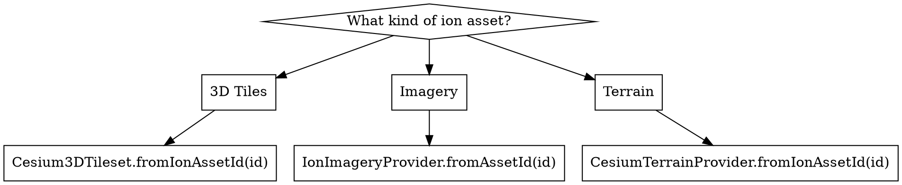

# CesiumJS Cesium ion Integration

## Overview

Cesium ion is the hosting and tiling platform behind CesiumJS. It ingests
geospatial data (3D buildings, AEC models, photogrammetry, point clouds,
imagery, terrain), runs a tiling pipeline, and streams the result back as 3D
Tiles or quantized-mesh terrain. A CesiumJS app reaches ion assets through
async factory methods, authenticated by an ion ACCESS TOKEN.

Core principle: `Cesium.Ion.defaultAccessToken` MUST be set before
constructing a `Viewer` that loads any ion asset. Every ion asset is reached
through an ASYNC factory (`fromIonAssetId`, `fromAssetId`), never a direct
constructor.

This skill is technology-specific: CesiumJS 1.124+, WebGL2 only.

## When to Use This Skill

- Loading an ion-hosted 3D Tiles, terrain, or imagery asset.
- Every ion asset returns 401 or the globe is blank.
- Configuring or scoping the ion access token.
- Uploading source data to ion for tiling.
- Choosing between ion SaaS, ion Self-Hosted, and self-hosting without ion.
- Loading the Cesium-hosted base assets (World Terrain, OSM Buildings).

## Quick Reference: ion Asset Factories

| Asset type | Factory | Returns |
|------------|---------|---------|
| 3D Tiles | `Cesium3DTileset.fromIonAssetId(id, options)` | `Promise<Cesium3DTileset>` |
| Imagery | `IonImageryProvider.fromAssetId(id, options)` | `Promise<IonImageryProvider>` |
| Terrain | `CesiumTerrainProvider.fromIonAssetId(id, options)` | `Promise<CesiumTerrainProvider>` |
| Any asset, raw | `IonResource.fromAssetId(id, options)` | `Promise<IonResource>` |

Every factory is ASYNC and returns a Promise. NEVER call the `IonResource`,
`IonImageryProvider`, or `Cesium3DTileset` constructor directly for an ion
asset; the documented path is the factory.

## The ion Access Token

`Cesium.Ion.defaultAccessToken` is a process-wide string token. ALWAYS set it
before constructing a `Viewer` that uses any ion asset, including the
Cesium-hosted base layers.

```js
Cesium.Ion.defaultAccessToken = import.meta.env.VITE_CESIUM_ION_TOKEN;
const viewer = new Cesium.Viewer("cesiumContainer");
```

ALWAYS load the token from an environment variable or runtime config. NEVER
hardcode a token in committed source.

`Cesium.Ion.defaultServer` defaults to `https://api.cesium.com`. Override it
only for an ion Self-Hosted deployment.

### Token Scoping and Security

An ion token carries SCOPES and an asset allow-list. A browser app ships its
token to every visitor, so the token MUST be restricted:

- ALWAYS create a dedicated token scoped to only the asset ids the app loads,
  with read-only access (`assets:read`, plus `geocode` if the Geocoder is on).
- NEVER ship a token with `assets:write`, `tokens:write`, or profile scopes to
  the browser. A leaked write token lets anyone modify your ion account.
- NEVER ship the Sandcastle demo token in production; it is rate-limited and
  not tied to your account.

A token that is valid but lacks a requested asset in its allow-list still
returns 401 or 403 for that asset.

## Loading ion Assets



```js
// 3D Tiles asset
const tileset = await Cesium.Cesium3DTileset.fromIonAssetId(123456);
viewer.scene.primitives.add(tileset);

// Terrain asset
viewer.scene.terrainProvider =
  await Cesium.CesiumTerrainProvider.fromIonAssetId(123456);

// Imagery asset
const layer = Cesium.ImageryLayer.fromProviderAsync(
  Cesium.IonImageryProvider.fromAssetId(123456)
);
viewer.imageryLayers.add(layer);
```

`IonResource.fromAssetId(id)` is the general bridge: it resolves an ion asset
to a streamable `Resource` that any `fromUrl` factory accepts. ALWAYS use the
type-specific `fromIonAssetId` shortcut when one exists; reach for
`IonResource` only when no shortcut covers the asset type, or to pass a
per-call `accessToken`.

```js
const resource = await Cesium.IonResource.fromAssetId(123456);
const tileset = await Cesium.Cesium3DTileset.fromUrl(resource);
```

## Cesium-hosted Base Assets

ion's free tier includes Cesium-hosted base layers, reached through global
helper functions instead of raw asset ids:

| Helper | Loads |
|--------|-------|
| `createWorldTerrainAsync(options)` | Cesium World Terrain |
| `createWorldImageryAsync(options)` | ion default base imagery (Bing Maps) |
| `createOsmBuildingsAsync(options)` | Cesium OSM Buildings |

```js
viewer.scene.terrainProvider = await Cesium.createWorldTerrainAsync();
viewer.scene.primitives.add(await Cesium.createOsmBuildingsAsync());
```

All three still require `Ion.defaultAccessToken` to be set.

## Uploading and Tiling Your Own Data

Custom assets are created through the ion REST API, served from
`https://api.cesium.com` (or the Self-Hosted server) and authenticated with a
Bearer token. The flow is:

1. Create an asset record describing the source data.
2. Upload the source files to the storage location ion returns.
3. ion runs the tiling pipeline asynchronously.
4. Poll the asset status until tiling completes.
5. The finished asset exposes an asset id usable with `fromIonAssetId`.

Exact REST endpoint paths are versioned. ALWAYS confirm them against the
current ion REST API reference before scripting an upload. The CesiumJS
browser SDK consumes finished assets only; it NEVER performs uploads, so run
upload scripts server-side or use the ion web UI.

## ion SaaS, Self-Hosted, and Self-Hosting Without ion

- ion SaaS: free signup with a storage and streaming quota; paid tiers add
  higher quotas and private assets.
- ion Self-Hosted: an enterprise deployment of the same platform; point
  `Ion.defaultServer` at the private server.
- Without ion: host pre-tiled 3D Tiles on any static CDN and load them with
  `Cesium3DTileset.fromUrl(url)`; serve quantized-mesh terrain (for example
  with `cesium-terrain-server`) and load it with
  `CesiumTerrainProvider.fromUrl(url)`. ALWAYS configure CORS on the host or
  the tiles never load.

## Common Mistakes

| Mistake | Fix |
|---------|-----|
| ion asset returns 401, globe blank | Set `Ion.defaultAccessToken` before the `Viewer` |
| Token set after the `Viewer` is built | Set the token first; assets request immediately |
| Write-scoped token shipped to the browser | Use a read-only token scoped to the app's assets |
| Sandcastle demo token in production | Create your own ion account token |
| `new IonResource(...)` | Use `IonResource.fromAssetId(id)` |
| Valid token, asset still 401 | Add that asset id to the token's allow-list |
| Self-hosted tiles never load | Configure CORS on the tile host |

Full root-cause analysis is in `references/anti-patterns.md`.

## Reference Files

- `references/methods.md` : verified signatures for `Ion`, `IonResource`,
  `Cesium3DTileset`, `IonImageryProvider`, `CesiumTerrainProvider`, and the
  base-asset helpers, plus the ion REST API outline.
- `references/examples.md` : runnable snippets for token setup, asset loading,
  the `IonResource` bridge, base assets, and self-hosting.
- `references/anti-patterns.md` : ion failure modes, each with symptom, root
  cause, prevention, and recovery.

## Related Skills

- `cesium-syntax-viewer` : `Viewer` construction and ion token timing.
- `cesium-syntax-3d-tiles` : loading and tuning the tilesets ion produces.
- `cesium-syntax-terrain` : terrain providers and Cesium World Terrain.
- `cesium-syntax-imagery` : imagery layers and providers.
- `cesium-errors-tileset` : 401, 403, and CORS failures on ion and third-party tilesets.
- `cesium-impl-aec-georef` : placing ion-tiled BIM and city models in ECEF.
