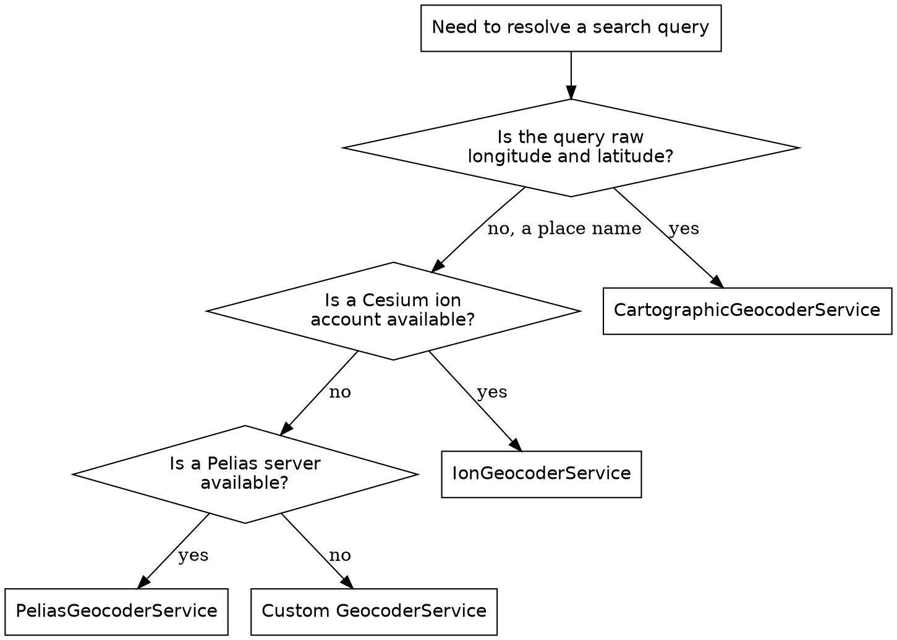

# CesiumJS Geocoding

## Overview

Geocoding turns a text query, such as an address or a place name, into a
geographic location the camera can fly to. CesiumJS models this with the
`GeocoderService` interface and several built-in implementations. The
`Viewer` shows a Geocoder widget by default and any `GeocoderService` can also
be called directly in code.

**Core principle:** CesiumJS geocoding maps a query string to one or more
coordinate results. ALWAYS treat a geocode call as returning an array.
CesiumJS and Cesium ion have NO routing or directions capability; NEVER write
code or documentation that implies one.

## When to Use This Skill

Use this skill when ANY of these apply:

- The Geocoder widget search box returns no results
- An `IonGeocoderService` call fails or returns an empty array
- Turning an address or place name into a camera destination in code
- Replacing the default geocoder backend with Pelias, OpenCage, or a custom one
- Accepting raw longitude and latitude input as a search query
- A request mentions routing, directions, or turn-by-turn navigation

Do NOT use this skill for camera flight mechanics (`cesium-syntax-camera`) or
for ion asset streaming and tokens (`cesium-impl-cesium-ion`).

## No Routing in CesiumJS or Cesium ion

CesiumJS and Cesium ion provide geocoding ONLY. There is no routing service,
no directions API, and no turn-by-turn navigation in either product. NEVER
claim a `RouteService`, a `directions()` method, or any path-finding call;
none exists.

When a route between two points is required, compute it with an external
service such as OSRM, the Mapbox Directions API, or the HERE Routing API, then
draw the returned path in CesiumJS as a `PolylineGraphics` entity or a
`Polyline` primitive. The routing math happens outside CesiumJS; CesiumJS only
renders the result.

## The Geocoder Widget on the Viewer

The `Viewer` creates a Geocoder widget unless told otherwise. The constructor
`geocoder` option controls it.

```js
// Default: the ion geocoder widget is shown.
const viewer = new Cesium.Viewer("cesiumContainer");

// Disable the widget entirely.
const viewer = new Cesium.Viewer("cesiumContainer", { geocoder: false });

// Replace the backend with custom services.
const viewer = new Cesium.Viewer("cesiumContainer", {
  geocoder: [new Cesium.CartographicGeocoderService()],
});
```

The `geocoder` option accepts `boolean`, an `IonGeocodeProviderType`, or an
`Array<GeocoderService>`. Its default is `IonGeocodeProviderType.DEFAULT`.
`false` suppresses the widget. The read-only `viewer.geocoder` property exposes
the widget, and `viewer.geocoder.viewModel` is its `GeocoderViewModel`.

## The GeocoderService Interface

Every geocoder implements one method and one member.

| Member | Shape | Purpose |
|--------|-------|---------|
| `geocode(query, type)` | `Promise<Array<GeocoderService.Result>>` | Resolve a query to results |
| `credit` | `Credit` or `undefined`, readonly | Attribution to display after a geocode |

A `GeocoderService.Result` has:

| Field | Type | Meaning |
|-------|------|---------|
| `displayName` | string | A human-readable name for the location |
| `destination` | `Rectangle` or `Cartesian3` | The location, as a box or a point |
| `attributions` | `Array<object>`, optional | Per-result attribution data |

`destination` is a `Rectangle` OR a `Cartesian3`. `camera.flyTo` accepts both
as its `destination`, so a result can be flown to without branching. NEVER
assume `destination` is always a `Cartesian3`; reading `.longitude` off a
`Rectangle` result is wrong.

## Built-in Geocoder Services

| Service | Constructor | Backend |
|---------|-------------|---------|
| `IonGeocoderService` | `new Cesium.IonGeocoderService(options)` | Cesium ion geocoding |
| `PeliasGeocoderService` | `new Cesium.PeliasGeocoderService(url)` | A Pelias server |
| `CartographicGeocoderService` | `new Cesium.CartographicGeocoderService()` | Parses coordinate strings |
| `BingMapsGeocoderService` | `new Cesium.BingMapsGeocoderService(options)` | Bing Maps |
| `GoogleGeocoderService` | `new Cesium.GoogleGeocoderService(options)` | Google geocoding |
| `OpenCageGeocoderService` | `new Cesium.OpenCageGeocoderService(...)` | OpenCage Data |

### IonGeocoderService

```js
const ionGeocoder = new Cesium.IonGeocoderService({
  scene: viewer.scene,
});
```

`scene` is required. `accessToken` defaults to `Ion.defaultAccessToken`,
`server` defaults to `Ion.defaultServer`, and `geocodeProviderType` defaults to
`IonGeocodeProviderType.DEFAULT`. ALWAYS set `Cesium.Ion.defaultAccessToken`
before an ion geocode, or pass an explicit `accessToken`; without a valid token
the call fails with an authorization error.

### CartographicGeocoderService

`CartographicGeocoderService` parses a query of the form
`longitude latitude` or `longitude latitude height`, with longitude and
latitude in degrees and height in meters. It takes no constructor arguments and
needs no token. Include it when users may type raw coordinates.

### PeliasGeocoderService

`PeliasGeocoderService` queries a Pelias server. The constructor takes the
server `url` as a string or a `Resource`.

## Programmatic Geocoding

Call `geocode` directly to resolve a query without the widget.

```js
const geocoder = new Cesium.IonGeocoderService({ scene: viewer.scene });
const results = await geocoder.geocode("Amsterdam Centraal");

if (results.length === 0) {
  console.warn("no match for that query");
} else {
  await viewer.camera.flyTo({ destination: results[0].destination });
}
```

`geocode` resolves to an array. ALWAYS check `results.length` before reading
`results[0]`; an unmatched query resolves to an empty array, not an error.

## GeocodeType: SEARCH and AUTOCOMPLETE

The optional second argument of `geocode` is a `GeocodeType`.

| Value | Use for |
|-------|---------|
| `SEARCH` | A complete query the user has finished typing (the default) |
| `AUTOCOMPLETE` | Partial input, to offer suggestions as the user types |

```js
const suggestions = await geocoder.geocode(
  partialText,
  Cesium.GeocodeType.AUTOCOMPLETE,
);
```

ALWAYS use `AUTOCOMPLETE` for type-ahead suggestion lists and `SEARCH` for the
final submitted query.

## IonGeocodeProviderType

`IonGeocoderService` can select an ion-side provider with `geocodeProviderType`.

| Value | Backend |
|-------|---------|
| `DEFAULT` | The provider configured on the ion server |
| `GOOGLE` | The Google geocoder, for use with Google data |
| `BING` | The Bing geocoder, for use with Bing data |

`GOOGLE` and `BING` require the matching data access on the ion account. Use
`DEFAULT` unless a specific provider is needed.

## Custom Geocoders

A custom geocoder is any object that satisfies the `GeocoderService`
interface: a `geocode(query, type)` method returning a promise of a results
array, and a `credit` getter.

```js
class MyGeocoderService {
  get credit() {
    return undefined; // or a Cesium.Credit for attribution
  }

  async geocode(query, type) {
    const response = await fetch(
      `https://example.com/search?q=${encodeURIComponent(query)}`,
    );
    const data = await response.json();
    return data.places.map((place) => ({
      displayName: place.name,
      destination: Cesium.Cartesian3.fromDegrees(place.lon, place.lat),
    }));
  }
}

const viewer = new Cesium.Viewer("cesiumContainer", {
  geocoder: [new MyGeocoderService()],
});
```

ALWAYS implement the `credit` getter, even when it returns `undefined`; the
widget reads it after every geocode. ALWAYS return an array from `geocode`,
empty when nothing matches.

## Decision: Which Geocoder



## Common Mistakes

| Mistake | Consequence | Fix |
|---------|-------------|-----|
| Expecting a routing or directions API | No such API exists | Use an external routing service, render the path as a polyline |
| `Ion.defaultAccessToken` unset before an ion geocode | Authorization failure, empty results | Set the token or pass `accessToken` |
| Treating the `geocode` result as a single object | Reads `undefined` properties | Use `results[0]` after checking `results.length` |
| Assuming `destination` is always a `Cartesian3` | Wrong values from a `Rectangle` result | Pass `destination` straight to `camera.flyTo` |
| Custom geocoder without a `credit` getter | Widget errors after a geocode | Implement `credit`, returning `undefined` if unused |
| Passing one `GeocoderService` instead of an array | The `geocoder` option is not honored | Wrap services in an `Array` |
| `geocodeProviderType: GOOGLE` without Google data access | ion geocode fails | Use `DEFAULT` unless the account has the provider |
| `SEARCH` used for live type-ahead | Heavier queries, no partial matching | Use `GeocodeType.AUTOCOMPLETE` while typing |

## Reference Files

- `references/methods.md` : the full `GeocoderService` interface, every
  built-in service constructor, `GeocoderViewModel`, and the enums.
- `references/examples.md` : recipes for widget configuration, programmatic
  geocoding, autocomplete, a custom geocoder, and rendering an external route.
- `references/anti-patterns.md` : each geocoding failure with symptom, root
  cause, and fix, including the routing misconception.

## Related Skills

- `cesium-syntax-camera` : `camera.flyTo` with a geocode `destination`.
- `cesium-impl-cesium-ion` : `Ion.defaultAccessToken` and ion accounts.
- `cesium-syntax-viewer` : the `Viewer` constructor and its widgets.
- `cesium-core-coordinates` : `Cartesian3` and `Rectangle` destinations.
- `cesium-syntax-entity` : drawing an external route as a polyline entity.
