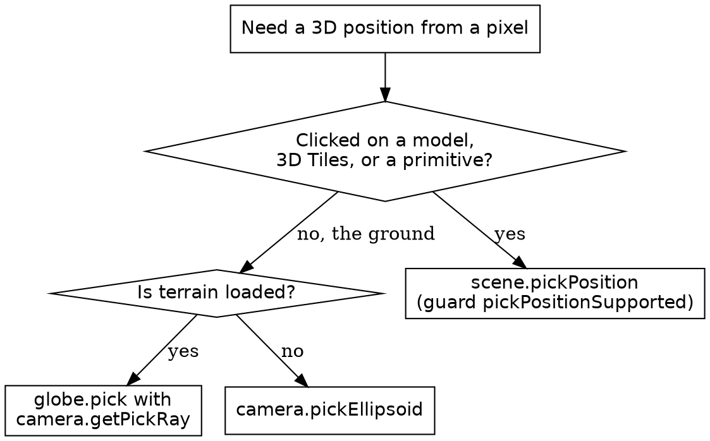

# CesiumJS Picking and Measurement

## Overview

Picking turns a screen pixel into scene data: the object under the cursor, or
the world position under it. CesiumJS separates the two. `scene.pick` answers
"which object", and `scene.pickPosition`, `globe.pick`, and
`camera.pickEllipsoid` answer "which 3D position". `ScreenSpaceEventHandler`
routes mouse and touch input to callbacks. Measurement tooling is built on
picked positions.

**Core principle:** ALWAYS choose the position-pick method by what was clicked.
`scene.pickPosition` reads rendered geometry, `globe.pick` reads the terrain
surface, and `camera.pickEllipsoid` reads the smooth ellipsoid. They return
different heights and are NOT interchangeable.

## When to Use This Skill

Use this skill when ANY of these apply:

- A click or hover handler returns `undefined` when something is visible
- A pick returns a different object than the one under the cursor
- A picked position sits at the wrong height, for example below terrain
- Registering mouse, touch, or keyboard-modified input
- Opening the InfoBox or driving a selection indicator
- Measuring distance or area between clicked points

Do NOT use this skill for camera flights (`cesium-syntax-camera`) or for 3D
Tiles loading and CORS failures (`cesium-syntax-3d-tiles`,
`cesium-errors-tileset`).

## Picking Objects: scene.pick and drillPick

`scene.pick(windowPosition)` returns the topmost object at a `Cartesian2`
window position, or `undefined` when nothing is hit.

```js
const handler = new Cesium.ScreenSpaceEventHandler(viewer.scene.canvas);
handler.setInputAction((click) => {
  const picked = viewer.scene.pick(click.position);
  if (!Cesium.defined(picked)) {
    return; // nothing under the cursor
  }
  if (picked.id instanceof Cesium.Entity) {
    console.log("entity:", picked.id.name);
  } else if (picked instanceof Cesium.Cesium3DTileFeature) {
    console.log("3D Tiles feature");
  }
}, Cesium.ScreenSpaceEventType.LEFT_CLICK);
```

The return value of `scene.pick` is NOT the entity. For entity-backed
geometry it is an object with a `primitive` and an `id`, where `id` is the
`Entity`. For a 3D Tileset it is a `Cesium3DTileFeature`. ALWAYS branch on the
result type before reading it.

`scene.drillPick(windowPosition, limit)` returns every object along the pick
ray, ordered front to back, for picking through overlapping geometry.

`scene.pick` samples a small box around the pixel; `width` and `height`
default to 3 pixels. Increasing them makes thin features easier to hit.

## Picking a 3D Position

Three methods return a world position; each reads a different surface.

| Method | Reads | Use when |
|--------|-------|----------|
| `scene.pickPosition(pos, result)` | Any rendered geometry via the depth buffer | Clicking a model, 3D Tiles, or a primitive |
| `globe.pick(ray, scene, result)` | The rendered terrain surface | Clicking the ground with terrain loaded |
| `camera.pickEllipsoid(pos, ellipsoid, result)` | The smooth WGS84 ellipsoid | No terrain loaded, ellipsoid height is acceptable |

```js
// Geometry under the cursor (model, tileset, primitive).
if (viewer.scene.pickPositionSupported) {
  const cartesian = viewer.scene.pickPosition(click.position);
  if (Cesium.defined(cartesian)) {
    const carto = Cesium.Cartographic.fromCartesian(cartesian);
    console.log(Cesium.Math.toDegrees(carto.longitude), carto.height);
  }
}

// The terrain surface under the cursor.
const ray = viewer.camera.getPickRay(click.position);
const groundPosition = viewer.scene.globe.pick(ray, viewer.scene);
```

`scene.pickPosition` reconstructs a position from the depth buffer. ALWAYS
guard it with `scene.pickPositionSupported`; it returns `undefined` where
nothing was rendered.

NEVER use `camera.pickEllipsoid` to find the ground point when terrain is
loaded. It ignores terrain and returns a point on the ellipsoid at height `0`,
so the result floats above or sinks below the visible surface. Use
`globe.pick` with a pick ray for the terrain surface.

## Sampling and Clamping Height

`scene.sampleHeight` and `scene.clampToHeight` read surface height without a
screen pixel.

```js
// Height of the surface at a known longitude and latitude.
const carto = Cesium.Cartographic.fromDegrees(4.9, 52.37);
if (viewer.scene.sampleHeightSupported) {
  const height = viewer.scene.sampleHeight(carto);
}

// Drop an existing Cartesian3 onto the surface.
const clamped = viewer.scene.clampToHeight(cartesian);
```

`sampleHeight` and `clampToHeight` read ONLY the globe and 3D Tiles tiles that
are currently rendered. When a tile is not yet loaded the result is
`undefined`. For a guaranteed answer use the asynchronous
`scene.sampleHeightMostDetailed(positions)` or
`scene.clampToHeightMostDetailed(cartesians)`, which load the finest level of
detail and resolve to a `Promise`.

## Input Events: ScreenSpaceEventHandler

`ScreenSpaceEventHandler` maps input to callbacks. ALWAYS construct it on the
scene canvas, and ALWAYS `destroy()` it during teardown.

```js
const handler = new Cesium.ScreenSpaceEventHandler(viewer.scene.canvas);

handler.setInputAction((click) => {
  // click.position is a Cartesian2
}, Cesium.ScreenSpaceEventType.LEFT_CLICK);

handler.setInputAction((movement) => {
  // movement.startPosition and movement.endPosition are Cartesian2
}, Cesium.ScreenSpaceEventType.MOUSE_MOVE);

// Shift + left click.
handler.setInputAction(
  (click) => {},
  Cesium.ScreenSpaceEventType.LEFT_CLICK,
  Cesium.KeyboardEventModifier.SHIFT,
);

// Teardown.
handler.destroy();
```

A click-type event (`LEFT_CLICK`, `RIGHT_CLICK`, and the down and up events)
delivers a single `position`. A motion event (`MOUSE_MOVE`) delivers
`startPosition` and `endPosition`. NEVER read `.position` inside a
`MOUSE_MOVE` callback; it is `undefined` there.

NEVER add a `LEFT_CLICK` action to `viewer.screenSpaceEventHandler`. That
handler drives the built-in entity selection; overriding it breaks the
InfoBox. ALWAYS create a separate handler for custom input.

## Selection and the InfoBox

Setting `viewer.selectedEntity` opens the InfoBox and the selection indicator
for that entity.

```js
handler.setInputAction((click) => {
  const picked = viewer.scene.pick(click.position);
  viewer.selectedEntity =
    Cesium.defined(picked) && picked.id instanceof Cesium.Entity
      ? picked.id
      : undefined;
}, Cesium.ScreenSpaceEventType.LEFT_CLICK);

viewer.selectedEntityChanged.addEventListener((entity) => {
  console.log("selection changed");
});
```

## Measurement: Distance

Two distances exist and they differ. `Cartesian3.distance(a, b)` is the
straight-line chord through the Earth. `EllipsoidGeodesic.surfaceDistance` is
the distance along the curved surface.

```js
// Straight-line distance between two picked positions.
const chord = Cesium.Cartesian3.distance(positionA, positionB);

// Geodesic surface distance.
const geodesic = new Cesium.EllipsoidGeodesic(
  Cesium.Cartographic.fromCartesian(positionA),
  Cesium.Cartographic.fromCartesian(positionB),
);
const surface = geodesic.surfaceDistance; // meters along the surface
```

ALWAYS use `EllipsoidGeodesic.surfaceDistance` for ground distance over long
spans; the straight-line chord underreports because it cuts through the
planet. For short spans on a single model the chord is acceptable.

Place a measurement label at the segment midpoint with
`Cartesian3.midpoint(a, b, new Cesium.Cartesian3())`.

## Measurement: Area

CesiumJS exposes no geodesic polygon-area function. Build area tooling from
picked vertices: collect the polygon `Cartographic` vertices, project them
into a local east-north-up plane with `Transforms.eastNorthUpToFixedFrame`,
and apply the shoelace formula in that plane. See `references/examples.md` for
a worked polygon-area routine.

## Decision: Which Position-Pick Method



## Common Mistakes

| Mistake | Consequence | Fix |
|---------|-------------|-----|
| `pickPosition` without `pickPositionSupported` | Returns `undefined` or unreliable result | Guard with `scene.pickPositionSupported` |
| `camera.pickEllipsoid` on a terrain scene | Position at ellipsoid height 0, floats off the surface | Use `globe.pick` with a pick ray |
| `ScreenSpaceEventHandler` never destroyed | Leaked listeners, zombie callbacks | Call `handler.destroy()` on teardown |
| `LEFT_CLICK` added to `viewer.screenSpaceEventHandler` | Built-in selection and InfoBox break | Create a separate `ScreenSpaceEventHandler` |
| Treating `scene.pick` result as the `Entity` | Reads `undefined` properties | Use `picked.id` for the `Entity` |
| `Cartesian3.distance` for long ground spans | Distance underreported, cuts through Earth | Use `EllipsoidGeodesic.surfaceDistance` |
| `sampleHeight` before tiles load | Returns `undefined` | Use `sampleHeightMostDetailed` |
| Reading `.position` in a `MOUSE_MOVE` callback | `undefined` value | Read `startPosition` and `endPosition` |
| No `Cesium.defined` check on a pick result | Crash on `undefined` | Guard every pick result before use |

## Reference Files

- `references/methods.md` : the full picking, height-sampling,
  `ScreenSpaceEventHandler`, and measurement API with signatures and enums.
- `references/examples.md` : complete recipes for object picking, ground
  picking, a hover readout, a polyline distance tool, and a polygon-area tool.
- `references/anti-patterns.md` : each picking and measurement failure with
  symptom, root cause, and fix.

## Related Skills

- `cesium-syntax-entity` : entities returned by `scene.pick`.
- `cesium-syntax-3d-tiles` : `Cesium3DTileFeature` picked from a tileset.
- `cesium-core-coordinates` : `Cartesian3`, `Cartographic`, and `Transforms`.
- `cesium-syntax-camera` : `camera.getPickRay` and camera framing.
- `cesium-errors-coordinates` : wrong-height and NaN-position failures.
