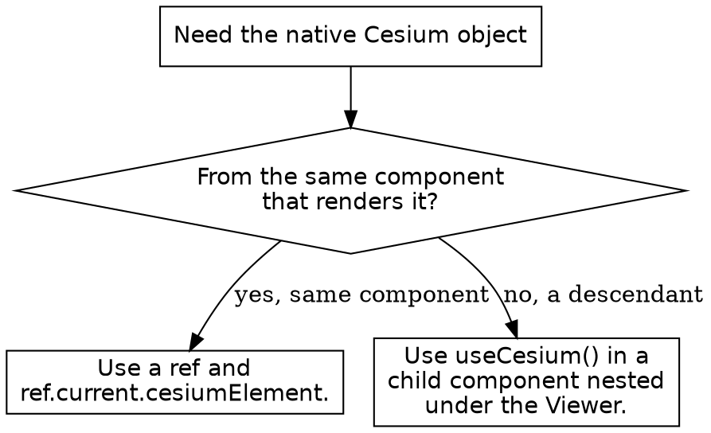

# Resium: CesiumJS in React

## Overview

Resium is a declarative React component library that wraps CesiumJS. Each
Resium component maps to a CesiumJS object: `<Viewer>` to `Cesium.Viewer`,
`<Entity>` to `Cesium.Entity`, `<Cesium3DTileset>` to
`Cesium.Cesium3DTileset`. The component tree builds and tears down the
underlying Cesium objects as React mounts and unmounts.

**Core principle:** CesiumJS is a peer dependency of Resium. The application
installs and pins `cesium` itself; Resium does not bundle it. ALWAYS install
both `resium` and `cesium`.

**Core principle:** Every Resium component except a root component MUST be
nested inside a `<Viewer>` or `<CesiumWidget>`. A component placed outside a
root renders nothing.

Resium 1.21.1 declares peer dependencies `cesium: "1.x"`,
`react: ">=18.2.0"`, and `react-dom: ">=18.2.0"`. It ships full TypeScript
types.

## When to Use This Skill

Use this skill when ANY of these apply:

- Building a CesiumJS scene inside a React application
- A Resium `<Viewer>` renders blank or unstyled
- A component is placed in the tree but never appears
- Reaching the native Cesium object from a Resium component
- `ref.current.cesiumElement` is `undefined`
- Reading the viewer, scene, or camera from a child component

Do NOT use this skill for plain CesiumJS without React; use the `syntax`
skills directly. Do NOT use it for the CesiumJS bundler and `CESIUM_BASE_URL`
setup; that is `cesium-impl-build-deploy`.

## Installation and Setup

```bash
npm install resium cesium
```

CesiumJS needs its static assets served and `window.CESIUM_BASE_URL` set
before import. In a Vite project, the `vite-plugin-cesium` plugin does both.
The CesiumJS widget CSS MUST be imported once, or the `Viewer` toolbar and
widgets render unstyled.

```js
import "cesium/Build/Cesium/Widgets/widgets.css";
```

The bundler and `CESIUM_BASE_URL` detail is in `cesium-impl-build-deploy`.

## Root Components

`Viewer` and `CesiumWidget` are the only root components. Use `Viewer` for the
full UI with widgets; use `CesiumWidget` for a minimal canvas with no toolbar.

```jsx
import { Viewer, Entity } from "resium";
import { Cartesian3 } from "cesium";

function Map() {
  return (
    <Viewer full>
      <Entity
        name="Tokyo"
        position={Cartesian3.fromDegrees(139.767, 35.681, 100)}
        point={{ pixelSize: 10 }}
      />
    </Viewer>
  );
}
```

The `full` prop makes the `Viewer` fill the viewport. A `Viewer` accepts the
same options as `new Cesium.Viewer`, passed as props.

## The Declarative Component Model

A Resium component maps to a CesiumJS class with the same name. Its props
mirror the constructor options or settable properties of that class. The
component tree is the scene.

```jsx
<Viewer full>
  <Cesium3DTileset url="https://example.com/tileset.json" />
  <ImageryLayer imageryProvider={provider} />
  <Entity position={position}>
    <PointGraphics pixelSize={12} color={Color.RED} />
  </Entity>
  <CameraFlyTo destination={destination} duration={3} />
</Viewer>
```

A graphics object is set either as an `Entity` prop (`point={{ ... }}`) or as
a nested graphics component (`<PointGraphics ... />`). The full component
catalog is in `references/methods.md`.

## Accessing the Native Cesium Object

A Resium component exposes its underlying Cesium object through a `ref`. The
ref value is a `CesiumComponentRef<T>`, whose `cesiumElement` property holds
the native object.

```ts
export type CesiumComponentRef<Element> = {
  cesiumElement?: Element;
};
```

`cesiumElement` is OPTIONAL. It is `undefined` until the component has
mounted and the Cesium object is created. ALWAYS read it inside `useEffect`
and ALWAYS guard it with a check. NEVER read `cesiumElement` during render.

```jsx
import { useRef, useEffect } from "react";
import { Viewer } from "resium";

function Map() {
  const viewerRef = useRef(null);

  useEffect(() => {
    const viewer = viewerRef.current?.cesiumElement;
    if (!viewer) {
      return;
    }
    viewer.scene.globe.enableLighting = true;
  }, []);

  return <Viewer ref={viewerRef} full />;
}
```

## The useCesium Hook

`useCesium` reads the Resium context from inside a component nested under a
root. It returns the context object with optional `viewer`, `cesiumWidget`,
`scene`, `globe`, `camera`, `screenSpaceEventHandler`, `entity`, and the
collection fields.

```jsx
import { useCesium } from "resium";

function FlyHomeButton() {
  const { camera } = useCesium();

  return (
    <button
      onClick={() => camera?.flyHome(2)}
      disabled={!camera}
    >
      Fly home
    </button>
  );
}
```

Every field of the returned context is OPTIONAL. ALWAYS guard a field before
use. `useCesium` called outside a `Viewer` or `CesiumWidget` returns an empty
object, because the context provider is the root component.

## Decision: Ref or useCesium



## Common Mistakes

| Mistake | Consequence | Fix |
|---------|-------------|-----|
| `resium` installed without `cesium` | Peer-dependency error, build fails | Install both `resium` and `cesium` |
| A component outside `<Viewer>` | Renders nothing | Nest it inside a `Viewer` or `CesiumWidget` |
| Reading `cesiumElement` in render | `undefined`, crash | Read it inside `useEffect` |
| Using `cesiumElement` without a guard | Crash when it is `undefined` | Check it before use |
| `useCesium` outside a root component | Empty context object | Call it in a descendant of `Viewer` |
| Missing `widgets.css` import | Toolbar and widgets unstyled | Import `cesium/Build/Cesium/Widgets/widgets.css` |
| `CESIUM_BASE_URL` unset | Blank viewer, worker 404s | Configure the bundler; see `cesium-impl-build-deploy` |
| Pinning a `cesium` version Resium rejects | Peer-dependency warning | Use a `1.x` CesiumJS, 1.124 or newer |

## Reference Files

- `references/methods.md` : the full Resium component catalog, the
  `useCesium` context shape, the `CesiumComponentRef` type, and the peer
  dependencies.
- `references/examples.md` : complete recipes for setup, the viewer, entities,
  refs, the hook, camera flight, tilesets, and events.
- `references/anti-patterns.md` : each Resium failure with symptom, root
  cause, and fix.

## Related Skills

- `cesium-impl-build-deploy` : `CESIUM_BASE_URL`, `vite-plugin-cesium`, and
  the static-asset setup Resium depends on.
- `cesium-syntax-viewer` : the `Cesium.Viewer` options behind `<Viewer>`.
- `cesium-syntax-entity` : the `Cesium.Entity` model behind `<Entity>`.
- `cesium-syntax-3d-tiles` : the `Cesium3DTileset` behind `<Cesium3DTileset>`.
- `cesium-core-memory` : Resium unmount calls `destroy()`; manual native
  objects still need teardown.
