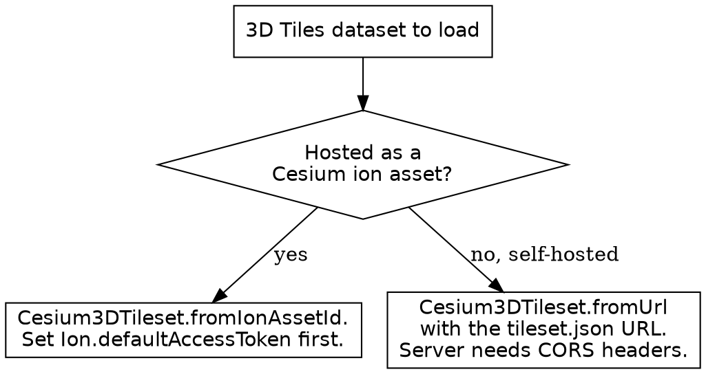

# CesiumJS 3D Tiles

## Overview

`Cesium3DTileset` streams a massive 3D dataset (a city, a point cloud, a
photogrammetry mesh) into a CesiumJS scene. The runtime loads only the tiles
visible at the current camera position and screen-space error, so a dataset
far larger than memory renders smoothly.

**Core principle:** ALWAYS create a tileset through the async static factory
`Cesium3DTileset.fromUrl` or `Cesium3DTileset.fromIonAssetId`. Both return a
`Promise<Cesium3DTileset>` that resolves once the tileset JSON is loaded and
the tileset is ready. NEVER call `new Cesium3DTileset({ url })`, and NEVER
reference `readyPromise` or `.ready`; the synchronous constructor path and
`readyPromise` were removed in CesiumJS 1.107.

## When to Use This Skill

Use this skill when ANY of these apply:

- Loading a 3D Tiles tileset from a `tileset.json` URL
- Loading a tileset hosted as a Cesium ion asset
- A tileset does not appear, loads blank, or fails with a CORS or 401 error
- Streaming a city, OSM Buildings, photogrammetry, or a point cloud
- Picking a feature inside a tileset and reading its metadata properties
- Tuning a tileset for detail, frame rate, or memory budget

Do NOT use this skill for the 3D Tiles styling expression language, clipping
workflow, or optimization deep dive; that is `cesium-impl-3d-tiles-styling`.
Do NOT use it for a single discrete glTF asset; that is
`cesium-syntax-gltf-model`.

## Loading a Tileset From a URL

```js
try {
  const tileset = await Cesium.Cesium3DTileset.fromUrl(
    "https://example.com/tilesets/city/tileset.json",
  );
  viewer.scene.primitives.add(tileset);
  await viewer.zoomTo(tileset);
} catch (error) {
  console.error("Tileset failed to load:", error);
}
```

`fromUrl(url, options)` accepts a string or a `Resource` as `url`. The
resolved `Cesium3DTileset` is a primitive; ALWAYS add it to
`viewer.scene.primitives`. The factory rejects on a network failure, a CORS
failure, or an unsupported tileset version, so ALWAYS wrap the `await` in
`try / catch`.

## Loading a Tileset From a Cesium ion Asset

```js
Cesium.Ion.defaultAccessToken = "<your-ion-token>";

const tileset = await Cesium.Cesium3DTileset.fromIonAssetId(96188);
viewer.scene.primitives.add(tileset);
await viewer.zoomTo(tileset);
```

`fromIonAssetId(assetId, options)` takes a numeric ion asset id. ALWAYS set
`Cesium.Ion.defaultAccessToken` before the call when the asset is ion-hosted;
a missing or expired token rejects the promise with a 401 or 403. See
`cesium-impl-cesium-ion` for the ion platform detail.

## After the Promise Resolves

Once the promise resolves, the tileset is fully ready and its derived
properties are valid. NEVER read `tileset.boundingSphere` or `tileset.root`
before the `await` completes; the variable is `undefined` until then.

```js
const tileset = await Cesium.Cesium3DTileset.fromUrl(url);
viewer.scene.primitives.add(tileset);

// boundingSphere is valid only after the promise resolves.
viewer.camera.viewBoundingSphere(
  tileset.boundingSphere,
  new Cesium.HeadingPitchRange(0.0, -0.5, tileset.boundingSphere.radius * 2.0),
);
```

## Tile Content Formats

A 3D Tiles dataset is a tree of tiles described by a `tileset.json` file. Each
tile points to a content file.

| Format | Spec | Content |
|--------|------|---------|
| `b3dm` | 1.0 | Batched 3D Model (buildings, meshes) |
| `i3dm` | 1.0 | Instanced 3D Model (repeated trees, lamps) |
| `pnts` | 1.0 | Point cloud |
| `cmpt` | 1.0 | Composite of other formats |
| `.gltf` / `.glb` | 1.1 | glTF used directly as tile content |

CesiumJS 1.124+ reads both 3D Tiles 1.0 and 1.1. NEVER convert format choice
into a runtime decision; the format is fixed by the tileset author and the
runtime detects it automatically.

## 3D Tiles 1.0 Versus 1.1

3D Tiles 1.1 is the current standard. Its changes over 1.0:

- glTF assets are supported directly as tile content. The four 1.0 binary
  formats (`b3dm`, `i3dm`, `pnts`, `cmpt`) are deprecated in favor of glTF
  content.
- Structured metadata can be associated with the tileset, tiles, tile
  content, and content groups. The 1.0 `tileset.properties` field is
  deprecated in favor of this metadata.
- Implicit tiling schemes describe the tile tree by a rule instead of an
  explicit node per tile.
- A single tile may carry multiple contents.

A tileset authored to 1.0 still loads in CesiumJS 1.124+. ALWAYS treat the
spec version as a property of the data, not a runtime setting.

## Key Properties

`Cesium3DTileset` properties accepted in the `options` argument and readable
or writable on the instance:

| Property | Type | Default | Purpose |
|----------|------|---------|---------|
| `style` | `Cesium3DTileStyle` | `undefined` | Feature styling expression |
| `maximumScreenSpaceError` | number | `16` | Detail threshold; higher loads coarser |
| `cacheBytes` | number | `536870912` | Tile cache size, 512 MiB default |
| `maximumCacheOverflowBytes` | number | `536870912` | Extra cache allowed on demand |
| `clippingPlanes` | `ClippingPlaneCollection` | `undefined` | Plane clipping |
| `clippingPolygons` | `ClippingPolygonCollection` | `undefined` | Polygon clipping |
| `modelMatrix` | `Matrix4` | `Matrix4.IDENTITY` | Transform applied to the whole tileset |
| `show` | boolean | `true` | Visibility toggle |

`boundingSphere` and `root` are read-only and valid only after the promise
resolves. For `style` authoring and the clipping workflow, see
`cesium-impl-3d-tiles-styling`.

## Controlling Detail and Memory

`maximumScreenSpaceError` is the primary detail and performance lever. It is
the maximum allowed error, in pixels, of a tile before a more detailed tile
loads. The default is `16`.

- A LOWER value loads more detail and costs more memory and bandwidth.
- A HIGHER value loads coarser tiles and renders faster.

```js
const tileset = await Cesium.Cesium3DTileset.fromUrl(url, {
  maximumScreenSpaceError: 24, // coarser, faster
  cacheBytes: 1024 * 1024 * 1024, // 1 GiB tile cache
});
```

`cacheBytes` sets the target tile cache size; `maximumCacheOverflowBytes`
bounds the extra cache allowed when the target is not enough for the current
view. See `cesium-core-performance` for the full tuning set.

## Picking a Feature

A pick against a tileset returns a `Cesium3DTileFeature`, not an `Entity`.

```js
const handler = new Cesium.ScreenSpaceEventHandler(viewer.scene.canvas);
handler.setInputAction((movement) => {
  const picked = viewer.scene.pick(movement.position);
  if (picked instanceof Cesium.Cesium3DTileFeature) {
    const ids = picked.getPropertyIds();
    for (const id of ids) {
      console.log(id, picked.getProperty(id));
    }
    picked.color = Cesium.Color.YELLOW; // highlight
  }
}, Cesium.ScreenSpaceEventType.LEFT_CLICK);
```

`getProperty(name)` returns a copy of a metadata value; `getPropertyIds()`
lists every property name; `hasProperty(name)` tests one. `picked.tileset`
returns the owning `Cesium3DTileset`. See `cesium-impl-picking-measurement`
for the full picking model.

## Loading Events

`Cesium3DTileset` raises events as tiles stream in. Use them to drive a
loading indicator or to react to a failure.

| Event | Fires when |
|-------|-----------|
| `tileLoad` | A tile's content finished loading |
| `tileFailed` | A tile's content failed to load |
| `tileVisible` | Once per visible tile per frame |
| `allTilesLoaded` | Every tile meeting screen-space error this frame is loaded |
| `initialTilesLoaded` | The initial-view tiles finished loading, fired once |
| `tileUnload` | A tile's content was unloaded from the cache |

```js
tileset.initialTilesLoaded.addEventListener(() => {
  console.log("Initial view ready");
});
tileset.tileFailed.addEventListener((error) => {
  console.error("Tile failed:", error.url, error.message);
});
```

## Decision: fromUrl or fromIonAssetId



## Common Mistakes

| Mistake | Consequence | Fix |
|---------|-------------|-----|
| `new Cesium3DTileset({ url })` | Throws; constructor path removed in 1.107 | Use `Cesium3DTileset.fromUrl` |
| `readyPromise` or `.ready` | Undefined; removed in 1.107 | `await` the factory instead |
| Reading `boundingSphere` before `await` | `undefined`, camera move fails | Read it after the promise resolves |
| No `try / catch` around the factory | Unhandled rejection on a load failure | Wrap the `await` in `try / catch` |
| ion asset, no `Ion.defaultAccessToken` | Promise rejects with 401 or 403 | Set the token before the call |
| `fromUrl` to a server without CORS headers | Promise rejects with a CORS error | Serve `Access-Control-Allow-Origin` |
| Forgetting `scene.primitives.add` | Tileset loads but never renders | Add the resolved tileset to `scene.primitives` |
| `maximumScreenSpaceError` set very low | Slow load, high memory use | Raise it toward `16` or higher |

## Reference Files

- `references/methods.md` : the full `Cesium3DTileset` constructor option
  catalog, factory signatures, instance properties, events, methods, and the
  `Cesium3DTileFeature` API.
- `references/examples.md` : complete recipes for loading from a URL and from
  ion, framing the camera, tuning detail and memory, picking a feature, and
  tracking load progress.
- `references/anti-patterns.md` : each tileset failure with symptom, root
  cause, and fix.

## Related Skills

- `cesium-impl-3d-tiles-styling` : `Cesium3DTileStyle` expression language,
  clipping, and the optimization workflow.
- `cesium-syntax-gltf-model` : a single discrete glTF asset with `Model`.
- `cesium-impl-cesium-ion` : the ion platform, tokens, and asset hosting.
- `cesium-impl-picking-measurement` : `scene.pick`, `drillPick`, and the
  full picking model.
- `cesium-core-performance` : `maximumScreenSpaceError`, `cacheBytes`, and
  the rest of the performance levers.
- `cesium-core-versioning` : the async-factory migration and `readyPromise`
  removal.
- `cesium-errors-tileset` : CORS, 401, and 403 tileset failures in depth.
