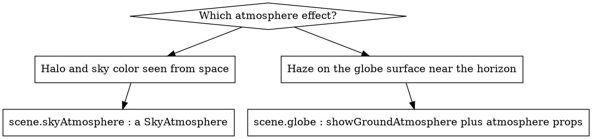

# CesiumJS Atmosphere and Lighting Syntax

## Overview

CesiumJS renders the sky, the air, and the light as distinct objects that all
hang off `Scene`. The blue halo seen AROUND the globe from space is
`scene.skyAtmosphere` (a `SkyAtmosphere`). The hazy air rendered ON the globe
surface near the horizon is the GROUND atmosphere, controlled on `scene.globe`
(a `Globe`). The star field is `scene.skyBox`, the celestial bodies are
`scene.sun` and `scene.moon`, distance haze is `scene.fog`, and the shading
light for models and tiles is `scene.light`.

Core principle: sky atmosphere and ground atmosphere are SEPARATE objects with
separately-stored but identically-named properties. Tuning one NEVER changes
the other. This single fact prevents most atmosphere bugs.

This skill is technology-specific: CesiumJS 1.124+, WebGL2 only.

## When to Use This Skill

- The sky is black instead of blue, or shows no atmosphere.
- The globe looks too dark, or has no day-night terminator.
- Tuning an atmosphere property had no visible effect.
- Adding or removing the star field, sun, or moon.
- Setting a fixed light direction instead of the moving sun.
- Distant terrain washes out, or you want to disable haze.
- Atmosphere looks wrong in 2D or Columbus view.

## Quick Reference: Atmosphere and Lighting Objects

| Object | Member | What it renders |
|--------|--------|-----------------|
| `SkyAtmosphere` | `scene.skyAtmosphere` | blue halo and sky color around the globe (3D only) |
| `Globe` | `scene.globe` | ground atmosphere haze and terrain day-night lighting |
| `SkyBox` | `scene.skyBox` | the star field behind the globe |
| `Sun` | `scene.sun` | the sun disc and lens flare |
| `Moon` | `scene.moon` | the moon disc |
| `Fog` | `scene.fog` | distance haze over terrain |
| `Light` | `scene.light` | the shading light for models, tiles, primitives |

A `Viewer` and a `CesiumWidget` create `skyAtmosphere`, `skyBox`, `sun`, and
`moon` automatically. They are present on `viewer.scene` without extra
construction.

## Sky Atmosphere vs Ground Atmosphere



Both objects expose `atmosphereLightIntensity`, `atmosphereRayleighCoefficient`,
`atmosphereMieCoefficient`, `atmosphereRayleighScaleHeight`,
`atmosphereMieScaleHeight`, and `atmosphereMieAnisotropy`. The names match; the
objects do not. ALWAYS set the property on the object you mean. NEVER expect
`globe.atmosphereLightIntensity` to change the halo, or
`skyAtmosphere.atmosphereLightIntensity` to change the surface haze.

The defaults differ, which confirms they are separate:
`SkyAtmosphere.atmosphereLightIntensity` is `50.0`,
`Globe.atmosphereLightIntensity` is `10.0`.

## Sky Atmosphere

`scene.skyAtmosphere` is a `SkyAtmosphere`. It renders ONLY in 3D scene mode and
fades out when morphing to 2D or Columbus view.

```js
const sky = viewer.scene.skyAtmosphere;
sky.show = true;             // default true
sky.hueShift = 0.0;          // -1.0 to 1.0
sky.saturationShift = 0.0;   // -1.0 to 1.0
sky.brightnessShift = 0.0;   // -1.0 to 1.0
sky.atmosphereLightIntensity = 50.0;
```

| Property | Default | Effect |
|----------|---------|--------|
| `show` | `true` | renders the halo and sky |
| `hueShift` | `0.0` | rotates sky hue |
| `saturationShift` | `0.0` | shifts sky saturation |
| `brightnessShift` | `0.0` | shifts sky brightness |
| `atmosphereLightIntensity` | `50.0` | brightness of scattered light |
| `perFragmentAtmosphere` | `false` | per-fragment instead of per-vertex shading |

ALWAYS toggle visibility with `skyAtmosphere.show`; it is the supported on-off
switch. Setting `show = false` yields pure black space.

## Ground Atmosphere and Globe Lighting

`scene.globe` carries the ground atmosphere haze and the terrain lighting.

```js
const globe = viewer.scene.globe;
globe.showGroundAtmosphere = true;   // haze on the surface near the horizon
globe.enableLighting = true;         // sun-based day-night terrain shading
globe.atmosphereLightIntensity = 10.0;
```

| Property | Default | Effect |
|----------|---------|--------|
| `showGroundAtmosphere` | `true` on WGS84 | surface haze near the horizon |
| `enableLighting` | `false` | day-night terminator on terrain |
| `dynamicAtmosphereLighting` | `true` | atmosphere follows the scene light |
| `dynamicAtmosphereLightingFromSun` | `false` | atmosphere follows the real sun instead |
| `atmosphereLightIntensity` | `10.0` | brightness of the ground atmosphere |

`enableLighting` defaults to `false`, so by default the whole globe is lit
evenly with no night side. ALWAYS set `globe.enableLighting = true` to get a
day-night terminator.

## Sky Box, Sun, and Moon

```js
viewer.scene.skyBox.show = true;   // star field
viewer.scene.sun.show = true;      // sun disc and flare
viewer.scene.moon.show = true;     // moon disc
```

- `SkyBox` is the star field. A custom star field uses
  `new Cesium.SkyBox({ sources: { positiveX, negativeX, positiveY, negativeY,
  positiveZ, negativeZ } })` with six cube-map face images.
- `Sun` has `show` (default `true`) and `glowFactor` (default `1.0`; `0` shows
  the disc with no flare).
- `Moon` has `show` (default `true`), `textureUrl`, `ellipsoid` (default
  `Ellipsoid.MOON`), and `onlySunLighting` (default `true`).
- `scene.sunBloom` (default `true`) adds a bloom post-process around the sun.

## Scene Light: SunLight vs DirectionalLight

`scene.light` is the `Light` that shades models, 3D Tiles, and primitives. Two
implementations exist.

| Class | Behavior | Default intensity |
|-------|----------|-------------------|
| `SunLight` | follows the real sun position over time | `2.0` |
| `DirectionalLight` | fixed direction, never moves | `1.0` |

`scene.light` defaults to a `SunLight`. ALWAYS use a `DirectionalLight` when the
shading must stay constant regardless of the clock.

```js
viewer.scene.light = new Cesium.DirectionalLight({
  direction: Cesium.Cartesian3.normalize(
    new Cesium.Cartesian3(0.5, -0.5, -0.7),
    new Cesium.Cartesian3()
  ),
  intensity: 2.0,
});
```

The `direction` is REQUIRED and must NEVER be zero-length; a zero-length vector
throws a `DeveloperError`.

## Fog

`scene.fog` is a `Fog`. It fades distant terrain into haze and lets CesiumJS
lower the detail of far tiles for performance.

| Property | Default | Effect |
|----------|---------|--------|
| `enabled` | `true` | fog on or off |
| `density` | `0.0006` | thickness of the fog |
| `minimumBrightness` | `0.03` | darkest the fog color may get |
| `screenSpaceErrorFactor` | `2.0` | how much far-tile detail drops in fog |

NEVER disable `fog` purely for visual clarity without measuring performance;
fog also reduces the tile load for distant terrain.

## Common Mistakes

| Mistake | Fix |
|---------|-----|
| `globe.atmosphereLightIntensity` to change the halo | Set it on `scene.skyAtmosphere` instead |
| Sky atmosphere tuned in 2D or Columbus view | `SkyAtmosphere` is 3D-only; it fades out otherwise |
| Globe evenly lit, no night side | Set `globe.enableLighting = true` |
| Sky is black, expected blue | `scene.skyAtmosphere.show` is `false`, or the scene is in 2D |
| `new DirectionalLight({})` with no direction | `direction` is required and non-zero |
| Disabled fog, distant terrain slow | Fog lowers far-tile detail; re-enable it |

Full root-cause analysis is in `references/anti-patterns.md`.

## Reference Files

- `references/methods.md` : verified properties and defaults for `SkyAtmosphere`,
  `Globe`, `SkyBox`, `Sun`, `Moon`, `Fog`, `SunLight`, and `DirectionalLight`.
- `references/examples.md` : runnable snippets for black space, day-night
  lighting, custom star fields, fixed lights, and fog tuning.
- `references/anti-patterns.md` : atmosphere and lighting failure modes, each
  with symptom, root cause, prevention, and recovery.

## Related Skills

- `cesium-core-architecture` : the `Scene` containment hierarchy these objects sit in.
- `cesium-syntax-viewer` : `Viewer` and `CesiumWidget` construction.
- `cesium-syntax-materials` : `CustomShader` lighting models and post-process stages.
- `cesium-syntax-time` : the `Clock` that drives `SunLight` and dynamic atmosphere.
- `cesium-core-performance` : `requestRenderMode` and fog-based detail tuning.
