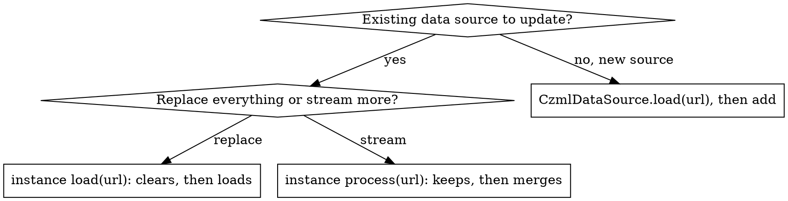

# CesiumJS DataSources Syntax

## Overview

A DATA SOURCE loads a whole geospatial file format into a collection of
`Entity` objects in one call. CesiumJS ships three: `CzmlDataSource` (CZML, a
JSON time-dynamic format), `GeoJsonDataSource` (GeoJSON and TopoJSON), and
`KmlDataSource` (KML and KMZ). The viewer holds them in `viewer.dataSources`,
a `DataSourceCollection`.

Core principle: every loader is an ASYNC static factory that returns a
`Promise`. `viewer.dataSources.add` accepts that promise directly and shows the
data when it resolves. NEVER hand-build the entities a file format already
describes.

This skill is technology-specific: CesiumJS 1.124+, WebGL2 only.

## When to Use This Skill

- Loading a CZML, GeoJSON, TopoJSON, KML, or KMZ file onto the globe.
- Loaded data does not appear at all.
- Polygons or lines float above terrain or sink underground.
- A second load call erased entities that were already on screen.
- Streaming incremental CZML updates into a live scene.
- KML network links or screen overlays do not work.
- Flying the camera to fit freshly loaded data.

## Quick Reference: The Three Data Sources

| Class | Formats | Loader | Watch out for |
|-------|---------|--------|---------------|
| `CzmlDataSource` | CZML | `CzmlDataSource.load(czml, options)` | `load` replaces, `process` appends |
| `GeoJsonDataSource` | GeoJSON, TopoJSON | `GeoJsonDataSource.load(data, options)` | `clampToGround` defaults `false` |
| `KmlDataSource` | KML, KMZ | `KmlDataSource.load(data, options)` | pass `camera` and `canvas` |

Each `load` is a STATIC method returning `Promise<DataSource>`. The `data`
argument may be a URL string, a `Resource`, or an already-parsed object.

## The Load Pattern

`DataSourceCollection.add` accepts a `DataSource` OR a `Promise<DataSource>`.
When given a promise, the data source joins the collection once the promise
resolves. ALWAYS pass the loader promise straight to `add`.

```js
viewer.dataSources.add(
  Cesium.GeoJsonDataSource.load("/data/roads.geojson", { clampToGround: true })
);
```

`add` itself returns a `Promise<DataSource>`. ALWAYS `await` it when you need a
reference to the resolved data source, for example to fly the camera:

```js
const dataSource = await viewer.dataSources.add(
  Cesium.CzmlDataSource.load("/data/flight.czml")
);
viewer.flyTo(dataSource);
```

NEVER read `dataSource.entities` straight after the `load()` call without
awaiting. The entities exist only after the promise resolves.

## CZML: load Replaces, process Appends

`CzmlDataSource` has two instance methods that look interchangeable and are not.



- Instance `load(czml, options)` CLEARS all existing entities, then loads. Use
  it to swap one dataset for another.
- Instance `process(czml, options)` KEEPS existing entities and merges the new
  packets. Use it for incremental or streamed CZML.
- ALWAYS use `process` for streaming updates. NEVER call `load` a second time
  to add data; `load` silently wipes every entity already in the data source.

```js
const source = new Cesium.CzmlDataSource();
viewer.dataSources.add(source);
await source.load("/data/initial.czml");      // first dataset
await source.process("/data/update-1.czml");  // appends, keeps initial
```

CZML itself is a JSON ARRAY of packets. The FIRST packet must be the document
packet: `{ "id": "document", "version": "1.0" }`, optionally carrying a `clock`.
A missing or non-`1` major version makes `load` reject with `RuntimeError`
("Cesium only supports CZML version 1.").

## GeoJSON and TopoJSON

`GeoJsonDataSource.load` reads BOTH GeoJSON and TopoJSON; it detects the form
from the data. No separate TopoJSON class exists.

`clampToGround` defaults to `false`. With terrain loaded, unclamped polygons
and lines render at ellipsoid height 0, so they float or sink. ALWAYS pass
`clampToGround: true` to drape vector data over terrain.

```js
viewer.dataSources.add(
  Cesium.GeoJsonDataSource.load("/data/parcels.geojson", {
    clampToGround: true,
    stroke: Cesium.Color.CRIMSON,
    strokeWidth: 3,
    fill: Cesium.Color.CRIMSON.withAlpha(0.4),
  })
);
```

Styling option defaults:

| Option | Default | Effect |
|--------|---------|--------|
| `stroke` | `Color.BLACK` | line and polygon outline color |
| `strokeWidth` | `2.0` | line width |
| `fill` | `Color.YELLOW` | polygon fill color |
| `markerColor` | `Color.ROYALBLUE` | pin color for points |
| `markerSize` | `48` | pin size in pixels |
| `markerSymbol` | none | Maki id or a single character |
| `clampToGround` | `false` | drape geometry on terrain |

Per-feature `simplestyle-spec` properties inside the GeoJSON (`stroke`, `fill`,
`marker-color`, and the rest) OVERRIDE these load options. The static fields
`GeoJsonDataSource.stroke`, `.fill`, `.clampToGround`, and their siblings set
process-wide defaults for every later load.

## KML and KMZ

`KmlDataSource.load` reads KML and KMZ; the `data` argument may be a URL, a
parsed `Document`, or a `Blob` holding KMZ bytes.

`camera` and `canvas` are technically optional, but KML network links and
screen overlays need them to compute request parameters and overlay sizes.
ALWAYS pass both.

```js
viewer.dataSources.add(
  Cesium.KmlDataSource.load("/data/tour.kmz", {
    camera: viewer.scene.camera,
    canvas: viewer.scene.canvas,
    clampToGround: true,
  })
);
```

KML-specific extras: `screenOverlayContainer` for ScreenOverlay images,
`kmlTours` on the resolved data source for camera tours, and the
`unsupportedNodeEvent` for unhandled KML node types.

## Flying to Loaded Data

`viewer.flyTo(target)` and `viewer.zoomTo(target)` accept a data source and
frame all of its entities. ALWAYS await the data source first.

```js
const ds = await viewer.dataSources.add(
  Cesium.KmlDataSource.load("/data/sites.kml", {
    camera: viewer.scene.camera,
    canvas: viewer.scene.canvas,
  })
);
viewer.flyTo(ds);
```

## Removing and Destroying Data Sources

| Operation | Call |
|-----------|------|
| Remove one, keep it alive | `viewer.dataSources.remove(ds)` |
| Remove one and free its memory | `viewer.dataSources.remove(ds, true)` |
| Remove all and free their memory | `viewer.dataSources.removeAll(true)` |
| Reorder | `raise`, `lower`, `raiseToTop`, `lowerToBottom` |
| Count | `viewer.dataSources.length` |

The `destroy` argument defaults to `false`. ALWAYS pass `true` when the data
source is gone for good, or its entity primitives leak.

## Common Mistakes

| Mistake | Fix |
|---------|-----|
| Calling instance `load` twice to add data | Use `process`; `load` wipes prior entities |
| GeoJSON or KML geometry floats or sinks | Pass `clampToGround: true` |
| Reading `dataSource.entities` right after `load()` | Await the promise first |
| `new GeoJsonDataSource("data.geojson")` | The constructor takes a name; load with `GeoJsonDataSource.load` |
| KML network links or overlays dead | Pass `camera` and `canvas` |
| Data sources never freed | `remove(ds, true)` or `removeAll(true)` |
| CZML without a document packet | First packet needs `id: "document"`, `version: "1.0"` |

Full root-cause analysis is in `references/anti-patterns.md`.

## Reference Files

- `references/methods.md` : verified signatures for `DataSourceCollection`,
  `CzmlDataSource`, `GeoJsonDataSource`, and `KmlDataSource`.
- `references/examples.md` : runnable load patterns for every format, CZML
  streaming, styling, flyTo, and teardown.
- `references/anti-patterns.md` : data-source failure modes, each with symptom,
  root cause, prevention, and recovery.

## Related Skills

- `cesium-syntax-entity` : the `Entity` objects every data source produces.
- `cesium-syntax-viewer` : the `dataSources` Viewer option and construction.
- `cesium-syntax-time` : the `Clock` and time-dynamic CZML playback.
- `cesium-syntax-camera` : `flyTo` and `zoomTo` framing.
- `cesium-errors-coordinates` : floating geometry and `clampToGround` failures.
