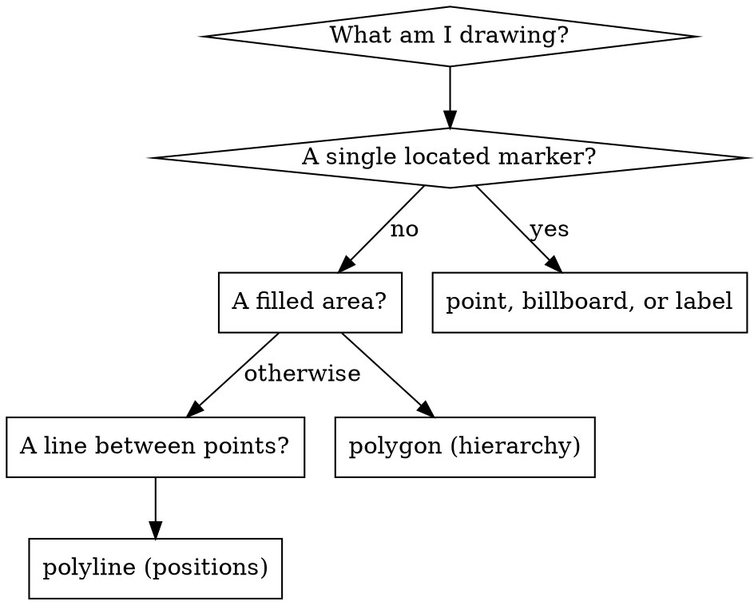

# CesiumJS Entity API

## Overview

The `Entity` API is the high-level, retained-mode way to put objects on the
globe. An `Entity` is a container: it carries a `position` and one or more
**graphics objects** (`point`, `billboard`, `label`, `polyline`, `polygon`,
`model`, and others). CesiumJS visualizes entities automatically every frame.

Every value on an entity is a `Property`, which makes entities time-dynamic by
construction. A raw value (a `Color`, a number, a `Cartesian3`) assigned to a
graphics field is wrapped in a `ConstantProperty` internally.

Verified signatures and defaults are in `references/methods.md`. Runnable code
is in `references/examples.md`. Failure modes are in `references/anti-patterns.md`.

## Core Rules

- An entity renders nothing unless it has at least one graphics field set.
  ALWAYS set `point`, `billboard`, `polygon`, or another graphics object.
- Point, billboard, label, and model graphics ALWAYS need `position`. Polygon
  uses `hierarchy`; polyline uses `positions`. NEVER expect a `point` to show
  without a `position`.
- ALWAYS add entities through `viewer.entities.add(...)`. NEVER push onto
  `viewer.entities.values`; that array must not be modified directly.
- A `CallbackProperty` whose value changes over time ALWAYS takes
  `isConstant = false`. With `true`, CesiumJS caches the first result and the
  value never updates.
- ALWAYS use the Entity API for interactive or time-dynamic data below roughly
  10000 objects. NEVER use entities for tens of thousands of static objects;
  the visualizer loops every entity each frame. Use batched primitives or 3D
  Tiles instead.
- ALWAYS call `entity.billboard.image` with a loaded image URL or canvas. A
  missing or 404 image renders no billboard.
- ALWAYS set `heightReference` to `CLAMP_TO_GROUND` for ground-following
  graphics. Without it the entity sits at the height in its position (0 by
  default), which floats below or above terrain.

## Quick Reference

| Goal | Code |
|------|------|
| Add a point | `viewer.entities.add({ position, point: { pixelSize: 10 } })` |
| Add a billboard | `viewer.entities.add({ position, billboard: { image: url } })` |
| Add a label | `viewer.entities.add({ position, label: { text: "Site" } })` |
| Add a polygon | `viewer.entities.add({ polygon: { hierarchy, material } })` |
| Add a polyline | `viewer.entities.add({ polyline: { positions, width: 3 } })` |
| Remove one entity | `viewer.entities.remove(entity)` |
| Remove by id | `viewer.entities.removeById(id)` |
| Remove all | `viewer.entities.removeAll()` |
| Look up by id | `viewer.entities.getById(id)` |
| Fly to an entity | `viewer.flyTo(entity)` |
| Open the InfoBox | `viewer.selectedEntity = entity` |

`viewer.entities.add` accepts an `Entity` or an `Entity.ConstructorOptions`
object and returns the `Entity`.

## Anatomy Of An Entity

```javascript
const site = viewer.entities.add({
  id: "site-42",                                   // omit for an auto GUID
  name: "Pumping Station",                          // shown in the InfoBox title
  position: Cesium.Cartesian3.fromDegrees(4.9, 52.37, 0.0),
  point: { pixelSize: 12, color: Cesium.Color.CYAN },
  label: { text: "Pumping Station", pixelOffset: new Cesium.Cartesian2(0, -24) },
  description: "<p>HTML shown in the InfoBox body.</p>",
});
```

An entity may carry several graphics objects at once (a point plus a label is
the standard marker pattern). `id` is auto-generated if omitted. `name` and
`description` feed the InfoBox.

## Which Graphics Object



- `point` : a simple GPU dot, fastest single marker.
- `billboard` : an image marker. Requires a loaded `image`.
- `label` : screen-space text.
- `polyline` : a line through `positions`. Set `clampToGround: true` to drape.
- `polygon` : a filled area from `hierarchy`. Set `perPositionHeight` or an
  `extrudedHeight` for 3D shapes.
- `model` : a glTF model. See `cesium-syntax-gltf-model`.

## Entity Versus Primitive

This is the most common architectural decision in CesiumJS code.

| Use Entity when | Use Primitive when |
|-----------------|--------------------|
| Below ~10000 objects | Tens of thousands of static objects |
| Interactive (picked, selected) | Batched, draw-call bound |
| Time-dynamic (tracks, availability) | Static after creation |
| Declarative, fast to write | Lower-level, hand-optimized |

The `EntityCollection` visualizer loops every entity every frame. Past ~10000
entities this dominates the frame budget; past ~100000 entities the tab runs
out of memory. For massive static data use batched `GeometryInstance`
primitives (`cesium-syntax-primitive`) or stream 3D Tiles
(`cesium-syntax-3d-tiles`).

## The Property System

Every graphics field is a `Property`. Three concrete types cover most needs.

### ConstantProperty (and auto-wrapping)

A raw value assigned to a graphics field is wrapped in a `ConstantProperty`
automatically. These two are equivalent:

```javascript
point: { color: Cesium.Color.RED }
point: { color: new Cesium.ConstantProperty(Cesium.Color.RED) }
```

Write the raw form. Use `ConstantProperty` explicitly only when calling
`setValue` later.

### SampledProperty (time-interpolated)

Holds time-indexed samples and interpolates between them. Use
`SampledPositionProperty` for moving positions (see `cesium-syntax-time`).

```javascript
const temperature = new Cesium.SampledProperty(Number);
temperature.addSample(Cesium.JulianDate.fromIso8601("2026-05-20T08:00:00Z"), 12);
temperature.addSample(Cesium.JulianDate.fromIso8601("2026-05-20T20:00:00Z"), 24);
```

### CallbackProperty (per-frame)

Evaluates a callback every frame. The second argument, `isConstant`, is the
single most error-prone parameter in the Entity API.

```javascript
// isConstant MUST be false: the value changes every frame.
polyline: {
  positions: new Cesium.CallbackProperty(() => livePositions, false),
}
```

With `isConstant = true`, CesiumJS caches the first evaluation and the entity
freezes. ALWAYS pass `false` for any animated callback. Use
`CallbackPositionProperty` for a callback-driven `position`.

## Materials

A graphics `material` field accepts a `MaterialProperty` or a raw `Color`
(auto-wrapped into a `ColorMaterialProperty`).

```javascript
polygon: { hierarchy, material: Cesium.Color.ORANGE.withAlpha(0.5) }
polyline: {
  positions,
  width: 8,
  material: new Cesium.PolylineGlowMaterialProperty({
    color: Cesium.Color.CYAN,
    glowPower: 0.25,   // verified default
    taperPower: 1.0,   // verified default
  }),
}
```

Polyline-specific materials: `PolylineGlowMaterialProperty`,
`PolylineDashMaterialProperty`, `PolylineArrowMaterialProperty`,
`PolylineOutlineMaterialProperty`. See `references/methods.md`.

## Hierarchy And Availability

- `parent` builds a tree. `entity.isShowing` reflects the entity's own `show`
  and every ancestor's `show`.
- `availability` is a `TimeIntervalCollection`. An entity outside its
  availability is hidden by the clock. Use it for time-bounded features.

```javascript
viewer.entities.add({
  parent: groupEntity,
  availability: new Cesium.TimeIntervalCollection([
    Cesium.TimeInterval.fromIso8601({ iso8601: "2026-05-20/2026-05-21" }),
  ]),
  position,
  point: { pixelSize: 8 },
});
```

## Bulk Add Performance

Wrap large add or remove batches in `suspendEvents` / `resumeEvents` so the
collection fires one change event instead of one per entity.

```javascript
viewer.entities.suspendEvents();
for (const feature of features) {
  viewer.entities.add({ position: feature.position, point: { pixelSize: 6 } });
}
viewer.entities.resumeEvents();
```

## Common Mistakes

| Mistake | Symptom | Fix |
|---------|---------|-----|
| No graphics field set | Entity exists, nothing renders | Set `point`, `billboard`, `polygon`, etc. |
| `point` without `position` | Marker never appears | Provide `position` |
| `CallbackProperty(cb, true)` for animation | Value frozen at frame 1 | Pass `isConstant` as `false` |
| Billboard `image` is a 404 | No billboard, no error thrown | Use a reachable, loaded image |
| Tens of thousands of entities | Frame rate collapses, tab crashes | Switch to primitives or 3D Tiles |
| No `heightReference` over terrain | Entity floats or is buried | Set `CLAMP_TO_GROUND` |
| Pushing to `entities.values` | Entity not visualized | Use `viewer.entities.add` |

Full diagnosis of each is in `references/anti-patterns.md`.

## Reference Files

- `references/methods.md` : verified signatures for `Entity`,
  `EntityCollection`, the graphics objects, and the Property and material
  classes.
- `references/examples.md` : complete runnable entity, polygon, polyline,
  time-dynamic, and bulk-add examples.
- `references/anti-patterns.md` : every invisible-entity, frozen-callback, and
  performance failure mode with root cause and fix.

## Related Skills

- `cesium-core-coordinates` : building `Cartesian3` positions and hierarchies.
- `cesium-syntax-primitive` : the batched low-level alternative at scale.
- `cesium-syntax-time` : `SampledPositionProperty` and the `Clock`.
- `cesium-syntax-gltf-model` : the `model` graphics object in depth.
- `cesium-impl-picking-measurement` : picking entities and the InfoBox.
