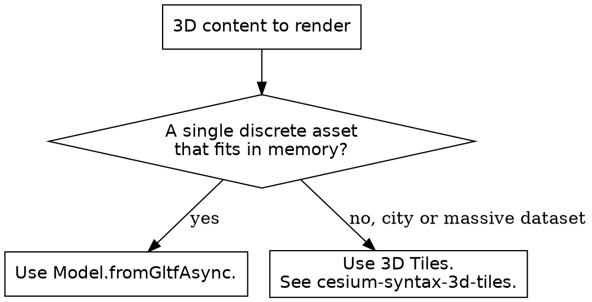

# CesiumJS glTF Model

## Overview

The `Model` class renders a glTF 2.0 or glb asset in a CesiumJS scene. It is
the production 3D-model renderer. `Model` is always created through the async
static factory `Model.fromGltfAsync`, which returns a `Promise<Model>` that
resolves once the model is ready to render.

**Core principle:** ALWAYS load a model with `await Model.fromGltfAsync(...)`.
NEVER call `Model.fromGltf`, and NEVER reference `ModelExperimental`; that
class was merged into `Model` and no longer exists.

## When to Use This Skill

Use this skill when ANY of these apply:

- Loading a glTF or glb file directly with the `Model` class
- A model does not appear, or appears at the center of the Earth
- A model renders on its side or facing the wrong way
- A glTF animation does not play
- Driving a model articulation, for example an antenna or a robot arm
- Coloring, silhouetting, or shading a model

Do NOT use this skill for streamed massive datasets; that is 3D Tiles
(`cesium-syntax-3d-tiles`). Do NOT use it for the declarative
`entity.model` graphics object; that is `cesium-syntax-entity`.

## Loading a Model

```js
try {
  const model = await Cesium.Model.fromGltfAsync({
    url: "./models/aircraft.glb",
    modelMatrix: Cesium.Transforms.eastNorthUpToFixedFrame(
      Cesium.Cartesian3.fromDegrees(4.9, 52.37, 100.0),
    ),
  });
  viewer.scene.primitives.add(model);
} catch (error) {
  console.error("Model failed to load:", error);
}
```

`url` is required and accepts a string path or a `Resource`. The resolved
`Model` is a primitive; ALWAYS add it to `viewer.scene.primitives`. The
factory rejects on a load failure, so wrap the `await` in `try / catch`.

## Placing a Model

A model with no `modelMatrix` sits at `Matrix4.IDENTITY`, which is the center
of the Earth and not visible. ALWAYS supply a `modelMatrix` that positions the
model on the globe.

```js
// Position only, axes aligned to local east-north-up.
const modelMatrix = Cesium.Transforms.eastNorthUpToFixedFrame(
  Cesium.Cartesian3.fromDegrees(4.9, 52.37, 100.0),
);
```

To position and rotate, build the matrix from a `HeadingPitchRoll`.

```js
const position = Cesium.Cartesian3.fromDegrees(4.9, 52.37, 100.0);
const hpr = new Cesium.HeadingPitchRoll(
  Cesium.Math.toRadians(90.0), // heading
  0.0, // pitch
  0.0, // roll
);
const modelMatrix = Cesium.Transforms.headingPitchRollToFixedFrame(
  position,
  hpr,
);
```

To move a model after load, reassign `model.modelMatrix`. The property is
read and write.

## Orientation: Up-Axis and Forward-Axis

glTF defines Y as up and Z as forward. CesiumJS `Model` defaults to
`upAxis: Axis.Y` and `forwardAxis: Axis.Z` to match.

A model authored in a CAD or Z-up tool and exported without axis correction
loads on its side. When a model lies flat or faces wrong, set the axes to
match how the asset was authored.

```js
const model = await Cesium.Model.fromGltfAsync({
  url: "./models/building.glb",
  modelMatrix: modelMatrix,
  upAxis: Cesium.Axis.Z,
  forwardAxis: Cesium.Axis.X,
});
```

NEVER fix a wrong-axis model by rotating `modelMatrix` blindly. Set `upAxis`
and `forwardAxis` to the asset's true axes; that is the root cause.

## Sizing a Model

| Option | Type | Default | Purpose |
|--------|------|---------|---------|
| `scale` | number | `1.0` | Uniform scale multiplier |
| `minimumPixelSize` | number | `0.0` | Smallest on-screen size in pixels, regardless of zoom |
| `maximumScale` | number | undefined | Upper bound that caps `minimumPixelSize` growth |

`minimumPixelSize` keeps a far-away model visible as a fixed pixel size. It is
distinct from `scale`, which is a constant world-space multiplier.

## Animations

`model.activeAnimations` is a `ModelAnimationCollection`. A freshly loaded
model plays nothing until an animation is added.

```js
// Play every glTF animation, looping.
model.activeAnimations.addAll({
  loop: Cesium.ModelAnimationLoop.REPEAT,
});

// Or play one animation by name.
model.activeAnimations.add({
  name: "Rotor",
  loop: Cesium.ModelAnimationLoop.REPEAT,
  multiplier: 2.0,
});
```

Animations advance with the simulation clock. They do NOT progress while the
clock is paused. ALWAYS set `viewer.clock.shouldAnimate = true`, or pass
`shouldAnimate: true` to the `Viewer` constructor, for animations to play.

`ModelAnimationLoop` includes `NONE` (play once) and `REPEAT` (loop). Key
`add` options: `loop`, `multiplier` (speed, default `1.0`), `reverse`,
`delay`, `removeOnStop`.

## Articulations

Articulations are named, parameterized poses defined in a glTF asset through
the `AGI_articulations` extension, for example a rotating turret or an
extending arm. Drive them in two steps.

```js
model.setArticulationStage("SampleArticulation Yaw", 45.0);
model.setArticulationStage("SampleArticulation Pitch", -30.0);
model.setArticulationStage("SampleArticulation MoveX", 2.0);

// ALWAYS apply after setting one or more stages.
model.applyArticulations();
```

`setArticulationStage(key, value)` records a stage value. `applyArticulations()`
writes every modified stage into the node matrices. NEVER expect a stage
change to show without calling `applyArticulations()`.

## Coloring and Styling

| Option | Type | Default | Purpose |
|--------|------|---------|---------|
| `color` | `Color` | undefined | Blend color over the rendered model |
| `colorBlendMode` | `ColorBlendMode` | `HIGHLIGHT` | `HIGHLIGHT`, `REPLACE`, or `MIX` |
| `colorBlendAmount` | number | `0.5` | Blend strength, used by `MIX` mode |
| `silhouetteColor` | `Color` | `Color.RED` | Outline color |
| `silhouetteSize` | number | `0.0` | Outline thickness in pixels |
| `customShader` | `CustomShader` | undefined | User GLSL for advanced shading |

For `CustomShader` authoring detail, see `cesium-syntax-materials`.

## Clamping to Terrain

`heightReference` clamps a model to terrain or 3D Tiles instead of using the
`modelMatrix` height.

```js
const model = await Cesium.Model.fromGltfAsync({
  url: "./models/tree.glb",
  modelMatrix: Cesium.Transforms.eastNorthUpToFixedFrame(
    Cesium.Cartesian3.fromDegrees(4.9, 52.37),
  ),
  heightReference: Cesium.HeightReference.CLAMP_TO_GROUND,
  scene: viewer.scene,
});
```

When `heightReference` is not `NONE`, the `scene` option is required, because
the model needs the scene to sample surface height.

## glTF 2.0 and Extensions

`Model` reads glTF 2.0 and glb. It supports over twenty glTF extensions,
including Draco mesh compression, the `KHR_materials_*` PBR material
extensions, GPU instancing, and structured feature metadata. NEVER assume an
extension is missing; consult the API reference for the current list.

## Decision: Model or 3D Tiles



## Common Mistakes

| Mistake | Consequence | Fix |
|---------|-------------|-----|
| `Model.fromGltf` or `ModelExperimental` | Throws or is undefined | Use `Model.fromGltfAsync` |
| No `modelMatrix` | Model sits at the Earth center, invisible | Supply a `modelMatrix` from `Transforms` |
| Z-up asset with default axes | Model lies on its side | Set `upAxis` and `forwardAxis` to the asset axes |
| No animation added | Model never animates | Call `activeAnimations.add` or `addAll` |
| Clock paused | Animations are added but frozen | Set `viewer.clock.shouldAnimate = true` |
| `setArticulationStage` without `applyArticulations` | Articulation change does not show | Call `applyArticulations()` after setting stages |
| `heightReference` set without `scene` | Clamping fails | Pass the `scene` option |
| Reading the model before `await` resolves | `undefined` model | `await` the factory before use |

## Reference Files

- `references/methods.md` : the full `Model.fromGltfAsync` option catalog,
  key instance properties, articulation methods, and the
  `ModelAnimationCollection` API.
- `references/examples.md` : complete recipes for loading, placing, orienting,
  animating, articulating, and styling a model.
- `references/anti-patterns.md` : each model failure with symptom, root
  cause, and fix.

## Related Skills

- `cesium-core-coordinates` : `Cartesian3`, `Transforms`, `HeadingPitchRoll`.
- `cesium-syntax-3d-tiles` : streamed massive datasets.
- `cesium-syntax-entity` : the declarative `entity.model` graphics object.
- `cesium-syntax-materials` : `CustomShader` for advanced model shading.
- `cesium-core-versioning` : the async-factory migration.
- `cesium-impl-aec-georef` : georeferencing BIM models exported to glTF.
