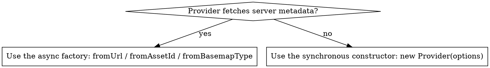

# CesiumJS Imagery Syntax

## Overview

Raster imagery on the CesiumJS globe has two layers of objects. An imagery PROVIDER is
the tile source (Bing, ArcGIS, OpenStreetMap, a WMS server). An `ImageryLayer` wraps
one provider and carries the display settings (alpha, brightness, draw order). The
globe renders an ordered stack of `ImageryLayer` objects, held in
`viewer.imageryLayers`, an `ImageryLayerCollection`.

Core principle: providers that fetch metadata from a server are created with an ASYNC
static factory (`fromUrl`, `fromAssetId`, `fromBasemapType`). NEVER call `new` on those
classes. Providers that need no metadata fetch use a plain synchronous constructor.

This skill is technology-specific: CesiumJS 1.124+, WebGL2 only.

## When to Use This Skill

- Adding a basemap or an overlay layer to the globe.
- The globe renders but shows no imagery, or tiles never appear.
- Tile requests return 401 or 403.
- Imagery layers draw in the wrong order, hiding the layer that should be on top.
- A provider constructor throws or yields an unusable provider.
- Blending two layers with alpha, brightness, or a split.
- Consuming MapTiler, a custom XYZ tile server, WMS, or WMTS.

## Quick Reference: Built-in Providers

| Provider | Source | Creation |
|----------|--------|----------|
| `IonImageryProvider` | Cesium ion asset | `fromAssetId(id)` async |
| `BingMapsImageryProvider` | Bing Maps | `fromUrl(url, {key})` async |
| `ArcGisMapServerImageryProvider` | ArcGIS MapServer | `fromUrl` / `fromBasemapType` async |
| `TileMapServiceImageryProvider` | TMS tile set | `fromUrl(url)` async |
| `SingleTileImageryProvider` | one image | `fromUrl(url)` async |
| `OpenStreetMapImageryProvider` | OSM-style XYZ | `new` synchronous |
| `UrlTemplateImageryProvider` | any XYZ template | `new` synchronous |
| `WebMapServiceImageryProvider` | WMS server | `new` synchronous |
| `WebMapTileServiceImageryProvider` | WMTS server | `new` synchronous |

## Synchronous vs Asynchronous Providers



- ALWAYS create `IonImageryProvider`, `BingMapsImageryProvider`,
  `ArcGisMapServerImageryProvider`, `TileMapServiceImageryProvider`, and
  `SingleTileImageryProvider` through their async factory. The direct constructor on
  these classes is documented as not-to-be-called.
- ALWAYS create `OpenStreetMapImageryProvider`, `UrlTemplateImageryProvider`,
  `WebMapServiceImageryProvider`, and `WebMapTileServiceImageryProvider` with `new`;
  they need no metadata fetch.
- NEVER use `readyPromise` or a `.ready` poll loop; `readyPromise` was removed in
  1.107. The async factory promise resolving IS the readiness signal.

## Adding an Imagery Layer

There are three correct patterns. Pick by whether the provider is async.

### Pattern A: async provider, wrapped by fromProviderAsync

ALWAYS use `ImageryLayer.fromProviderAsync` when the provider is async. It accepts the
provider PROMISE directly and manages the pending state.

```js
const layer = Cesium.ImageryLayer.fromProviderAsync(
  Cesium.ArcGisMapServerImageryProvider.fromBasemapType(
    Cesium.ArcGisBaseMapType.SATELLITE,
    { token: arcGisToken }
  )
);
viewer.imageryLayers.add(layer);
```

### Pattern B: await the provider, then construct the layer

```js
const provider = await Cesium.IonImageryProvider.fromAssetId(3954);
const layer = new Cesium.ImageryLayer(provider);
viewer.imageryLayers.add(layer);
```

### Pattern C: synchronous provider via addImageryProvider

`ImageryLayerCollection.addImageryProvider(provider, index)` builds and adds the layer
in one call. ALWAYS use it for a synchronous provider.

```js
viewer.imageryLayers.addImageryProvider(
  new Cesium.OpenStreetMapImageryProvider()
);
```

NEVER pass an async provider Promise to `new Cesium.ImageryLayer(...)`. That constructor
expects a resolved provider instance; a Promise yields a layer that never draws. Use
`fromProviderAsync` (Pattern A) or `await` first (Pattern B).

## Default and World Imagery

`ImageryLayer.fromWorldImagery(options)` creates a layer for Cesium ion global base
imagery. The global helper `createWorldImageryAsync()` returns a Promise of the same
provider. ion imagery requires `Cesium.Ion.defaultAccessToken` set before use.

## MapTiler and Custom XYZ Servers

There is NO dedicated MapTiler provider class. ALWAYS consume MapTiler through
`UrlTemplateImageryProvider` with the MapTiler XYZ tile URL, or through
`WebMapTileServiceImageryProvider` for a WMTS endpoint.

```js
viewer.imageryLayers.addImageryProvider(
  new Cesium.UrlTemplateImageryProvider({
    url: "https://api.maptiler.com/maps/streets-v2/{z}/{x}/{y}.png?key=" + maptilerKey,
  })
);
```

The URL template understands `{z}`, `{x}`, `{y}`, and `{s}` (subdomains, default
`abc`), plus `{reverseX}`, `{reverseY}`, and geographic bound tags.

## Layer Ordering and Blending

`viewer.imageryLayers` is an ordered collection. Index `0` is the BOTTOM layer; the
last index is drawn on TOP.

| Operation | Method |
|-----------|--------|
| Move a layer up one step | `imageryLayers.raise(layer)` |
| Move a layer down one step | `imageryLayers.lower(layer)` |
| Move a layer to the top | `imageryLayers.raiseToTop(layer)` |
| Move a layer to the bottom | `imageryLayers.lowerToBottom(layer)` |
| Read a layer by index | `imageryLayers.get(index)` |
| Remove a layer | `imageryLayers.remove(layer, destroy)` |

Per-layer display settings, with their defaults:

| Member | Default | Effect |
|--------|---------|--------|
| `alpha` | `1.0` | layer opacity, `0.0` to `1.0` |
| `brightness` | `1.0` | `1.0` is unchanged |
| `contrast` | `1.0` | `1.0` is unchanged |
| `hue` | `0.0` | hue shift in radians |
| `saturation` | `1.0` | `1.0` is unchanged |
| `gamma` | `1.0` | gamma correction |
| `show` | `true` | layer visibility |
| `splitDirection` | `SplitDirection.NONE` | left or right side of a slider |

ALWAYS lower `alpha` on the TOP layer to blend it over the layer beneath. NEVER expect
a bottom layer to show through an opaque layer above it.

## Common Mistakes

| Mistake | Fix |
|---------|-----|
| `new BingMapsImageryProvider(...)` | Use `BingMapsImageryProvider.fromUrl(...)` |
| `readyPromise` or a `.ready` poll | Await the factory promise; `readyPromise` is removed |
| Passing a provider Promise to `new ImageryLayer` | Use `ImageryLayer.fromProviderAsync` |
| Tiles return 401 or 403 | Set the ion, ArcGIS, or Bing access token |
| Layer hidden behind another | Index 0 is the bottom; `raiseToTop` the overlay |
| Looking for `MapTilerImageryProvider` | No such class; use `UrlTemplateImageryProvider` |

Full root-cause analysis is in `references/anti-patterns.md`.

## Reference Files

- `references/methods.md` : verified factory and constructor signatures for
  `ImageryLayer`, `ImageryLayerCollection`, and every built-in provider.
- `references/examples.md` : runnable layer-adding patterns, every provider, MapTiler,
  WMS, WMTS, ordering, and blending.
- `references/anti-patterns.md` : imagery failure modes, each with symptom, root cause,
  prevention, and recovery.

## Related Skills

- `cesium-syntax-viewer` : the `baseLayer` option and `Viewer` construction.
- `cesium-syntax-terrain` : terrain providers, the elevation counterpart to imagery.
- `cesium-core-versioning` : the async-factory migration and `readyPromise` removal.
- `cesium-errors-rendering` : blank globe and missing-imagery diagnosis.
