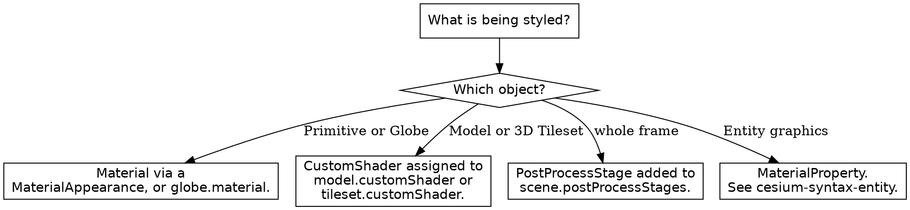

# CesiumJS Materials and Shaders

## Overview

CesiumJS has three distinct appearance APIs. They are not interchangeable.

- **`Material`** describes a surface appearance through Fabric JSON compiled
  to GLSL. It applies to Primitive appearances and to the `Globe`.
- **`CustomShader`** injects user GLSL into the rendering of a `Model` or a
  `Cesium3DTileset`.
- **`PostProcessStage`** runs a full-screen GLSL fragment shader over the
  rendered frame.

**Core principle:** ALWAYS pick the API that matches the target object. Use
`Material` for a Primitive or the Globe, `CustomShader` for a Model or a
tileset, and `PostProcessStage` for a screen-space effect. NEVER apply a
`Material` to a `Model` or a `CustomShader` to a `Primitive`; the target does
not accept it.

CesiumJS renders on WebGL2 and compiles GLSL ES 3.00. ALWAYS use `texture()`
and `in` or `out` qualifiers. NEVER use the WebGL1 `texture2D()`, `varying`,
or `attribute` keywords.

## When to Use This Skill

Use this skill when ANY of these apply:

- Coloring or texturing a Primitive surface or the Globe
- A material renders the wrong color, or does not appear
- Writing a `CustomShader` for a `Model` or a `Cesium3DTileset`
- A shader fails to compile
- Adding a screen-space effect such as bloom, silhouette, or a color filter
- A post-process stage produces no visible effect

Do NOT use this skill for `Entity` graphics materials; an `Entity` uses a
`MaterialProperty` such as `ColorMaterialProperty`, covered in
`cesium-syntax-entity`. Do NOT use it for `skyAtmosphere` or `fog`; that is
`cesium-syntax-atmosphere`.

## Decision: Which Appearance API



## Material: Built-In Types

`Material.fromType(type, uniforms)` creates a material from a built-in type.
The `type` argument is a string; the `Material.<Name>Type` constants hold the
exact strings.

```js
const material = Cesium.Material.fromType("Color", {
  color: Cesium.Color.RED.withAlpha(0.5),
});
```

Common built-in types and their key uniforms:

| Type | Key uniforms |
|------|--------------|
| `Color` | `color` |
| `Image` | `image`, `repeat` |
| `DiffuseMap` | `image`, `channels`, `repeat` |
| `NormalMap` | `image`, `channels`, `repeat`, `strength` |
| `Grid` | `color`, `cellAlpha`, `lineCount`, `lineThickness` |
| `Stripe` | `horizontal`, `evenColor`, `oddColor`, `repeat` |
| `Checkerboard` | `lightColor`, `darkColor`, `repeat` |
| `Dot` | `lightColor`, `darkColor`, `repeat` |
| `Water` | `baseWaterColor`, `normalMap`, `frequency`, `amplitude` |
| `RimLighting` | `color`, `rimColor`, `width` |
| `Fade` | `fadeInColor`, `fadeOutColor`, `maximumDistance` |
| `PolylineGlow` | `color`, `glowPower`, `taperPower` |
| `ElevationRamp` | `image`, `minimumHeight`, `maximumHeight` |
| `ElevationContour` | `color`, `spacing`, `width` |
| `SlopeRamp` | `image` |
| `AspectRamp` | `image` |

The full uniform list per type is in `references/methods.md`.

## Material: Fabric JSON

For a material not covered by a built-in type, pass `fabric` JSON to the
constructor. Fabric declares a `type`, `uniforms`, and a `components` or
`source` GLSL block.

```js
const material = new Cesium.Material({
  fabric: {
    type: "PulsingStripe",
    uniforms: {
      color: new Cesium.Color(1.0, 0.5, 0.0, 1.0),
    },
    components: {
      diffuse: "color.rgb",
      alpha: "color.a * abs(fract(materialInput.st.s * 8.0) - 0.5) * 2.0",
    },
  },
});
```

A `type` that is reused with different `uniforms` is cached by name. ALWAYS
give each distinct Fabric material a unique `type` string, or omit `type` to
get an auto-generated one.

## Material: Applying to a Primitive

A `Material` reaches a Primitive through an appearance. Use
`MaterialAppearance` for surface geometry and `PolylineMaterialAppearance`
for polylines.

```js
const primitive = new Cesium.Primitive({
  geometryInstances: instance,
  appearance: new Cesium.MaterialAppearance({
    material: Cesium.Material.fromType("Grid"),
  }),
});
viewer.scene.primitives.add(primitive);
```

The `Globe` accepts a material directly through `globe.material` for
surface-shading materials such as the elevation ramps.

```js
viewer.scene.globe.material = Cesium.Material.fromType("ElevationRamp", {
  minimumHeight: 0.0,
  maximumHeight: 3000.0,
});
```

When a material has transparency, set `translucent` correctly on the
appearance so depth sorting is right. `PerInstanceColorAppearance` and
`MaterialAppearance` expose a `translucent` flag.

## CustomShader

`CustomShader` injects GLSL into a `Model` or a `Cesium3DTileset`. Assign it
to `model.customShader` or `tileset.customShader`, or pass it as the
`customShader` constructor option.

```js
const customShader = new Cesium.CustomShader({
  mode: Cesium.CustomShaderMode.MODIFY_MATERIAL,
  lightingModel: Cesium.LightingModel.PBR,
  fragmentShaderText: `
    void fragmentMain(FragmentInput fsInput, inout czm_modelMaterial material) {
      material.diffuse = vec3(0.0, 0.6, 1.0);
    }
  `,
});

const model = await Cesium.Model.fromGltfAsync({ url: "./model.glb" });
model.customShader = customShader;
viewer.scene.primitives.add(model);
```

| Option | Values | Purpose |
|--------|--------|---------|
| `mode` | `MODIFY_MATERIAL` (default), `REPLACE_MATERIAL` | How the GLSL is inserted |
| `lightingModel` | `UNLIT`, `PBR` | Overrides the model lighting |
| `translucencyMode` | `INHERIT` (default), `OPAQUE`, `TRANSLUCENT` | Transparency handling |
| `uniforms` | object | User uniform declarations |
| `varyings` | object | Vertex-to-fragment varyings |
| `vertexShaderText` | string | Must define `vertexMain` |
| `fragmentShaderText` | string | Must define `fragmentMain` |

The `fragmentShaderText` MUST define a function named `fragmentMain`, and
`vertexShaderText` MUST define `vertexMain`. A shader without the required
function fails to compile.

### CustomShader Uniforms

Declare uniforms in the `uniforms` option with a `type` and a `value`, then
read them by name in the GLSL.

```js
const customShader = new Cesium.CustomShader({
  uniforms: {
    u_tint: {
      type: Cesium.UniformType.VEC3,
      value: new Cesium.Cartesian3(1.0, 0.4, 0.0),
    },
  },
  fragmentShaderText: `
    void fragmentMain(FragmentInput fsInput, inout czm_modelMaterial material) {
      material.diffuse *= u_tint;
    }
  `,
});

// Update a uniform after creation.
customShader.setUniform("u_tint", new Cesium.Cartesian3(0.0, 1.0, 0.0));
```

`UniformType` covers scalar, vector, matrix, and `SAMPLER_2D` types.
`setUniform(name, value)` updates a declared uniform.

## PostProcessStage

A `PostProcessStage` runs a full-screen fragment shader over the rendered
frame. Add it to `scene.postProcessStages`.

```js
const invert = viewer.scene.postProcessStages.add(
  new Cesium.PostProcessStage({
    fragmentShader: `
      void main() {
        vec4 color = texture(colorTexture, v_textureCoordinates);
        out_FragColor = vec4(vec3(1.0) - color.rgb, color.a);
      }
    `,
  }),
);
```

The fragment shader has `colorTexture` and `depthTexture` `sampler2D`
uniforms and a `v_textureCoordinates` `vec2` varying provided automatically.
ALWAYS write the result to `out_FragColor`. NEVER redeclare `colorTexture`,
`depthTexture`, or `v_textureCoordinates`; the runtime injects them.

Custom uniforms are passed through the `uniforms` option and MUST be declared
in the shader.

```js
viewer.scene.postProcessStages.add(
  new Cesium.PostProcessStage({
    uniforms: { u_intensity: 0.8 },
    fragmentShader: `
      uniform float u_intensity;
      void main() {
        vec4 color = texture(colorTexture, v_textureCoordinates);
        float gray = dot(color.rgb, vec3(0.299, 0.587, 0.114));
        out_FragColor = vec4(mix(color.rgb, vec3(gray), u_intensity), color.a);
      }
    `,
  }),
);
```

A `uniforms` value may be a constant or a function returning the value each
frame.

## PostProcessStage: Built-In Stages

`scene.postProcessStages` exposes ready-made stages as properties. Enable
them through the `enabled` flag.

```js
viewer.scene.postProcessStages.fxaa.enabled = true;
viewer.scene.postProcessStages.bloom.enabled = true;
viewer.scene.postProcessStages.ambientOcclusion.enabled = true;
```

`PostProcessStageLibrary` builds further stages with static factories:
`createBlurStage`, `createDepthOfFieldStage`, `createEdgeDetectionStage`,
`createSilhouetteStage`, `createBrightnessStage`, `createNightVisionStage`,
`createBlackAndWhiteStage`.

```js
const blackAndWhite = Cesium.PostProcessStageLibrary.createBlackAndWhiteStage();
viewer.scene.postProcessStages.add(blackAndWhite);
```

Remove a stage with `scene.postProcessStages.remove(stage)`, which destroys
it. `removeAll()` clears every added stage.

## Common Mistakes

| Mistake | Consequence | Fix |
|---------|-------------|-----|
| `Material` on a `Model` | No effect; Model ignores it | Use a `CustomShader` |
| `CustomShader` on a `Primitive` | Not accepted | Use a `Material` via an appearance |
| `Material.fromType` on `entity.polygon.material` | Wrong type, fails | Use a `MaterialProperty`; see `cesium-syntax-entity` |
| `texture2D()` or `varying` in GLSL | Shader will not compile | Use `texture()` and `in` or `out` |
| `fragmentShaderText` without `fragmentMain` | CustomShader fails to compile | Define a `fragmentMain` function |
| PostProcessStage not added to `scene.postProcessStages` | No visible effect | Call `scene.postProcessStages.add(stage)` |
| Writing to `gl_FragColor` in a post-process shader | No output | Write to `out_FragColor` |
| Redeclaring `colorTexture` in a post-process shader | Compile error | Use it directly; it is injected |
| Reusing a Fabric `type` string with new uniforms | Cached material returned | Give each Fabric material a unique `type` |
| Wrong `translucent` flag on the appearance | Depth-sort artifacts | Match `translucent` to the material alpha |

## Reference Files

- `references/methods.md` : the full `Material`, `CustomShader`,
  `PostProcessStage`, `PostProcessStageCollection`, and
  `PostProcessStageLibrary` API, with every constructor option and built-in
  material uniform set.
- `references/examples.md` : complete recipes for each of the three appearance
  APIs.
- `references/anti-patterns.md` : each materials and shader failure with
  symptom, root cause, and fix.

## Related Skills

- `cesium-syntax-entity` : `MaterialProperty` types for `Entity` graphics.
- `cesium-syntax-primitive` : appearances that carry a `Material`.
- `cesium-syntax-gltf-model` : the `Model` that a `CustomShader` targets.
- `cesium-syntax-3d-tiles` : the `Cesium3DTileset` that a `CustomShader`
  targets.
- `cesium-syntax-atmosphere` : `skyAtmosphere`, `fog`, and scene lighting.
- `cesium-core-performance` : the cost of post-process stages.
