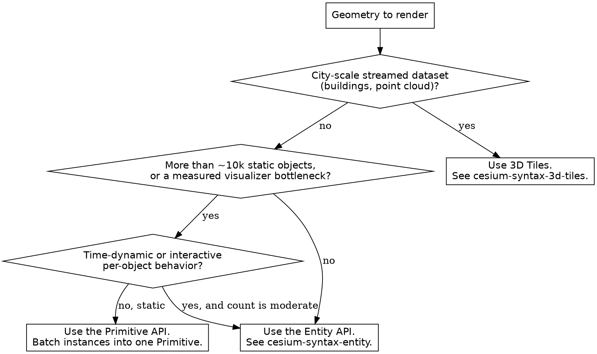
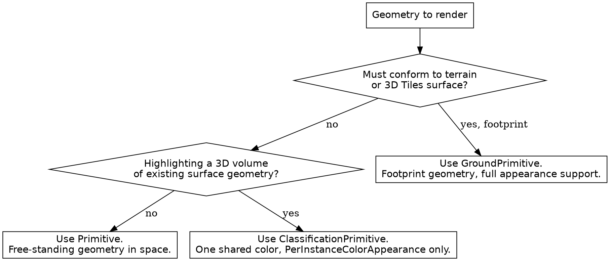

# CesiumJS Primitive API

## Overview

The Primitive API is the low-level rendering tier of CesiumJS. A `Primitive`
batches one or more `GeometryInstance` objects into a small number of WebGL
draw calls, builds the geometry on a web worker, and renders it as static
content. It trades the convenience of the Entity API for raw throughput.

**Core principle:** A primitive is built from three layers, ALWAYS in this
order: a `Geometry` describes shape, a `GeometryInstance` places and tags one
copy of that geometry, and a `Primitive` batches instances under one
`Appearance`. The geometry's `vertexFormat` MUST match the appearance.

## When to Use This Skill

Use this skill when ANY of these apply:

- Rendering more than roughly ten thousand static shapes
- A batch of geometry must drape over terrain or 3D Tiles
- A volume must classify and highlight terrain or buildings under it
- The Entity API visualizer loop is the measured performance bottleneck
- A primitive renders blank, or geometry is missing or appears flat

Do NOT use this skill for interactive or time-dynamic content under ten
thousand objects. The Entity API (`cesium-syntax-entity`) is the correct
default there. Do NOT use it for streamed massive datasets; 3D Tiles
(`cesium-syntax-3d-tiles`) supersedes both APIs at city scale.

## Decision Tree: Entity or Primitive



## The Three-Object Build

```js
// 1. Geometry: the shape. vertexFormat MUST match the appearance.
const geometry = new Cesium.BoxGeometry({
  vertexFormat: Cesium.PerInstanceColorAppearance.VERTEX_FORMAT,
  maximum: new Cesium.Cartesian3(10.0, 10.0, 10.0),
  minimum: new Cesium.Cartesian3(-10.0, -10.0, -10.0),
});

// 2. GeometryInstance: one placed, tagged copy of the geometry.
const instance = new Cesium.GeometryInstance({
  geometry: geometry,
  modelMatrix: Cesium.Transforms.eastNorthUpToFixedFrame(
    Cesium.Cartesian3.fromDegrees(4.9, 52.37, 100.0),
  ),
  id: "box-1",
  attributes: {
    color: Cesium.ColorGeometryInstanceAttribute.fromColor(Cesium.Color.RED),
  },
});

// 3. Primitive: batches instances under one appearance.
const primitive = new Cesium.Primitive({
  geometryInstances: instance,
  appearance: new Cesium.PerInstanceColorAppearance(),
});

viewer.scene.primitives.add(primitive);
```

`geometryInstances` accepts a single `GeometryInstance` or an array. Many
instances in one array batch into one primitive while each stays individually
pickable through its `id`.

## Geometry and vertexFormat

Every appearance needs specific vertex attributes. The geometry's
`vertexFormat` MUST equal the appearance's `VERTEX_FORMAT`, or the primitive
renders wrong or fails shader compilation.

| Appearance | Geometry vertexFormat to use |
|------------|------------------------------|
| `PerInstanceColorAppearance` | `PerInstanceColorAppearance.VERTEX_FORMAT` |
| `EllipsoidSurfaceAppearance` | `EllipsoidSurfaceAppearance.VERTEX_FORMAT` |
| `MaterialAppearance` | `MaterialAppearance.MaterialSupport.<level>.vertexFormat` |

ALWAYS set the geometry `vertexFormat` from the appearance you will use. NEVER
pair a default-vertexFormat geometry with `PerInstanceColorAppearance` and
expect per-instance color to appear.

## Appearances

An `Appearance` defines how a primitive is shaded. The geometry type and the
appearance MUST be compatible.

| Appearance | Use for | Color source |
|------------|---------|--------------|
| `PerInstanceColorAppearance` | Solid-color geometry, each instance its own color | Per-instance `ColorGeometryInstanceAttribute` |
| `MaterialAppearance` | Geometry shaded by a `Material` | Shared `Material`; per-instance color is ignored |
| `EllipsoidSurfaceAppearance` | Geometry that lies on the ellipsoid surface | Shared `Material` |
| `PolylineColorAppearance` | `PolylineGeometry` with per-instance color | Per-instance `ColorGeometryInstanceAttribute` |
| `PolylineMaterialAppearance` | `PolylineGeometry` shaded by a `Material` | Shared `Material` |

Key `PerInstanceColorAppearance` options: `flat` (default `false`, `true`
disables lighting), `translucent` (default `true`), `closed` (default
`false`, `true` enables backface culling for closed solids).

## Per-Instance Attributes

Per-instance attributes are constant across one instance and set in the
`GeometryInstance` `attributes` object.

| Attribute class | Purpose |
|-----------------|---------|
| `ColorGeometryInstanceAttribute` | Per-instance color; build with `.fromColor(color)` |
| `ShowGeometryInstanceAttribute` | Per-instance visibility toggle |
| `DistanceDisplayConditionGeometryInstanceAttribute` | Per-instance visible distance range |

After construction, read or update an attribute through
`primitive.getGeometryInstanceAttributes(id)`, never by mutating the original
`GeometryInstance`.

## GroundPrimitive: Draping on Terrain and 3D Tiles

`GroundPrimitive` drapes 2D-footprint geometry onto terrain or 3D Tiles. It
does not need height values; the surface supplies them.

```js
const drape = new Cesium.GroundPrimitive({
  geometryInstances: new Cesium.GeometryInstance({
    geometry: new Cesium.PolygonGeometry({
      polygonHierarchy: new Cesium.PolygonHierarchy(
        Cesium.Cartesian3.fromDegreesArray([4.88, 52.36, 4.92, 52.36, 4.90, 52.39]),
      ),
    }),
    attributes: {
      color: Cesium.ColorGeometryInstanceAttribute.fromColor(
        Cesium.Color.CYAN.withAlpha(0.5),
      ),
    },
  }),
  classificationType: Cesium.ClassificationType.BOTH,
});
viewer.scene.primitives.add(drape);
```

`GroundPrimitive` supports exactly these geometry types: `CircleGeometry`,
`CorridorGeometry`, `EllipseGeometry`, `PolygonGeometry`, `RectangleGeometry`.
NEVER feed it a `BoxGeometry` or other volume geometry.

`classificationType` defaults to `ClassificationType.BOTH`. The three values
are `TERRAIN`, `CESIUM_3D_TILE`, and `BOTH`.

ALWAYS call `GroundPrimitive.supportsMaterials(scene)` before using a
`MaterialAppearance` on a `GroundPrimitive`; materials need the
`WEBGL_depth_texture` extension. Call `GroundPrimitive.isSupported(scene)`
before relying on ground primitives at all.

## ClassificationPrimitive: Volume Highlighting

`ClassificationPrimitive` renders a volume that highlights the terrain or
3D Tiles geometry enclosed by it.

`ClassificationPrimitive` has a hard restriction: it supports only
`PerInstanceColorAppearance`, and EVERY geometry instance MUST carry the same
color. A differing color throws a `DeveloperError` on the first render.

For per-instance colors or material shading on classified surfaces, use
`GroundPrimitive` instead.

## Decision Tree: Which Classification Primitive



## PrimitiveCollection

`scene.primitives` is a `PrimitiveCollection`. It owns every primitive,
ground primitive, classification primitive, tileset, and model in the scene.

| Method | Effect |
|--------|--------|
| `add(primitive)` | Add a primitive; returns the added primitive |
| `remove(primitive)` | Remove and, by default, destroy the primitive |
| `removeAll()` | Remove and destroy all primitives |
| `contains(primitive)` | Report membership |

`remove` and `removeAll` destroy the primitive by default. After removal the
primitive object is destroyed and NEVER reusable.

## Common Mistakes

| Mistake | Consequence | Fix |
|---------|-------------|-----|
| Geometry `vertexFormat` does not match the appearance | Blank primitive or per-instance color missing | Set `vertexFormat` from the appearance `VERTEX_FORMAT` |
| `MaterialAppearance` with per-instance color attributes | Per-instance color silently ignored | Use `PerInstanceColorAppearance` for per-instance color |
| Volume geometry passed to `GroundPrimitive` | Nothing drapes; primitive is empty | Use a footprint geometry from the supported list |
| Differing instance colors in `ClassificationPrimitive` | `DeveloperError` on first render | Use one shared color, or switch to `GroundPrimitive` |
| Material on `GroundPrimitive` without a support check | Material fails on devices lacking the extension | Gate on `GroundPrimitive.supportsMaterials(scene)` |
| Reading `primitive.geometryInstances` after build | Returns `undefined` | `releaseGeometryInstances` defaults to `true`; keep your own reference |
| Polling a primitive to detect readiness | Wasted frames, race conditions | Add to `scene.primitives`; the render loop displays it when built |
| Using a primitive after `scene.primitives.remove(...)` | Throws; the object was destroyed | Build a fresh primitive |

## Reference Files

- `references/methods.md` : full constructor option catalog for `Primitive`,
  `GeometryInstance`, `GroundPrimitive`, `ClassificationPrimitive`, the
  appearance classes, and `PrimitiveCollection`.
- `references/examples.md` : complete recipes for batching, draping, volume
  classification, and picking batched instances.
- `references/anti-patterns.md` : each primitive failure with symptom, root
  cause, and fix.

## Related Skills

- `cesium-syntax-entity` : the high-level retained-mode alternative.
- `cesium-syntax-3d-tiles` : streamed massive datasets.
- `cesium-core-coordinates` : `Cartesian3` and `Transforms` for `modelMatrix`.
- `cesium-syntax-materials` : `Material` and `CustomShader` for appearances.
- `cesium-impl-picking-measurement` : picking batched instances by `id`.
- `cesium-core-performance` : batching strategy and primitive tuning.
