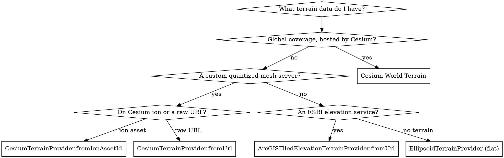

# CesiumJS Terrain

## Overview

By default a CesiumJS globe is a smooth ellipsoid with no elevation. Terrain is
supplied by a `TerrainProvider` that streams height data as quantized-mesh
tiles. Since CesiumJS 1.104 every network-backed terrain provider is created
through an async static factory; the direct constructor must not be called.

This skill covers choosing a provider, attaching it to the `Viewer`, the three
request options, and sampling elevation at a coordinate.

Verified signatures are in `references/methods.md`. Runnable code is in
`references/examples.md`. Failure modes are in `references/anti-patterns.md`.

## Core Rules

- ALWAYS create a network terrain provider with an async factory:
  `CesiumTerrainProvider.fromUrl`, `CesiumTerrainProvider.fromIonAssetId`,
  `createWorldTerrainAsync`, or `ArcGISTiledElevationTerrainProvider.fromUrl`.
  NEVER call `new CesiumTerrainProvider(...)`; the constructor must not be used
  directly.
- The factories return a `Promise`. NEVER assign that promise to
  `scene.terrainProvider`. ALWAYS `await` it first, or wrap it in a `Terrain`
  helper.
- Cesium World Terrain is an ion asset. ALWAYS set
  `Cesium.Ion.defaultAccessToken` before loading it, or the globe stays flat
  and requests return 401.
- ALWAYS pass `requestVertexNormals: true` when the globe uses lighting
  (`globe.enableLighting`). Terrain lighting is dark and flat without normals.
- ALWAYS pass `requestWaterMask: true` when the animated water effect is
  needed. It is off by default.
- NEVER use the removed synchronous `createWorldTerrain`. The async form
  `createWorldTerrainAsync` is the only valid one in 1.124+.
- ALWAYS enable `globe.depthTestAgainstTerrain` when markers must be hidden
  behind hills. Without it, primitives draw on top of terrain.

## Quick Reference

| Goal | Code |
|------|------|
| Cesium World Terrain at construction | `new Viewer(el, { terrain: Cesium.Terrain.fromWorldTerrain() })` |
| World Terrain, awaited provider | `await Cesium.createWorldTerrainAsync()` |
| Custom quantized-mesh endpoint | `await Cesium.CesiumTerrainProvider.fromUrl(url)` |
| ion-hosted terrain asset | `await Cesium.CesiumTerrainProvider.fromIonAssetId(id)` |
| ESRI elevation service | `await Cesium.ArcGISTiledElevationTerrainProvider.fromUrl(url)` |
| Flat globe (no elevation) | `new Cesium.EllipsoidTerrainProvider()` |
| Attach after construction | `scene.setTerrain(terrain)` |
| Remove terrain | `scene.terrainProvider = new Cesium.EllipsoidTerrainProvider()` |
| Sample ground height | `await Cesium.sampleTerrainMostDetailed(provider, positions)` |

## Choosing A Provider



`EllipsoidTerrainProvider` is the implicit default: a globe with no terrain
provider set renders the smooth ellipsoid. Construct it explicitly only to
remove terrain that was set earlier.

## Attaching Terrain To The Viewer

There are three correct ways. Pick one; never mix them on the same `Viewer`.

### At construction with the terrain option

The `Viewer` `terrain` option takes a `Terrain` instance, not a provider and
not a promise. `Terrain` manages the async loading internally.

```javascript
const viewer = new Cesium.Viewer("cesiumContainer", {
  terrain: Cesium.Terrain.fromWorldTerrain(),
});
```

### After construction with scene.setTerrain

`scene.setTerrain(terrain)` also takes a `Terrain` instance and returns it.

```javascript
viewer.scene.setTerrain(
  new Cesium.Terrain(Cesium.CesiumTerrainProvider.fromUrl("https://host/tiles")),
);
```

### By awaiting the provider yourself

When the provider is needed as a value (for example to call `sampleTerrain`),
`await` the factory and assign the resolved provider.

```javascript
const provider = await Cesium.createWorldTerrainAsync({
  requestVertexNormals: true,
});
viewer.scene.terrainProvider = provider; // a resolved provider, never a promise
```

## The Request Options

`CesiumTerrainProvider.fromUrl` and `fromIonAssetId` accept three flags. All
also exist on `createWorldTerrainAsync` and `Terrain.fromWorldTerrain` except
`requestMetadata`.

| Option | Default | Enable it when |
|--------|---------|----------------|
| `requestVertexNormals` | `false` | The globe uses lighting; normals shade slopes |
| `requestWaterMask` | `false` | The animated water effect is needed |
| `requestMetadata` | `true` | Per-tile metadata is consumed; leave on otherwise |

```javascript
const provider = await Cesium.CesiumTerrainProvider.fromIonAssetId(1, {
  requestVertexNormals: true,
  requestWaterMask: true,
});
```

## Sampling Elevation

To read the ground height at a coordinate, sample the terrain. Both functions
mutate the input `Cartographic` array in place and resolve to the same array.

```javascript
const positions = [
  Cesium.Cartographic.fromDegrees(86.925, 27.988),
  Cesium.Cartographic.fromDegrees(6.865, 45.833),
];
// Highest available detail; needs a provider with availability.
const updated = await Cesium.sampleTerrainMostDetailed(provider, positions);
const everestHeight = updated[0].height; // meters above the ellipsoid
```

`sampleTerrain(provider, level, positions)` samples at a fixed level.
`sampleTerrainMostDetailed(provider, positions)` samples at the deepest tile
and rejects if the provider has no `availability`. Terrain loads
asynchronously, so ALWAYS sample after the provider promise resolves.

## Vertical Exaggeration

Terrain exaggeration is a `Scene` property since CesiumJS 1.113. The old
`Globe.terrainExaggeration` no longer exists.

```javascript
viewer.scene.verticalExaggeration = 2.0;            // double the relief
viewer.scene.verticalExaggerationRelativeHeight = 0; // relative to the ellipsoid
```

## Common Mistakes

| Mistake | Symptom | Fix |
|---------|---------|-----|
| `new CesiumTerrainProvider({url})` | Constructor error or dead provider | Use `CesiumTerrainProvider.fromUrl` |
| Assigning the factory promise to `terrainProvider` | Globe stays flat | `await` the factory first |
| World Terrain without an ion token | Flat globe, 401 in console | Set `Ion.defaultAccessToken` |
| Lighting on, `requestVertexNormals` off | Terrain looks dark and flat | Pass `requestVertexNormals: true` |
| `createWorldTerrain` (sync) | Function is not defined | Use `createWorldTerrainAsync` |
| Sampling before the provider resolves | Wrong or ellipsoid heights | Sample after `await` |
| `globe.terrainExaggeration` | Property does nothing | Use `scene.verticalExaggeration` |

Full diagnosis of each is in `references/anti-patterns.md`.

## Reference Files

- `references/methods.md` : verified signatures for every terrain provider
  factory, the `Terrain` helper, the attachment APIs, and the sampling
  functions.
- `references/examples.md` : complete runnable terrain setup, switching,
  removal, and elevation-sampling examples.
- `references/anti-patterns.md` : every flat-globe and terrain-not-loading
  failure mode with root cause and fix.

## Related Skills

- `cesium-syntax-viewer` : the `Viewer` `terrain` constructor option.
- `cesium-core-versioning` : the async-factory migration that removed the
  synchronous terrain constructors.
- `cesium-core-coordinates` : `Cartographic` heights and the ellipsoid.
- `cesium-errors-rendering` : a flat or blank globe as a rendering failure.
