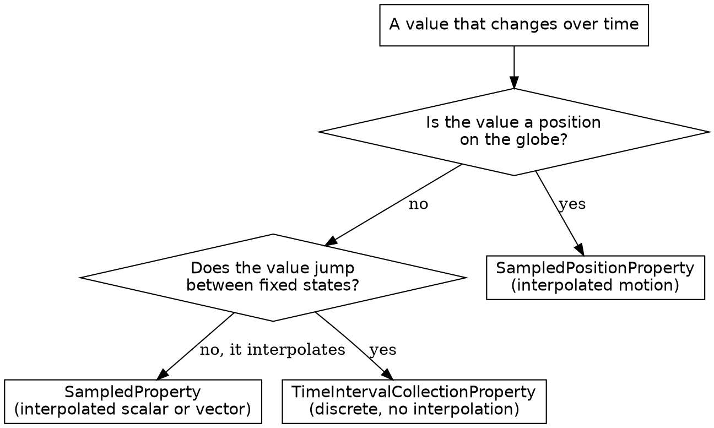

# CesiumJS Time and Clock

## Overview

CesiumJS is time-dynamic. A `Clock` advances a simulation time each frame, and
`Property` objects evaluate their value at that time. `JulianDate` is the time
type. `SampledPositionProperty` interpolates a position between time-stamped
samples. `TimeIntervalCollection` defines when an entity exists.

**Core principle:** ALWAYS represent simulation time as a `JulianDate`, NEVER a
JavaScript `Date` or a raw number. An animation advances ONLY when
`viewer.clock.shouldAnimate` is `true`.

## When to Use This Skill

Use this skill when ANY of these apply:

- An entity with a time-varying position does not move
- An animation is added but stays frozen
- A clock or timeline shows the wrong time
- A `SampledPositionProperty` returns `undefined` or the wrong position
- Choosing an interpolation algorithm for a track
- Controlling when an entity is visible with `availability`

Do NOT use this skill for glTF model animation playback detail; that is
`cesium-syntax-gltf-model`. Do NOT use it for the `Property` abstraction or
`CallbackProperty`; that is `cesium-syntax-entity`. Both skills share the clock
described here.

## JulianDate: the time type

`JulianDate` stores whole days and seconds-of-day separately, internally in
International Atomic Time (`TimeStandard.TAI`). That storage makes its
arithmetic leap-second-safe. NEVER build a `JulianDate` from raw day numbers by
hand; ALWAYS use a factory.

```js
const fromIso = Cesium.JulianDate.fromIso8601("2026-05-20T14:30:00Z");
const fromJsDate = Cesium.JulianDate.fromDate(new Date());
const rightNow = Cesium.JulianDate.now();
```

ALWAYS parse ISO 8601 strings with `JulianDate.fromIso8601`. It accepts every
ISO 8601 form and is correct where `Date.parse` is unreliable.

`JulianDate` arithmetic uses static methods that write into a `result` argument
and return it. They do NOT change their input.

```js
const start = Cesium.JulianDate.fromIso8601("2026-05-20T00:00:00Z");
const oneHourLater = Cesium.JulianDate.addSeconds(
  start,
  3600,
  new Cesium.JulianDate(),
);
const order = Cesium.JulianDate.compare(start, oneHourLater); // negative
const gapSeconds = Cesium.JulianDate.secondsDifference(oneHourLater, start);
```

NEVER add time by writing to `secondsOfDay` directly; that field does not roll
over into `dayNumber`. ALWAYS use `JulianDate.addSeconds`, `addMinutes`,
`addHours`, or `addDays`.

| Method | Purpose |
|--------|---------|
| `JulianDate.fromIso8601(str, result)` | Parse an ISO 8601 string |
| `JulianDate.fromDate(date, result)` | Convert a JavaScript `Date` |
| `JulianDate.now(result)` | Current system time |
| `JulianDate.addSeconds(date, seconds, result)` | Offset by seconds |
| `JulianDate.compare(left, right)` | Sort order, negative or positive |
| `JulianDate.secondsDifference(left, right)` | Elapsed seconds |
| `JulianDate.toIso8601(date, precision)` | Format back to a string |
| `JulianDate.clone(date, result)` | Independent copy |

## Clock: driving simulation time

A `Clock` advances simulation time. The `Viewer` owns one, reachable as
`viewer.clock`.

```js
const viewer = new Cesium.Viewer("cesiumContainer");
const start = Cesium.JulianDate.fromIso8601("2026-05-20T00:00:00Z");
const stop = Cesium.JulianDate.addSeconds(start, 3600, new Cesium.JulianDate());

viewer.clock.startTime = start;
viewer.clock.stopTime = stop;
viewer.clock.currentTime = Cesium.JulianDate.clone(start);
viewer.clock.clockRange = Cesium.ClockRange.LOOP_STOP;
viewer.clock.multiplier = 60; // 60 simulated seconds per real second
viewer.clock.shouldAnimate = true;
viewer.timeline.zoomTo(start, stop);
```

`shouldAnimate` is `false` by default. NEVER expect a track or animation to
move until `viewer.clock.shouldAnimate` is `true`, or `shouldAnimate: true` is
passed to the `Viewer` constructor.

ALWAYS assign `currentTime` a `JulianDate.clone` of `startTime`. The clock
mutates its `currentTime` object on each tick; a shared reference would corrupt
`startTime`.

`ClockRange` controls behavior when `currentTime` reaches `stopTime`:

| Value | Behavior at stopTime |
|-------|----------------------|
| `UNBOUNDED` | Keeps advancing past `stopTime` (default) |
| `CLAMPED` | Stops at `stopTime`, playback halts |
| `LOOP_STOP` | Jumps back to `startTime` and replays |

`ClockStep` controls how much time each `tick()` adds:

| Value | tick advances by |
|-------|------------------|
| `SYSTEM_CLOCK_MULTIPLIER` | Real elapsed time times `multiplier` (default) |
| `TICK_DEPENDENT` | A fixed `multiplier` seconds per frame |
| `SYSTEM_CLOCK` | The real system time, `multiplier` ignored |

ALWAYS use `TICK_DEPENDENT` for deterministic, frame-rate-independent playback,
such as a recorded video export.

## ClockViewModel

`ClockViewModel` is the binding layer between a `Clock` and the Animation and
Timeline widgets. The `Viewer` creates one; reach it as `viewer.clockViewModel`.
Construct a standalone one with `new Cesium.ClockViewModel(clock)`, where the
`Clock` argument is optional. Call `synchronize()` to refresh the view model
after changing the underlying clock outside the tick loop.

## SampledPositionProperty: time-dynamic position

A `SampledPositionProperty` holds time-stamped positions and interpolates
between them. Assign it to `entity.position` and the entity moves as the clock
advances.

```js
const positionProperty = new Cesium.SampledPositionProperty();

const samples = [
  { time: "2026-05-20T00:00:00Z", lon: 4.9, lat: 52.37, height: 1000 },
  { time: "2026-05-20T00:10:00Z", lon: 4.95, lat: 52.4, height: 1500 },
  { time: "2026-05-20T00:20:00Z", lon: 5.0, lat: 52.45, height: 1200 },
];
for (const s of samples) {
  positionProperty.addSample(
    Cesium.JulianDate.fromIso8601(s.time),
    Cesium.Cartesian3.fromDegrees(s.lon, s.lat, s.height),
  );
}

const aircraft = viewer.entities.add({
  position: positionProperty,
  point: { pixelSize: 12, color: Cesium.Color.YELLOW },
  path: { width: 2, material: Cesium.Color.CYAN },
});
viewer.trackedEntity = aircraft;
```

A `SampledPositionProperty` with one sample is constant; it can NEVER
interpolate. ALWAYS add two or more samples for motion.

The constructor is `new Cesium.SampledPositionProperty(referenceFrame,
numberOfDerivatives)`. `referenceFrame` defaults to `ReferenceFrame.FIXED`. Set
`numberOfDerivatives` to `1` ONLY when you also pass velocity vectors as the
third `addSample` argument and intend to use Hermite interpolation.

## Interpolation algorithms

By default a sampled property uses `LinearApproximation` at
`interpolationDegree` `1`. Change it with `setInterpolationOptions`.

```js
positionProperty.setInterpolationOptions({
  interpolationAlgorithm: Cesium.LagrangePolynomialApproximation,
  interpolationDegree: 2,
});
```

| Algorithm | Use for | Samples needed |
|-----------|---------|----------------|
| `LinearApproximation` | Straight segments, the default | Degree 1 needs 2 |
| `LagrangePolynomialApproximation` | Smooth curved paths | Degree N needs N+1 |
| `HermitePolynomialApproximation` | Paths with known velocity data | Degree N needs N+1 |

ALWAYS keep `interpolationDegree` below the in-range sample count. A
`LagrangePolynomialApproximation` at degree `5` needs at least 6 samples around
the query time; with fewer, CesiumJS falls back to a lower degree and the curve
is not the one configured. `HermitePolynomialApproximation` is correct ONLY
when the property carries derivatives (`numberOfDerivatives` is above `0`).

## Extrapolation

Outside the sample range a sampled property extrapolates according to
`forwardExtrapolationType` and `backwardExtrapolationType`. Both default to
`ExtrapolationType.NONE`.

| `ExtrapolationType` | Value outside the sample range |
|---------------------|--------------------------------|
| `NONE` | The property returns `undefined` (default) |
| `HOLD` | The first or last sample value is held |
| `EXTRAPOLATE` | The value is projected from the trend |

A track that vanishes before its first sample or after its last is the default
`NONE` behavior. Set `HOLD` to park the entity at its endpoint.

```js
positionProperty.forwardExtrapolationType = Cesium.ExtrapolationType.HOLD;
positionProperty.backwardExtrapolationType = Cesium.ExtrapolationType.HOLD;
```

## TimeIntervalCollection and Entity.availability

A `TimeIntervalCollection` is a sorted, non-overlapping set of `TimeInterval`s.
Assign one to `entity.availability` and the entity is shown ONLY while the
clock is inside an interval.

```js
const availability = new Cesium.TimeIntervalCollection([
  Cesium.TimeInterval.fromIso8601({
    iso8601: "2026-05-20T00:05:00Z/2026-05-20T00:18:00Z",
  }),
]);
aircraft.availability = availability;
```

Build intervals from ISO 8601 with `TimeInterval.fromIso8601` for a single
interval, or `TimeIntervalCollection.fromIso8601` for a start, stop, or
duration spec. A `TimeInterval` exposes `isStartIncluded` and `isStopIncluded`,
both default `true`.

An entity whose `availability` excludes the current clock time is hidden even
when its `position` is valid. When an entity will not appear during playback,
ALWAYS check `availability` against `viewer.clock.currentTime`.

## Decision: which time property



For controlling visibility windows rather than a value, use a
`TimeIntervalCollection` on `entity.availability`.

## Common Mistakes

| Mistake | Consequence | Fix |
|---------|-------------|-----|
| `shouldAnimate` left `false` | Clock and every track frozen | Set `viewer.clock.shouldAnimate = true` |
| One sample in a `SampledPositionProperty` | Entity never moves | Add two or more samples |
| `interpolationDegree` at or above sample count | Silent fallback, wrong curve | Keep degree below the in-range sample count |
| Hermite without derivatives | Interpolation wrong or throws | Use Linear or Lagrange, or pass derivatives |
| Query outside samples with `NONE` | Track disappears at the ends | Set `forwardExtrapolationType` and backward to `HOLD` |
| `availability` excludes `currentTime` | Entity hidden though position is valid | Widen the `TimeIntervalCollection` |
| `Date.parse` for ISO 8601 strings | Wrong or invalid time | Use `JulianDate.fromIso8601` |
| Writing to `secondsOfDay` to add time | No day rollover, wrong date | Use `JulianDate.addSeconds` |
| `clockRange` `CLAMPED` then expecting a loop | Playback stops at `stopTime` | Use `ClockRange.LOOP_STOP` |
| Shared `JulianDate` for `startTime` and `currentTime` | Clock tick corrupts `startTime` | Assign a `JulianDate.clone` to `currentTime` |

## Reference Files

- `references/methods.md` : the full `JulianDate`, `Clock`, `ClockViewModel`,
  `SampledPositionProperty`, `SampledProperty`, `TimeIntervalCollection`, and
  `TimeInterval` API, with enum members.
- `references/examples.md` : complete recipes for an animated track, a looping
  clock, interpolation tuning, extrapolation, and availability windows.
- `references/anti-patterns.md` : each time failure with symptom, root cause,
  and fix.

## Related Skills

- `cesium-syntax-entity` : the `Property` abstraction, `CallbackProperty`, and
  `path` graphics that visualize a track.
- `cesium-syntax-gltf-model` : glTF model animations driven by this same clock.
- `cesium-core-coordinates` : `Cartesian3` positions used as samples.
- `cesium-syntax-viewer` : the Animation and Timeline widgets on the `Viewer`.
- `cesium-syntax-datasources` : CZML, the time-dynamic data format.
