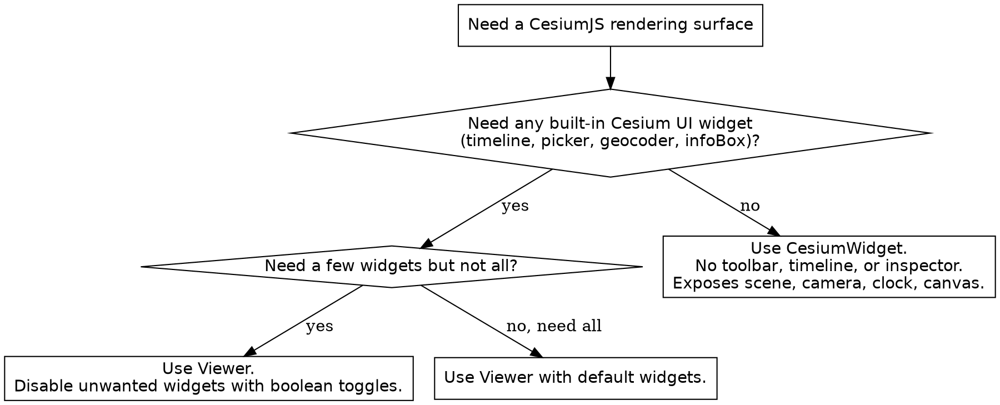

# CesiumJS Viewer Construction

## Overview

`Viewer` is the standard entry point for a CesiumJS application. It wraps a
`CesiumWidget` (canvas, `Scene`, `Camera`, `Clock`, render loop) and adds the
UI widget set: animation control, timeline, base-layer picker, geocoder,
home button, info box, and more.

**Core principle:** A CesiumJS application ALWAYS follows a fixed startup
order. Set `Ion.defaultAccessToken` first, then construct the `Viewer` or
`CesiumWidget`, then `await` async terrain and tileset factories, then add data
and move the camera. Skipping or reordering the token step is the dominant
cause of a blank globe.

## When to Use This Skill

Use this skill when ANY of these apply:

- Creating a new CesiumJS application from scratch
- Choosing between `Viewer` and `CesiumWidget`
- A globe renders blank or black on first load
- The UI feels cluttered and widgets need to be turned off
- Tuning render quality through `msaaSamples`, `contextOptions`, or
  `useBrowserRecommendedResolution`
- A constructor throws because the container element is missing

Do NOT use this skill for camera movement (`cesium-syntax-camera`), entity or
primitive content (`cesium-syntax-entity`, `cesium-syntax-primitive`), or
bundler asset setup and `CESIUM_BASE_URL` (`cesium-impl-build-deploy`).

## The Startup Order

ALWAYS run these steps in this exact order. NEVER construct the `Viewer`
before the ion token line.

```js
// 1. Set the ion token BEFORE constructing the Viewer.
Cesium.Ion.defaultAccessToken = "<your-ion-token>";

// 2. Construct the Viewer against an existing container element.
const viewer = new Cesium.Viewer("cesiumContainer");

// 3. await async terrain and tileset factories.
viewer.scene.setTerrain(Cesium.Terrain.fromWorldTerrain());

// 4. Add data and move the camera.
viewer.camera.flyTo({
  destination: Cesium.Cartesian3.fromDegrees(4.9, 52.37, 5000),
});
```

The `Viewer` constructor takes a container as the first argument: either a DOM
element or the `id` string of an existing element. If the element does not
exist, the constructor throws a `DeveloperError`.

## Constructor Signature

```js
const viewer = new Cesium.Viewer(container, options);
```

`container` is a DOM element or an element `id` string. `options` is an
optional object. Every option has a default, so `new Cesium.Viewer("id")`
alone produces a working globe.

## Widget Toggles

Every widget toggle is a boolean. Set one to `false` to remove that piece of
UI. Defaults verified against the API reference on 2026-05-20.

| Option | Default | Removes when false |
|--------|---------|--------------------|
| `animation` | `true` | Clock dial in the lower left |
| `baseLayerPicker` | `true` | Imagery and terrain picker |
| `fullscreenButton` | `true` | Fullscreen toggle button |
| `vrButton` | `false` | VR toggle button |
| `geocoder` | enabled (`IonGeocodeProviderType.DEFAULT`) | Location search box |
| `homeButton` | `true` | Reset-view button |
| `infoBox` | `true` | Selected-feature description panel |
| `sceneModePicker` | `true` | 3D / 2D / Columbus View switch |
| `selectionIndicator` | `true` | Green selection crosshair |
| `timeline` | `true` | Time scrubber bar |
| `navigationHelpButton` | `true` | Navigation instructions overlay |

For a map with no Cesium UI chrome at all, set every toggle to `false`, or use
`CesiumWidget` instead (see the decision tree below).

```js
const viewer = new Cesium.Viewer("cesiumContainer", {
  animation: false,
  timeline: false,
  baseLayerPicker: false,
  geocoder: false,
  homeButton: false,
  navigationHelpButton: false,
  sceneModePicker: false,
  fullscreenButton: false,
});
```

## Rendering Options

| Option | Type | Default | Purpose |
|--------|------|---------|---------|
| `scene3DOnly` | boolean | `false` | Restrict to 3D; skips 2D and Columbus View geometry batches, saving GPU memory |
| `requestRenderMode` | boolean | `false` | Render only on scene change; the app calls `scene.requestRender()` |
| `maximumRenderTimeChange` | number | `0.0` | Simulation-time delta that forces a render under `requestRenderMode` |
| `sceneMode` | `SceneMode` | `SCENE3D` | Initial mode: `SCENE3D`, `SCENE2D`, or `COLUMBUS_VIEW` |
| `msaaSamples` | number | `4` | Multisample anti-aliasing; `1` disables MSAA |
| `useBrowserRecommendedResolution` | boolean | `true` | When `true`, ignore `window.devicePixelRatio` for sharper-but-cheaper output |
| `targetFrameRate` | number | undefined | Caps the render-loop frame rate |
| `orderIndependentTranslucency` | boolean | `true` | Correct blending of overlapping translucent geometry |

When `requestRenderMode` is `true`, the scene freezes until something requests
a frame. ALWAYS call `viewer.scene.requestRender()` after any change the
engine cannot detect on its own. Deep performance tuning belongs in
`cesium-core-performance`.

## contextOptions: WebGL Tuning

`contextOptions` passes raw flags to WebGL context creation. CesiumJS renders
exclusively on WebGL2. NEVER configure a WebGPU path; no WebGPU backend exists
in 1.124+.

```js
const viewer = new Cesium.Viewer("cesiumContainer", {
  contextOptions: {
    requestWebgl2: true,
    webgl: {
      powerPreference: "high-performance",
      alpha: false,
    },
  },
});
```

`powerPreference` accepts `"high-performance"`, `"low-power"`, or `"default"`.
Set `alpha: true` only when the canvas must blend with HTML behind it.

## Data Options

| Option | Type | Default | Purpose |
|--------|------|---------|---------|
| `baseLayer` | `ImageryLayer` or `false` | `ImageryLayer.fromWorldImagery()` | Initial base imagery; `false` starts with no imagery |
| `terrain` | `Terrain` | undefined | Terrain through the async `Terrain` helper |
| `globe` | `Globe` or `false` | `new Globe(...)` | `false` removes the globe entirely (useful for pure 3D Tiles scenes) |
| `dataSources` | `DataSourceCollection` | new collection | Pre-populated data sources |
| `shouldAnimate` | boolean | `false` | Start the clock running on load |

The `baseLayer` and `terrain` options expect async-aware helpers. ALWAYS feed
`terrain` a `Terrain` instance such as `Terrain.fromWorldTerrain()`, and feed
`baseLayer` an `ImageryLayer` from `ImageryLayer.fromWorldImagery()` or
`ImageryLayer.fromProviderAsync(...)`. NEVER pass a synchronously constructed
provider that depends on a removed `readyPromise`. See `cesium-core-versioning`
for the async-factory migration.

```js
const viewer = new Cesium.Viewer("cesiumContainer", {
  terrain: Cesium.Terrain.fromWorldTerrain(),
  baseLayer: Cesium.ImageryLayer.fromWorldImagery({
    style: Cesium.IonWorldImageryStyle.AERIAL_WITH_LABELS,
  }),
});
```

## Decision Tree: Viewer or CesiumWidget



`CesiumWidget` is the foundational rendering component. It owns the canvas,
`Scene`, `Camera`, `Clock`, and `ScreenSpaceEventHandler`, and runs the render
loop, but has no UI chrome. It accepts the same rendering and data options as
`Viewer` minus the widget toggles.

```js
// Minimal UI-free rendering surface.
const widget = new Cesium.CesiumWidget("cesiumContainer", {
  scene3DOnly: true,
  msaaSamples: 4,
});
widget.scene; // same Scene API as viewer.scene
```

## Teardown

A `Viewer` holds a WebGL context and GPU resources that the garbage collector
NEVER reclaims on its own. ALWAYS call `viewer.destroy()` when removing a
viewer, and check `viewer.isDestroyed()` before further use. Memory detail
lives in `cesium-core-memory`.

## Common Mistakes

| Mistake | Consequence | Fix |
|---------|-------------|-----|
| Setting `Ion.defaultAccessToken` after `new Viewer(...)` | Blank or black globe, 401 on ion assets | Set the token before construction |
| Passing an `id` for an element not in the DOM | `DeveloperError` thrown from the constructor | Ensure the container exists before construction |
| `requestRenderMode: true` without `scene.requestRender()` | Scene freezes after the first frame | Request a render after every undetected change |
| Passing a sync provider to `baseLayer` | Load failure from removed `readyPromise` | Use `ImageryLayer.fromWorldImagery` or `fromProviderAsync` |
| Disabling `globe` but expecting terrain | Nothing to drape terrain or imagery on | Keep `globe` enabled unless the scene is pure 3D Tiles |
| Dropping a `Viewer` reference without `destroy()` | WebGL context leak, 16-context limit hit | Call `viewer.destroy()` on teardown |

## Reference Files

- `references/methods.md` : the full constructor option catalog with types and
  defaults, key `Viewer` instance properties, and the `CesiumWidget` option
  set.
- `references/examples.md` : complete construction recipes for common
  application shapes.
- `references/anti-patterns.md` : each construction failure with symptom, root
  cause, and fix.

## Related Skills

- `cesium-core-architecture` : the Viewer / CesiumWidget / Scene / Globe
  containment hierarchy and render loop.
- `cesium-syntax-camera` : moving the camera after construction.
- `cesium-syntax-terrain` : terrain provider async factories.
- `cesium-syntax-imagery` : imagery providers and layer ordering.
- `cesium-core-versioning` : the async-factory migration for providers.
- `cesium-impl-build-deploy` : `CESIUM_BASE_URL` and bundler asset setup.
- `cesium-errors-rendering` : diagnosing a blank or black globe.
